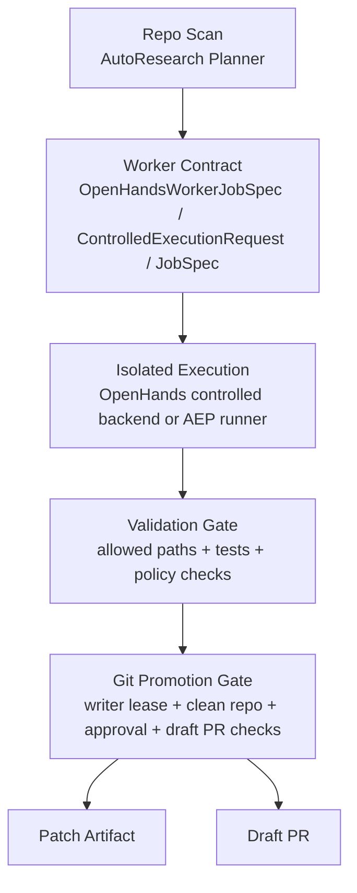

# Architecture

This file is the canonical architecture handoff for the current `autonomous-agent-stack` checkout.

It describes the system that actually exists in this repository on March 28, 2026, not the older aspirational stack diagrams that still exist in some historical docs. If a historical document disagrees with this file, trust this file first and then verify against code.

## What This Repository Is Now

The repository is no longer just a collection of agent experiments. The current stable spine is a bounded control plane for:

- planning safe repository improvements,
- executing those improvements inside isolated workspaces,
- validating the resulting patch,
- re-checking the patch through a promotion gate,
- and only then upgrading the result to a Draft PR.

The most important shift is that autonomous work is now intentionally constrained. Agents are allowed to propose and edit inside isolation, but they do not own the repository, the branch graph, or production promotion authority.

The current mainline flow is:

1. `AutoResearchPlannerService` scans the repo and selects a bounded change candidate.
2. It emits an `OpenHandsWorkerJobSpec`, a `ControlledExecutionRequest`, and an AEP `JobSpec`.
3. `OpenHandsWorkerService` translates that contract into a strict patch-only worker prompt.
4. `OpenHandsControlledBackendService` or `AgentExecutionRunner` executes inside an isolated workspace.
5. Validation commands run against the isolated result.
6. `GitPromotionGateService` re-checks scope, runtime artifacts, binary changes, writer lease, approval state, and Draft PR preconditions.
7. Promotion ends as either:
   - a patch artifact ready for human review, or
   - a Draft PR created from an isolated worktree.

## Canonical Pipeline



This pipeline is intentionally asymmetric:

- the planning layer can suggest work,
- the execution layer can produce a patch candidate,
- but only the promotion layer is allowed to translate that patch into branch or PR level state.

That asymmetry is the core safety mechanism.

## Zero-Trust Invariants

### 1. Brain and Hand Separation

Planning and execution are separate from promotion.

- The planner finds the next task.
- The worker edits files inside an isolated workspace.
- The promotion gate decides whether the resulting patch may become a patch artifact or Draft PR.

OpenHands is therefore treated as a constrained worker, not as the system control plane.

### 2. Patch-Only by Default

Patch-only is the default contract for autonomous edits.

The worker prompt built in `src/autoresearch/core/services/openhands_worker.py` explicitly forbids:

- `git add`
- `git commit`
- `git push`
- `git merge`
- `git rebase`
- `git reset`
- `git checkout`

It also constrains output to `allowed_paths` and forbids touching `forbidden_paths`.

### 3. Deny-Wins Policy Merge

The AEP layer merges policy with deny-wins semantics:

- `forbidden_paths`: union
- `allowed_paths`: intersection
- network access: stricter wins
- tool allowlist: intersection
- limits such as patch lines and changed files: smaller limit wins

This prevents a permissive job request from widening a tighter manifest default.

### 4. Single Writer for Mutable State

`WriterLeaseService` is the single-writer lock for mutable control-plane operations.

Current code uses writer leases in the places where concurrent mutation would be most dangerous:

- git promotion finalization,
- managed skill promotion,
- approval-linked mutation flows,
- other repository or state transitions that must not race.

If a writer lease cannot be acquired, the system blocks rather than guessing.

### 5. Runtime Artifacts Never Promote

Promotion rejects runtime or control artifacts from being smuggled into source changes.

Current deny prefixes include:

- `logs/`
- `.masfactory_runtime/`
- `memory/`
- `.git/`

This rule exists both in AEP patch filtering and in the git promotion gate.

### 6. Clean Base Requirement

Two operations refuse to run on a dirty base checkout:

- `OpenHandsControlledBackendService` blocks OpenHands CLI execution if the repo root has uncommitted changes.
- `GitPromotionGateService` requires a clean base repo before upgrading to Draft PR mode.

This ensures the system does not mistake unrelated local edits for agent output.

## Physical and Sandbox Topology

The current machine layout is intentionally non-default and should be treated as part of the architecture.

### Host and Storage

- host machine: MacBook Air M1
- container runtime: Colima / Docker
- repository checkout: `/Volumes/AI_LAB/Github/autonomous-agent-stack`
- ai-lab writable runtime roots: `/Volumes/AI_LAB/ai_lab/workspace`, `/Volumes/AI_LAB/ai_lab/logs`, `/Volumes/AI_LAB/ai_lab/.cache`

The `ai_lab.env` file points Docker to the Colima socket and pins the writable lab roots to the external disk. This matters because capacity, cleanup behavior, and path assumptions are all tied to `/Volumes/AI_LAB`.

### Mount Model

The current `scripts/launch_ai_lab.sh` logic effectively creates a layered execution topology:

1. The host repository is the source of truth.
2. The ai-lab launcher mounts the chosen host root into the container at `/workspace` as read-only.
3. When OpenHands controlled runs need a writable execution root, an extra writable mount is attached at `/opt/workspace`.
4. Controlled execution also snapshots a baseline and creates its own isolated `workspace` directory under a per-run root before any validation or promotion decision.

Conceptually, the stack is:

```text
Mac host source checkout
  -> Colima / Docker runtime
    -> ai-lab writable roots on /Volumes/AI_LAB/ai_lab
      -> isolated execution workspace
        -> isolated promotion worktree
```

This is why the handoff shorthand is:

`Mac host read source -> Colima -> ai-lab external disk read/write -> isolated worktree`

### Isolation Surfaces

There are two independent isolation phases:

#### Execution Isolation

`OpenHandsControlledBackendService` copies the repository into:

- `baseline/`
- `workspace/`
- `artifacts/`

under a run root, with repo noise excluded. The worker edits only the isolated workspace, never the main repo directly.

#### Promotion Isolation

`GitPromotionGateService` and `GitPromotionService` use git worktrees rooted under salted `/tmp` paths.

The current implementation salts the worktree base with a hash of the absolute repo root, for example:

- `/tmp/<repo-name>-<repo-hash>/promotion-worktrees/<run-id>`
- `/tmp/repo-<repo-hash>/promotions/<promotion-id>/worktree`

That salt exists so two repositories with the same basename do not collide in `/tmp`.

## Zero-Trust Promotion and Approval State Machines

### Managed Skill Promotion

Managed skills follow a four-stage trust pipeline implemented by `ManagedSkillRegistryService`:

1. `pending`
2. `quarantined`
3. `cold_validated`
4. `promoted`

The operational meaning is:

- `quarantined`: bundle copied out of the untrusted source into a contained holding area
- `cold_validated`: signature, contract, manifest, and bounded checks passed without granting active runtime status
- `promoted`: copied into the active root and made visible to runtime consumers

Promotion from `cold_validated` to `promoted` is guarded by a writer lease so that only one writer activates skill state at a time.

### Patch Promotion

Patch promotion is handled by `GitPromotionGateService`.

The gate always computes a preflight report first. Only if patch-level checks pass may the result continue. Draft PR mode adds stricter checks:

- remote health is good,
- repo base is clean,
- credentials are available,
- target base branch exists,
- explicit approval has been granted.

If Draft PR checks fail but patch checks pass, the system degrades to patch mode rather than silently escalating.

This is deliberate: patch mode is the safe floor; Draft PR is a privilege upgrade.

## Current Controlled Execution Loop

### Planner Layer

`AutoResearchPlannerService` is the new "active seeker" layer.

It currently scans `src/`, `scripts/`, and `tests/` for bounded opportunities:

- backlog markers such as `FIXME`, `TODO`, `HACK`, `XXX`, `BUG`
- source hotspots that do not appear to have a direct regression test

It scores those candidates and emits three downstream-ready contracts:

- `OpenHandsWorkerJobSpec`
- `ControlledExecutionRequest`
- AEP `JobSpec`

The planner does not execute code itself. Its job is to produce the smallest next safe contract.

### Worker Layer

`OpenHandsWorkerService` turns the plan into a strict patch-only prompt and contract set.

The worker prompt repeats the non-negotiable rules:

- touch only allowed paths,
- never touch forbidden paths,
- do not perform git branch or commit operations,
- keep the patch minimal,
- leave promotion to the gate.

### Controlled Backend Layer

`OpenHandsControlledBackendService` is the narrowest path from worker output to promotion input.

It:

- snapshots the repo,
- executes the backend,
- calculates changed files,
- writes a patch artifact,
- runs validation commands,
- blocks out-of-scope writes,
- and only then hands the result to the promotion gate.

If the backend is OpenHands CLI and the repo is dirty, it stops immediately.

### AEP Runner Layer

`AgentExecutionRunner` provides a parallel control path using the AEP contract:

`JobSpec -> driver adapter -> DriverResult -> validation -> promotion patch -> decision`

The important architectural point is that both the controlled backend path and the AEP path converge on the same promotion discipline.

## Persistent State and Artifacts

The system separates long-lived control-plane state from per-run artifacts.

### SQLite Control Plane

FastAPI dependencies build `SQLiteModelRepository` instances for typed resources such as:

- approvals,
- managed skill installs,
- capability snapshots,
- execution runs,
- evaluations,
- AutoResearch plans,
- and other API-visible state.

SQLite is the system of record for control-plane metadata, not the artifact filesystem.

### Artifact Filesystem

Per-run execution artifacts live under `.masfactory_runtime/` or the controlled backend run root and include:

- job specification,
- effective policy,
- stdout and stderr logs,
- validation logs,
- patch artifact,
- summary JSON,
- event streams.

These artifacts are intentionally excluded from promotion.

## Canonical Source Files

When another AI or human needs the real architecture, start here:

- `ARCHITECTURE.md`
- `memory/SOP/MASFactory_Strict_Execution_v1.md`
- `src/autoresearch/core/services/autoresearch_planner.py`
- `src/autoresearch/core/services/openhands_worker.py`
- `src/autoresearch/core/services/openhands_controlled_backend.py`
- `src/autoresearch/executions/runner.py`
- `src/autoresearch/core/services/git_promotion_gate.py`
- `src/autoresearch/core/services/managed_skill_registry.py`
- `src/autoresearch/core/services/writer_lease.py`
- `scripts/launch_ai_lab.sh`

If one of those files changes meaningfully, this document should be updated in the same branch.

## Non-Goals and Red Lines

This architecture is intentionally not trying to do the following:

- let autonomous workers push directly to `main`,
- let unreviewed remote bundles become live skills,
- let multiple writers mutate promotion state concurrently,
- let runtime artifacts leak into source patches,
- or let a dirty local checkout masquerade as a clean agent result.

Those are not missing features. They are explicit non-goals.

## Handoff Rule

Future AI handoffs should assume:

- `ARCHITECTURE.md` is the canonical system picture,
- `docs/architecture.md` exists for compatibility with older references,
- the SOP in `memory/SOP/MASFactory_Strict_Execution_v1.md` is the short operational checklist,
- and all autonomous changes must remain patch-only until the promotion gate says otherwise.
