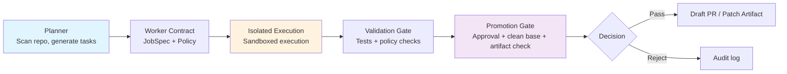

# Autonomous Agent Stack

**Build trustworthy agent infrastructure across machines, identities, and organizations.**

[](https://github.com/srxly888-creator/autonomous-agent-stack/actions/workflows/ci.yml)
[](https://github.com/srxly888-creator/autonomous-agent-stack/actions/workflows/quality-gates.yml)
[](docs/rfc/)

[**简体中文**](README.zh-CN.md) | English

---

## Why AAS?

Most AI agent projects give agents direct access to codebases. **This is dangerous.**

AAS takes a different approach:

| Traditional Agents | AAS |
|-------------------|-----|
| Agent can `git push` directly | Agent only produces patches |
| Agent owns repository write access | Controlled execution + validation + approval |
| Single-point execution, hard to scale | Control plane / worker separation |
| State scattered everywhere | SQLite authoritative control plane |
| Security boundaries fuzzy | Zero-trust invariants: patch-only, deny-wins, single-writer |

## Core Architecture



### Key Design Principles

1. **Brain and Hand Separation**: Planning and execution are independent; promotion gate has final authority
2. **Patch-Only Default**: Workers can only edit files, never `git commit`/`push`
3. **Deny-Wins Policy Merging**: Stricter constraints always win, preventing permission escalation
4. **Single Writer Lease**: Mutable state operations require a global lock
5. **Runtime Artifact Isolation**: `logs/`, `.masfactory_runtime/` never enter source patches

## Quick Start

### Requirements

- Python 3.11+
- Docker or Colima (for ai-lab sandbox, optional)

### Installation

```bash
# Clone the repository
git clone https://github.com/srxly888-creator/autonomous-agent-stack.git
cd autonomous-agent-stack

# Install dependencies
make setup

# Health check
make doctor

# Start services
make start
```

Visit:
- API Docs: http://127.0.0.1:8001/docs
- Admin Panel: http://127.0.0.1:8001/panel
- Health Check: http://127.0.0.1:8001/health

### Verify Installation

```bash
# Run test suite
make test-quick

# Code quality checks
make hygiene-check
```

## What You Can Do With AAS

### 1. GitHub Repository Automation

```python
# Trigger repository analysis via API
POST /api/v1/github-assistant/triage
{
  "repo": "owner/repo",
  "issue_number": 123
}

# Let AI review PRs
POST /api/v1/github-assistant/review-pr
{
  "repo": "owner/repo",
  "pr_number": 456
}
```

### 2. Remote Worker Orchestration

```bash
# Linux remote node as OpenHands execution surface
OPENHANDS_RUNTIME=host make doctor-linux
OPENHANDS_RUNTIME=host make start
```

### 3. Custom Agent Skills

```bash
# Scan and load local skills
make agent-run AEP_AGENT=custom AEP_TASK="your task"

# Manage skill lifecycle
POST /api/v1/skills/register
POST /api/v1/skills/promote
```

### 4. Telegram Integration

```bash
# Configure environment variables
export AUTORESEARCH_TELEGRAM_BOT_TOKEN="your_token"
export AUTORESEARCH_TELEGRAM_ALLOWED_UIDS="your_uid"

# Trigger tasks via Telegram
# Send /review or /analyze in Telegram
```

## Documentation

| Document | For | Content |
|----------|-----|---------|
| [ARCHITECTURE.md](./ARCHITECTURE.md) | Everyone | Canonical architecture, zero-trust invariants |
| [WHY_AAS.md](./WHY_AAS.md) | Everyone | Why AAS exists and where we're going |
| [docs/QUICK_START.md](./docs/QUICK_START.md) | New Users | Detailed setup guide |
| [docs/linux-remote-worker.md](./docs/linux-remote-worker.md) | Ops | Linux remote node deployment |
| [docs/agent-execution-protocol.md](./docs/agent-execution-protocol.md) | Developers | AEP protocol specification |
| [docs/github-assistant-quickstart.md](./docs/github-assistant-quickstart.md) | GitHub Users | GitHub assistant usage guide |

## Roadmap

AAS is evolving into a distributed orchestration platform:

### Phase 1: Stable Release ✅
- Single-machine control plane + isolated execution
- SQLite authoritative state + artifact separation
- GitHub Assistant, Telegram integration
- OpenHands / Claude Code CLI adapters

### Phase 2: Distributed Execution (In Progress)
**RFC**: [docs/rfc/distributed-execution.md](./docs/rfc/distributed-execution.md)
- Linux control plane + Mac execution nodes
- Heartbeat + lease + durable queue
- Offline recovery with outbox/inbox pattern

### Phase 3: Multi-Machine Pools
**RFC**: [docs/rfc/three-machine-architecture.md](./docs/rfc/three-machine-architecture.md)
- Linux (OpenHands) + Mac mini (primary) + MacBook (identity-bound)
- Capability/pool routing instead of machine-hardcoded
- Intelligent task scheduling and failover

### Phase 4: Federation Network
**RFC**: [docs/rfc/federation-protocol.md](./docs/rfc/federation-protocol.md)
- Layered trust federation (open → trusted → strategic)
- Graduated resource sharing (compute / workers / agents)
- Revocable federation with audit boundaries

## Contributing

We welcome all forms of contributions!

### Quick Ways to Contribute

1. **Report Bugs**: Submit detailed descriptions in Issues
2. **Propose Features**: Open RFC Issues to discuss design
3. **Submit PRs**:
   - Fork the repository
   - Create a feature branch
   - Ensure CI and Quality Gates pass
   - Submit PR with description

### Developer Workflow

```bash
# 1. Create feature branch
git checkout -b feature/your-feature

# 2. Develop and test
make test-quick
make review-gates-local

# 3. Commit changes
git commit -m "feat: add your feature"

# 4. Push and create PR
git push origin feature/your-feature
```

### Code Standards

- **Python**: Follow PEP 8, use `mypy` for type checking
- **Security**: Pass `bandit` and `semgrep` scans
- **Tests**: New features require test coverage, maintain 80%+ coverage

See [CONTRIBUTING.md](CONTRIBUTING.md) for details.

## FAQ

<details>
<summary><b>Q: How is AAS different from other agent projects?</b></summary>

A: The core difference is **security architecture**. AAS separates "thinking" (planner), "execution" (worker), and "decision" (promotion gate). Agents cannot directly modify codebases—they must go through validation and approval. This mimics mature CI/CD processes instead of letting AI `git push` directly.
</details>

<details>
<summary><b>Q: Which AI backends are supported?</b></summary>

A: Currently supported:
- **OpenHands** (primary, controlled execution mode)
- **Claude Code CLI** (repository-level tasks)
- **Codex** / custom scripts (via AEP adapters)
</details>

<details>
<summary><b>Q: How to deploy in production?</b></summary>

A: See [docs/linux-remote-worker.md](docs/linux-remote-worker.md) for remote node deployment. The core idea: control plane on stable host, execution nodes can be any machine with GPU/special permissions.
</details>

## License

MIT License - see [LICENSE](./LICENSE)

## Acknowledgments

Inspired by excellent open-source projects:

- [MASFactory](https://github.com/BUPT-GAMMA/MASFactory) - Multi-agent orchestration framework
- [deer-flow](https://github.com/nxs9bg24js-tech/deer-flow) - Concurrent orchestration and sandbox isolation
- [OpenClaw](https://github.com/openclaw/openclaw) - Multi-channel access and skill system
- [AutoResearch](https://github.com/karpathy/autoresearch) - Karpathy loop

## Contact

- **GitHub Issues**: Technical discussions and bug reports
- **Discussions**: Architecture design and RFC discussions
- **Email**: srxly888@gmail.com

---

**Join us in building safer, more reliable AI agent infrastructure!** 🚀
