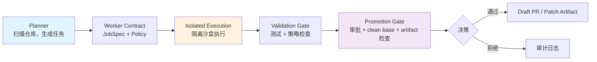

# Autonomous Agent Stack

**跨机器、跨身份、跨组织，构建可信的自治智能体协作底座。**

[](https://github.com/srxly888-creator/autonomous-agent-stack/actions/workflows/ci.yml)
[](https://github.com/srxly888-creator/autonomous-agent-stack/actions/workflows/quality-gates.yml)
[](docs/rfc/)

English | [**简体中文**](README.zh-CN.md)

---

## 为什么选择 AAS？

大多数 AI Agent 项目让智能体直接操作代码库——**这很危险**。

AAS 采用不同的架构哲学：

| 传统 Agent 项目 | AAS |
|----------------|-----|
| Agent 可直接 `git push` | Agent 只产出 patch |
| Agent 拥有仓库写权限 | 受控执行 + 验证 + 审批 |
| 单点执行，难以扩展 | Control Plane / Worker 分离 |
| 状态散落各处 | SQLite 权威控制面 |
| 安全边界模糊 | 零信任原则：patch-only、deny-wins、single-writer |

## 核心架构



### 关键设计原则

1. **脑手分离**：规划与执行独立，promotion gate 拥有最终决策权
2. **Patch-Only 默认**：Worker 只能编辑文件，禁止 `git commit`/`push` 等操作
3. **Deny-Wins 策略合并**：限制条件取更严格者，防止权限逃逸
4. **Single Writer Lease**：可变状态操作必须有全局唯一写锁
5. **Runtime Artifact 隔离**：`logs/`、`.masfactory_runtime/` 等永不进入 source patch

## 快速上手

### 环境要求

- Python 3.11+
- Docker 或 Colima（用于 ai-lab 沙盒，可选）

### 安装步骤

```bash
# 克隆仓库
git clone https://github.com/srxly888-creator/autonomous-agent-stack.git
cd autonomous-agent-stack

# 安装依赖
make setup

# 健康检查
make doctor

# 启动服务
make start
```

启动后可访问：
- API 文档：http://127.0.0.1:8001/docs
- 管理面板：http://127.0.0.1:8001/panel
- 健康检查：http://127.0.0.1:8001/health

### 验证安装

```bash
# 运行测试套件
make test-quick

# 代码质量检查
make hygiene-check
```

## 你可以用 AAS 做什么

### 1. GitHub 仓库自动化

```python
# 通过 API 触发仓库分析任务
POST /api/v1/github-assistant/triage
{
  "repo": "owner/repo",
  "issue_number": 123
}

# 让 AI 审查 PR
POST /api/v1/github-assistant/review-pr
{
  "repo": "owner/repo",
  "pr_number": 456
}
```

### 2. 远程 Worker 编排

```bash
# Linux 远端节点作为 OpenHands 执行面
OPENHANDS_RUNTIME=host make doctor-linux
OPENHANDS_RUNTIME=host make start
```

### 3. 自定义 Agent 技能

```bash
# 扫描并加载本地技能
make agent-run AEP_AGENT=custom AEP_TASK="your task"

# 托管技能生命周期
POST /api/v1/skills/register
POST /api/v1/skills/promote
```

### 4. Telegram 集成

```bash
# 配置环境变量
export AUTORESEARCH_TELEGRAM_BOT_TOKEN="your_token"
export AUTORESEARCH_TELEGRAM_ALLOWED_UIDS="your_uid"

# 通过 Telegram 触发任务
# 在 Telegram 中发送 /review 或 /analyze
```

## 文档导航

| 文档 | 适合谁 | 内容 |
|------|--------|------|
| [ARCHITECTURE.md](./ARCHITECTURE.md) | 所有人 | 权威架构总图，zero-trust invariants |
| [WHY_AAS.zh-CN.md](./WHY_AAS.zh-CN.md) | 所有人 | 为什么需要 AAS 以及发展方向 |
| [docs/QUICK_START.md](./docs/QUICK_START.md) | 新用户 | 详细启动指南 |
| [docs/linux-remote-worker.md](./docs/linux-remote-worker.md) | 运维 | Linux 远端节点部署 |
| [docs/agent-execution-protocol.md](./docs/agent-execution-protocol.md) | 开发者 | AEP 协议规范 |
| [docs/github-assistant-quickstart.md](./docs/github-assistant-quickstart.md) | GitHub 用户 | GitHub 助理使用指南 |
| [docs/rfc/README.zh-CN.md](./docs/rfc/README.zh-CN.md) | 架构爱好者 | RFC 索引与流程说明 |

## 发展路线

AAS 正在向分布式编排平台演进：

### Phase 1: 稳定版本 ✅
- 单机 control plane + 隔离执行
- SQLite 权威状态 + artifact 分离
- GitHub Assistant、Telegram 集成
- OpenHands / Claude Code CLI 适配器

### Phase 2: 分布式执行（进行中）
**RFC**: [docs/rfc/distributed-execution.md](./docs/rfc/distributed-execution.md)
- Linux 控制面 + Mac 执行节点
- 心跳 + 租约 + durable queue
- 离线恢复与 outbox/inbox 模式

### Phase 3: 多机异构池
**RFC**: [docs/rfc/three-machine-architecture.md](./docs/rfc/three-machine-architecture.md)
- Linux（OpenHands）+ Mac mini（主力）+ MacBook（身份绑定）
- Capability/pool 路由，而非机器硬编码
- 智能任务调度与故障转移

### Phase 4: 联邦网络
**RFC**: [docs/rfc/federation-protocol.md](./docs/rfc/federation-protocol.md)
- 分层信任联邦（开放 → 互信 → 战略）
- 算力/worker/agent 分级共享
- 可撤销建交与审计边界

## 贡献指南

我们欢迎各种形式的贡献！

### 快速贡献途径

1. **报告 Bug**：在 Issues 中提交详细描述
2. **提议新功能**：打开 RFC Issue 讨论设计
3. **提交 PR**：
   - Fork 仓库
   - 创建特性分支
   - 确保通过 CI 和 Quality Gates
   - 提交 PR 并描述变更

### 开发者工作流

```bash
# 1. 创建特性分支
git checkout -b feature/your-feature

# 2. 开发并测试
make test-quick
make review-gates-local

# 3. 提交变更
git commit -m "feat: add your feature"

# 4. 推送并创建 PR
git push origin feature/your-feature
```

### 代码规范

- **Python**：遵循 PEP 8，使用 `mypy` 类型检查
- **安全**：通过 `bandit` 和 `semgrep` 扫描
- **测试**：新功能需要测试覆盖，保持 80%+ 覆盖率

详见 [CONTRIBUTING.zh-CN.md](CONTRIBUTING.zh-CN.md)。

## 常见问题

<details>
<summary><b>Q：AAS 和其他 Agent 项目有什么区别？</b></summary>

A：核心区别在于 **安全架构**。AAS 把"思考"（planner）、"执行"（worker）和"决策"（promotion gate）三层分离，智能体不能直接修改代码库，必须经过验证和审批。这模仿了成熟的 CI/CD 流程，而不是让 AI 直接 `git push`。
</details>

<details>
<summary><b>Q：支持哪些 AI 后端？</b></summary>

A：当前支持：
- **OpenHands**（主力，受控执行模式）
- **Claude Code CLI**（仓库级任务）
- **Codex** / 自定义脚本（通过 AEP 适配器）
</details>

<details>
<summary><b>Q：如何在生产环境部署？</b></summary>

A：参考 [docs/linux-remote-worker.md](docs/linux-remote-worker.md) 进行远端节点部署。核心思路是：控制面在稳定主机，执行节点可以是任意有 GPU/特殊权限的机器。
</details>

## 许可证

MIT License - 详见 [LICENSE](./LICENSE)

## 致谢

本项目深受以下开源项目启发：

- [MASFactory](https://github.com/BUPT-GAMMA/MASFactory) - 多智能体编排框架
- [deer-flow](https://github.com/nxs9bg24js-tech/deer-flow) - 并发编排与沙盒隔离
- [OpenClaw](https://github.com/openclaw/openclaw) - 多渠道接入与技能系统
- [AutoResearch](https://github.com/karpathy/autoresearch) - Karpathy 循环

## 联系方式

- **GitHub Issues**：技术讨论和 Bug 报告
- **Discussions**：架构设计和 RFC 讨论
- **Email**：srxly888@gmail.com

---

**让我们一起构建更安全、更可靠的 AI Agent 基础设施！** 🚀
