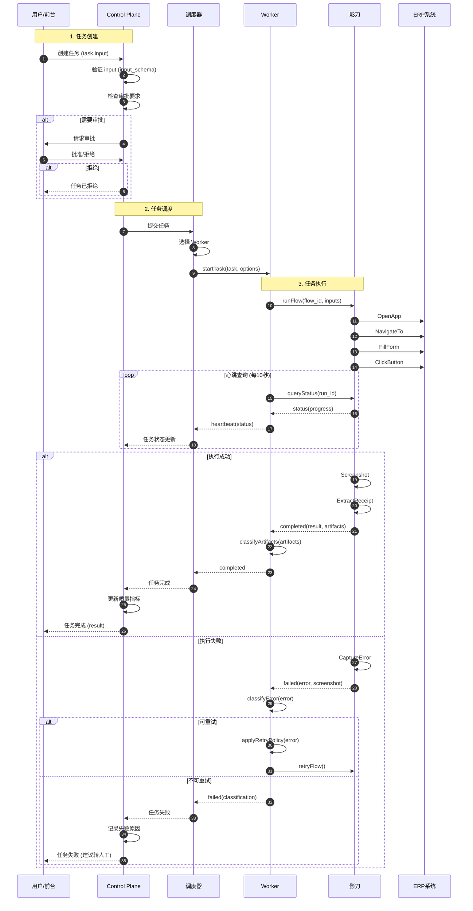
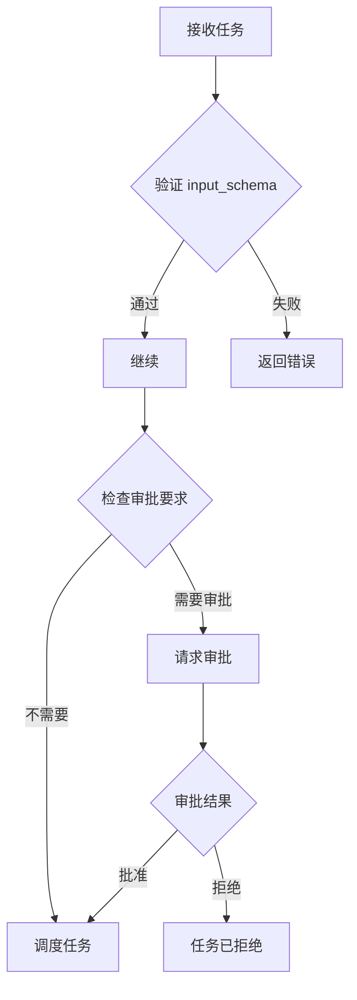
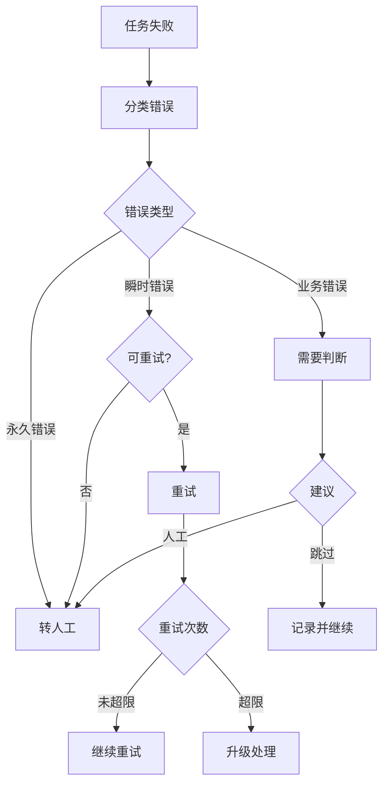
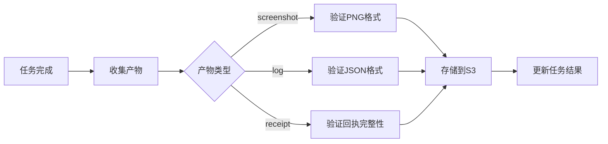

# Task Execution Sequence Flow

> **最后更新**: 2026-03-31 15:25
> **状态**: 已冻结

---

## 完整执行流程



---

## 关键决策点

### 1. 输入验证



### 2. 错误处理



### 3. 产物收集



---

## 数据流

### 输入数据

```
User (前台)
  → {customer_name: "张三", order_id: "ORD20260331", amount: 1500.00}
  → Control Plane (验证 input_schema)
  → Scheduler (选择 Worker)
  → Worker (准备 options)
  → Yingdao (执行 flow)
  → ERP (录入数据)
```

### 输出数据

```
ERP (回执)
  → Yingdao (提取 receipt)
  → Worker (包装 artifacts)
  → Scheduler (更新状态)
  → Control Plane (记录质量指标)
  → User (返回结果)
  → {success: true, receipt: {...}, artifacts: [...]}
```

---

## 错误流

### 瞬时错误 (可重试)

```
NETWORK_ERROR
  → Worker (classifyError)
  → {category: 'transient', retryable: true}
  → Worker (applyRetryPolicy)
  → retry after 5000ms
  → Yingdao (retryFlow)
```

### 永久错误 (需人工)

```
ELEMENT_NOT_FOUND
  → Worker (classifyError)
  → {category: 'permanent', retryable: false}
  → Worker (不重试)
  → Scheduler (转人工)
  → Control Plane (记录原因)
  → User (通知转人工)
```

### 业务错误 (需判断)

```
DUPLICATE_RECORD
  → Worker (classifyError)
  → {category: 'business', suggested_action: 'skip'}
  → Worker (跳过)
  → Scheduler (标记完成)
  → Control Plane (记录)
  → User (通知记录已存在)
```

---

## 性能指标

### 关键时间点

| 时间点 | 说明 | 预期值 |
|--------|------|--------|
| 创建到调度 | 任务进入队列 | < 1s |
| 调度到启动 | Worker 开始执行 | < 5s |
| 启动到完成 | 任务执行完成 | ~15s |
| 心跳间隔 | 状态查询频率 | 10s |
| 完整流程 | 端到端时间 | < 30s |

### 质量指标

| 指标 | 目标值 | 当前值 |
|------|--------|--------|
| 成功率 | ≥ 95% | - |
| 平均执行时间 | ≤ 20s | - |
| 重试率 | ≤ 10% | - |
| 审批通过率 | ≥ 80% | - |

---

## 验收标准

- [ ] Sequence diagram 完整描述执行流程
- [ ] 所有关键决策点都有标注
- [ ] 数据流清晰可追踪
- [ ] 错误流处理完整
- [ ] 性能指标有明确目标

---

## 下一步

- [ ] 实现调度器
- [ ] 实现 Worker
- [ ] 实现错误分类器
- [ ] 写单元测试
