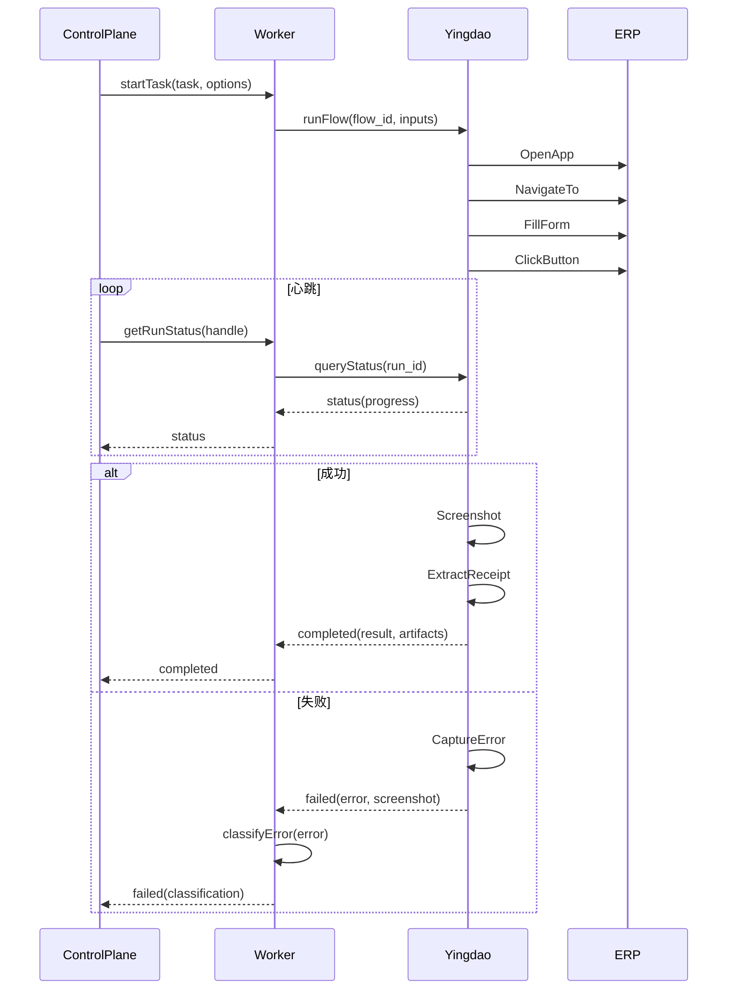

# Win+影刀 Worker Contract v0

> **最后更新**: 2026-03-31 15:20
> **状态**: 已冻结

---

## 接口定义

### 核心方法 (5个)

```typescript
interface YingdaoWorker {
  /**
   * 启动任务
   */
  startTask(task: Task, options: YingdaoTaskOptions): Promise<YingdaoTaskHandle>;

  /**
   * 查询运行状态
   */
  getRunStatus(handle: YingdaoTaskHandle): Promise<YingdaoRunStatus>;

  /**
   * 拉取产物
   */
  getArtifacts(handle: YingdaoTaskHandle): Promise<YingdaoArtifact[]>;

  /**
   * 取消运行
   */
  cancelRun(handle: YingdaoTaskHandle): Promise<void>;

  /**
   * 分类错误
   */
  classifyError(error: Error): YingdaoErrorClassification;
}
```

---

## 数据结构

### YingdaoTaskOptions

```typescript
interface YingdaoTaskOptions {
  flow_id: string;                  // 必须: Flow ID
  flow_version?: string;            // 可选: Flow 版本
  inputs: Record<string, any>;      // 必须: Flow 输入参数
  timeout_ms?: number;              // 可选: 超时时间 (默认 300000)
  screenshot_interval_ms?: number;  // 可选: 截图间隔 (默认 5000)
  save_logs?: boolean;              // 可选: 是否保存日志 (默认 true)
}
```

### YingdaoTaskHandle

```typescript
interface YingdaoTaskHandle {
  task_id: string;                  // 任务 ID (来自 Task)
  worker_id: string;                // Worker ID
  flow_run_id: string;              // 影刀内部的 run_id
  windows_session_id: string;       // Windows 会话 ID
  started_at: Date;                 // 启动时间
}
```

### YingdaoRunStatus

```typescript
interface YingdaoRunStatus {
  task_id: string;                  // 任务 ID
  flow_run_id: string;              // Flow Run ID
  status: 'running' | 'completed' | 'failed' | 'cancelled';

  // 进度信息
  progress: {
    current_step: number;           // 当前步骤 (从 1 开始)
    total_steps: number;            // 总步骤数
    current_step_name: string;      // 当前步骤名称
    percent: number;                // 百分比 (0-100)
  };

  // 时间信息
  started_at: Date;                 // 开始时间
  updated_at: Date;                 // 更新时间
  completed_at?: Date;              // 完成时间

  // 错误信息
  error?: YingdaoError;

  // 检查点
  checkpoints?: Checkpoint[];
}
```

### YingdaoError

```typescript
interface YingdaoError {
  code: YingdaoErrorCode;           // 错误码
  message: string;                  // 错误消息
  step_name?: string;               // 出错的步骤
  screenshot_path?: string;         // 错误截图路径
  log_path?: string;                // 错误日志路径

  // 详细信息
  details: {
    error_type: string;             // 错误类型

    // 元素未找到
    element_not_found?: {
      selector: string;             // 选择器
      search_duration_ms: number;   // 搜索时长
    };

    // 超时
    timeout?: {
      expected_duration_ms: number; // 期望时长
      actual_duration_ms: number;   // 实际时长
    };

    // 应用崩溃
    application_crash?: {
      app_name: string;             // 应用名称
      crash_time: Date;             // 崩溃时间
    };
  };

  retryable: boolean;               // 是否可重试
  suggested_action: 'retry' | 'retry_with_delay' | 'manual' | 'skip' | 'escalate';
}
```

### YingdaoArtifact

```typescript
interface YingdaoArtifact {
  type: 'screenshot' | 'log' | 'receipt' | 'excel' | 'pdf' | 'metadata';
  path: string;                     // 文件路径
  size_bytes: number;               // 文件大小
  mime_type: string;                // MIME 类型
  created_at: Date;                 // 创建时间
  metadata: Record<string, any>;    // 元数据

  // 影刀特定
  flow_run_id: string;              // Flow Run ID
  step_name?: string;               // 步骤名称

  // 截图特定
  screenshot_info?: {
    element_selector?: string;      // 元素选择器
    before_action?: boolean;        // 动作前截图
    after_action?: boolean;         // 动作后截图
    on_error?: boolean;             // 错误时截图
  };

  // 回执特定
  receipt_info?: {
    system: string;                 // 系统 (ERP/CRM)
    record_id: string;              // 记录 ID
    timestamp: Date;                // 时间戳
    operator: string;               // 操作员
  };
}
```

---

## 错误分类 (15+ 种)

### 应用层错误 (4种)

```typescript
enum YingdaoErrorCode {
  APP_NOT_FOUND = 'APP_NOT_FOUND',
  APP_CRASHED = 'APP_CRASHED',
  APP_TIMEOUT = 'APP_TIMEOUT',
  APP_NOT_RESPONDING = 'APP_NOT_RESPONDING',
}
```

### 元素定位错误 (5种)

```typescript
enum YingdaoErrorCode {
  ELEMENT_NOT_FOUND = 'ELEMENT_NOT_FOUND',
  ELEMENT_NOT_VISIBLE = 'ELEMENT_NOT_VISIBLE',
  ELEMENT_NOT_INTERACTABLE = 'ELEMENT_NOT_INTERACTABLE',
  AMBIGUOUS_SELECTOR = 'AMBIGUOUS_SELECTOR',
  ELEMENT_OBSURED = 'ELEMENT_OBSURED',
}
```

### 输入错误 (4种)

```typescript
enum YingdaoErrorCode {
  INVALID_INPUT = 'INVALID_INPUT',
  INPUT_OUT_OF_RANGE = 'INPUT_OUT_OF_RANGE',
  REQUIRED_FIELD_MISSING = 'REQUIRED_FIELD_MISSING',
  INPUT_TYPE_MISMATCH = 'INPUT_TYPE_MISMATCH',
}
```

### 流程错误 (4种)

```typescript
enum YingdaoErrorCode {
  STEP_FAILED = 'STEP_FAILED',
  FLOW_NOT_FOUND = 'FLOW_NOT_FOUND',
  FLOW_VERSION_MISMATCH = 'FLOW_VERSION_MISMATCH',
  FLOW_EXECUTION_ERROR = 'FLOW_EXECUTION_ERROR',
}
```

### 系统错误 (5种)

```typescript
enum YingdaoErrorCode {
  SYSTEM_TIMEOUT = 'SYSTEM_TIMEOUT',
  SYSTEM_RESOURCE_EXHAUSTED = 'SYSTEM_RESOURCE_EXHAUSTED',
  NETWORK_ERROR = 'NETWORK_ERROR',
  FILE_NOT_FOUND = 'FILE_NOT_FOUND',
  PERMISSION_DENIED = 'PERMISSION_DENIED',
}
```

### 业务错误 (4种)

```typescript
enum YingdaoErrorCode {
  VALIDATION_FAILED = 'VALIDATION_FAILED',
  DUPLICATE_RECORD = 'DUPLICATE_RECORD',
  BUSINESS_RULE_VIOLATION = 'BUSINESS_RULE_VIOLATION',
  DATA_CONFLICT = 'DATA_CONFLICT',
}
```

---

## 错误分类规则

### 瞬时错误 (可重试)

| 错误码 | 重试延迟 | 最大重试 | 说明 |
|--------|----------|----------|------|
| APP_TIMEOUT | 5000ms | 3 | 应用超时 |
| NETWORK_ERROR | 3000ms | 5 | 网络错误 |
| SYSTEM_TIMEOUT | 10000ms | 2 | 系统超时 |
| ELEMENT_NOT_VISIBLE | 2000ms | 3 | 元素暂时不可见 |

### 永久错误 (需人工)

| 错误码 | 建议 | 说明 |
|--------|------|------|
| ELEMENT_NOT_FOUND | manual | 元素不存在 |
| APP_CRASHED | escalate | 应用崩溃 |
| PERMISSION_DENIED | manual | 权限不足 |
| INVALID_INPUT | manual | 输入无效 |

### 业务错误 (需判断)

| 错误码 | 建议 | 说明 |
|--------|------|------|
| VALIDATION_FAILED | manual | 验证失败 |
| DUPLICATE_RECORD | skip | 记录重复，跳过 |
| BUSINESS_RULE_VIOLATION | manual | 违反业务规则 |

---

## Sequence Diagram

### 完整执行流程



---

## 实现示例

### 基本使用

```typescript
import { YingdaoWorker, YingdaoTaskOptions } from '@agent-control-plane/workers';

// 创建 worker
const worker = new YingdaoWorker({
  windows_host: '192.168.1.100',
  yingdao_api_url: 'http://192.168.1.100:8080',
  yingdao_api_key: 'your-api-key'
});

// 启动任务
const options: YingdaoTaskOptions = {
  flow_id: 'form_fill_flow_v1',
  inputs: {
    customer_name: '张三',
    order_id: 'ORD20260331',
    amount: 1500.00
  },
  timeout_ms: 300000,
  screenshot_interval_ms: 5000
};

const handle = await worker.startTask(task, options);

// 查询状态
const status = await worker.getRunStatus(handle);
console.log(`Progress: ${status.progress.percent}%`);

// 获取产物
const artifacts = await worker.getArtifacts(handle);
const screenshot = artifacts.find(a => a.type === 'screenshot');

// 取消任务
if (needToCancel) {
  await worker.cancelRun(handle, '用户取消');
}
```

---

## 验收标准

- [ ] 接口定义完整，所有方法都有签名
- [ ] 数据结构清晰，所有字段都有类型
- [ ] 错误分类完整，15+ 种错误码
- [ ] 有 sequence diagram 说明流程
- [ ] 有使用示例
- [ ] 能照着文档实现一个 worker

---

## 下一步

- [ ] 实现影刀 worker
- [ ] 写单元测试
- [ ] 写集成测试
