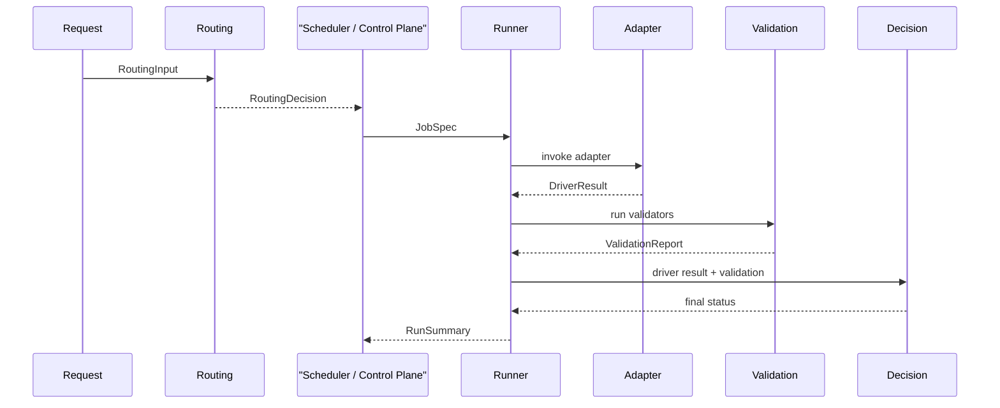

# Agent Contract And Routing Foundation

## Scope

This slice defines the shared platform contract for multi-agent execution and a
thin routing decision layer.

It does not implement any agent-specific business behavior.
It does not replace the runner.
It does not introduce a second decision engine, status enum, or patch gate.

## Shared Surface Area

Only this contract layer is shared across agents:

- `JobSpec`
- `DriverResult`
- `ExecutionPolicy`
- `ValidatorSpec`
- `FallbackStep`
- `RunSummary`
- `RoutingInput`
- `RoutingDecision`

Principle: share declarative contracts, not orchestration internals.

## Ownership Boundaries

| Contract | Owned By | Written By | Read By | Notes |
| --- | --- | --- | --- | --- |
| `AgentManifest` | driver/agent integration | adapter owner | routing, runner | Declares capability, entrypoint, default mode, and policy defaults. |
| `ExecutionPolicy` | scheduler/control plane | scheduler/control plane | routing, runner, adapter | Routing may suggest an additive overlay upstream. Hard policy still wins later. |
| `ValidatorSpec` | scheduler/control plane | scheduler/control plane | runner | Routing may only point at a validator profile id; runner still executes validators from `JobSpec`. |
| `FallbackStep` | scheduler/control plane | scheduler/control plane | runner | Routing does not own fallback. Runner remains the only fallback coordinator. |
| `JobSpec` | scheduler/control plane | scheduler/control plane | runner, adapter | Materialized after routing. Adapter reads it but does not own control fields. |
| `DriverResult` | adapter attempt contract | adapter, or runner for synthetic contract/policy failures | runner, decision, downstream observers | Adapter supplies normal attempt outcomes. Runner may synthesize `contract_error` or clamp to `policy_blocked`. |
| `RunSummary` | runner/control plane | runner | APIs, UIs, downstream systems | Terminal summary after validation and decision. Routing never writes terminal status. |
| `RoutingInput` | request-side control plane | scheduler/control plane | routing | Read-only decision input. |
| `RoutingDecision` | routing foundation | routing | scheduler/control plane | Declarative selection only: who to run and which additive profiles to attach. |

## Routing Foundation

### Minimal Input

`RoutingInput` contains only:

- `task`
- `metadata`
- `requested_agent_id` (optional)
- `capability_hint` (optional)
- `policy_profile_hint` (optional)
- `validator_profile_hint` (optional)
- `mode_hint` (optional)

### Minimal Output

`RoutingDecision` contains only:

- `selected_agent_id`
- `selected_mode`
- `policy_overlay_id` / `policy_overlay` (optional, additive only)
- `validator_profile_id` (optional)
- `rationale`

`RoutingDecision` must not contain:

- `fallback`
- `retry`
- `run_now`
- `dispatch_target`
- `promotion_mode`
- `commit` / `push`
- any execution-state or terminal-status field

### Decision Point

Routing happens before `JobSpec` is materialized and before the runner is
called.

The order is:

1. Incoming request or scheduler intent
2. Routing reads `RoutingInput`
3. Control plane materializes `JobSpec` from the decision
4. Runner executes the job
5. Validators run
6. Decision derives terminal state

Routing is upstream configuration, not downstream execution control.

Manifest directory scan order is not routing priority.
Selection priority is explicit only:

1. `requested_agent_id`
2. explicit `default_agent_id`
3. single eligible candidate
4. otherwise fail closed as ambiguous

### Materialization Bridge

`src/autoresearch/routing/builder.py` is the dedicated control-plane bridge
from routing into runner input.

Its responsibilities are intentionally narrow:

1. accept a scheduler-owned `ControlPlaneJobRequest`
2. call `RoutingResolver.decide(...)`
3. apply additive-only `policy_overlay` to the caller-provided job policy
4. expand an optional validator profile into concrete `ValidatorSpec` items
5. materialize the final `JobSpec`

It does not call the runner and does not own fallback execution, retry
coordination, or terminal status.

Builder is a control-plane materialization layer only. It does not perform
routing fallback, workflow orchestration, scheduling, or execution dispatch.

If routing cannot produce one valid declarative decision, builder must surface
that error unchanged. It must not pick the first manifest, invent a default
agent, or degrade ambiguity into execution.

## Hard Boundary Answers

### Where is the routing decision point?

Before `JobSpec` creation and before `AgentExecutionRunner.run_job(...)`.

### Can routing change policy?

Only additively, through an explicit `policy_overlay`.

Routing cannot:

- mutate hard policy
- mutate manifest defaults
- widen the scheduler-owned job policy
- bypass `build_effective_policy(...)`
- widen execution beyond deny-wins policy merging

### Can routing change fallback?

No.

Fallback remains part of `JobSpec` and is executed only by the runner. Routing
has no fallback field and must not rewrite fallback on the fly.

### Can routing directly trigger an agent?

No.

Routing returns `RoutingDecision`. The scheduler/control plane still has to
materialize `JobSpec` and call the runner. Adapters are invoked only by the
runner.

## Sequence

## Explicit Non-Goals

- No repo-agent business implementation
- No adapter-internal execution logic takeover
- No second recommended-action or terminal-status enum
- No new orchestration engine beside the runner
- No agent-specific prompt templates or repository procedures in shared code
- No repo-agent-specific artifact schema in shared contract

## Forbidden Shared State

Do not share:

- agent internal execution context objects
- agent-specific state enums
- agent-specific artifact schemas
- repo-agent-only capability interpreters
- a second patch gate or decision helper

## Owning Areas

Control-plane single-source areas that must not be split across parallel branch
work:

- `src/autoresearch/agent_protocol/models.py`
- `src/autoresearch/agent_protocol/policy.py`
- `src/autoresearch/agent_protocol/decision.py`
- `src/autoresearch/executions/runner.py`
- `scripts/agent_run.py`

Foundation-branch area:

- `src/autoresearch/agent_protocol/**`
- `src/autoresearch/routing/**`
- `configs/agents/_shared*` for shared config if needed
- routing and protocol foundation docs

Agent-specific branch area:

- `configs/agents/<agent>.yaml`
- `drivers/<agent>_adapter.*`
- `docs/<agent>-*.md`
- agent-specific tests
- `src/autoresearch/agents/<agent>/**` or equivalent agent-local modules

## Degrade Strategy

If routing cannot produce a single valid decision, it must fail closed and hand
control back to the scheduler/control plane.

Examples:

- unknown requested agent id: reject routing input
- requested agent conflicts with capability hint: reject routing input
- multiple eligible agents without explicit override or configured default: reject routing input
- unknown policy or validator profile hint: reject routing input

The fallback for route failure is not "pick something and run it". The fallback
is "do not materialize a job until the control plane resolves the ambiguity".
