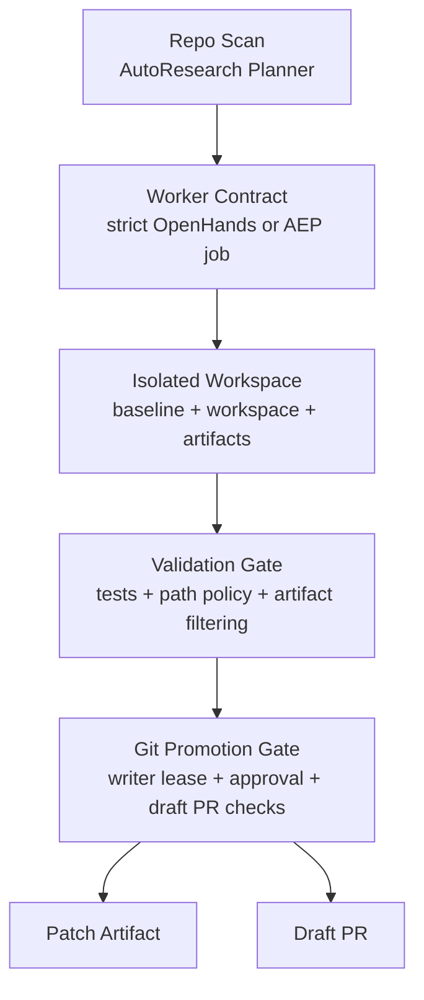

# Architecture

Compatibility mirror for legacy documentation links.

Canonical source: [`../ARCHITECTURE.md`](../ARCHITECTURE.md)

This file intentionally mirrors the current architecture in a docs-relative location because older docs, reports, and completeness checks still expect `docs/architecture.md` to exist. Keep this file aligned with the root `ARCHITECTURE.md`.

## Current System Summary

`autonomous-agent-stack` is currently a bounded control plane for autonomous repository changes, not an unconstrained self-editing agent.

The stable path is:

1. plan a bounded repository improvement,
2. execute it inside isolation,
3. validate the patch,
4. re-check promotion conditions,
5. emit either a patch artifact or a Draft PR.

That means the system is optimized for controlled mutation, not unrestricted autonomy.

## Canonical Mainline

The architectural principle is simple:

- planning may select work,
- workers may edit in isolation,
- promotion may upgrade the result,
- but no single layer owns all three powers.

## Zero-Trust Rules

### Brain and Hand Separation

OpenHands and other workers are execution hands, not the control plane.

The control plane lives in the repository code:

- planner services,
- execution contracts,
- validation logic,
- promotion gates,
- approval flows,
- writer leases.

### Patch-Only Default

Autonomous edits should default to patch-only mode.

The OpenHands worker prompt built by `src/autoresearch/core/services/openhands_worker.py` explicitly forbids direct git mutation commands such as commit, push, merge, rebase, reset, and checkout. The worker is expected to produce the smallest possible patch inside `allowed_paths`.

### Deny-Wins Policy Merge

The AEP layer merges policy with deny-wins behavior:

- forbidden paths widen,
- allowed paths narrow,
- stricter network mode wins,
- smaller mutation limits win.

This prevents a single request from widening safety boundaries beyond the manifest defaults.

### Single Writer Rule

`WriterLeaseService` is the repository's single-writer lock for dangerous mutable transitions.

It is used in the current codebase for:

- git promotion finalization,
- managed skill promotion,
- approval-linked mutation paths,
- and any place where two concurrent writers would create ambiguous state.

If a lease is unavailable, the system should block rather than guess.

### Runtime Artifacts Never Promote

The promotion path rejects runtime/control artifacts from source promotion. The active deny prefixes include:

- `logs/`
- `.masfactory_runtime/`
- `memory/`
- `.git/`

This rule exists in both the AEP patch filtering logic and the git promotion gate.

### Clean Base Requirement

Two current operations enforce a clean checkout:

- OpenHands CLI execution in `OpenHandsControlledBackendService`
- Draft PR upgrade in `GitPromotionGateService`

This prevents unrelated local changes from being mixed into agent output.

## Physical and Sandbox Topology

The physical environment is part of the architecture, not just an ops footnote.

### Host Layout

- host: MacBook Air M1
- runtime: Colima / Docker
- repository path: `/Volumes/AI_LAB/Github/autonomous-agent-stack`
- ai-lab writable roots:
  - `/Volumes/AI_LAB/ai_lab/workspace`
  - `/Volumes/AI_LAB/ai_lab/logs`
  - `/Volumes/AI_LAB/ai_lab/.cache`

`ai_lab.env` binds the current environment to those external disk paths and points Docker to the Colima socket. Capacity, cleanup, and mount behavior all assume that external-disk layout.

### Mount Behavior

`scripts/launch_ai_lab.sh` builds a layered mount strategy:

1. host source checkout remains the baseline,
2. the selected host root is mounted into the container at `/workspace` as read-only,
3. when OpenHands controlled execution needs a writable surface, an extra writable mount is attached at `/opt/workspace`,
4. controlled execution still snapshots into its own per-run baseline/workspace/artifact directories before validation or promotion.

In practical handoff language:

`Mac host source -> Colima -> ai-lab writable roots on /Volumes/AI_LAB -> isolated workspace -> isolated promotion worktree`

### Execution Isolation

`OpenHandsControlledBackendService` creates:

- `baseline/`
- `workspace/`
- `artifacts/`

under a per-run root. The main repo checkout is copied, not edited in place.

### Promotion Isolation

`GitPromotionGateService` and `GitPromotionService` create git worktrees under salted `/tmp` paths derived from the repo root hash. That salt is there to stop same-named repos from colliding.

Examples of the current patterns:

- `/tmp/<repo-name>-<repo-hash>/promotion-worktrees/<run-id>`
- `/tmp/repo-<repo-hash>/promotions/<promotion-id>/worktree`

This separation matters because promotion is intentionally a second isolation hop, not a continuation of execution isolation.

## Trust State Machines

### Managed Skill Ladder

Managed skills advance through:

`pending -> quarantined -> cold_validated -> promoted`

Interpretation:

- `pending`: request has been accepted but not yet trusted
- `quarantined`: copied into holding
- `cold_validated`: static and contract checks passed
- `promoted`: copied into the active skill root

Promotion to active runtime is guarded by a writer lease. The system is intentionally biased toward rejection or stalling over unsafe activation.

### Patch Promotion Ladder

Patch promotion begins with a patch artifact and then computes a preflight report.

Patch-level checks include:

- patch exists,
- forbidden paths are untouched,
- runtime artifacts are excluded,
- changed file count limit,
- patch line limit,
- no binary changes unless explicitly allowed,
- no direct write to the base branch,
- writer lease is available.

Draft PR adds stricter checks:

- remote is healthy,
- base repo is clean,
- credentials are available,
- target base branch exists,
- approval is granted.

If Draft PR cannot be safely upgraded but patch checks pass, the system degrades to patch mode.

## Controlled Execution Loop

### Planner

`AutoResearchPlannerService` is the current active-seeking layer.

It scans the repo for bounded, patch-friendly work. The current heuristics are intentionally simple and auditable:

- high-signal backlog markers such as `FIXME`, `BUG`, `HACK`, `XXX`, `TODO`
- source hotspots without a direct regression test

The planner emits three downstream-ready contracts:

- `OpenHandsWorkerJobSpec`
- `ControlledExecutionRequest`
- AEP `JobSpec`

This means downstream execution does not need to reinterpret a vague natural-language task. The contract is explicit from the start.

### Worker Contract

`OpenHandsWorkerService` turns the selected plan into a strict worker prompt:

- modify only allowed paths,
- never touch forbidden paths,
- do not perform git branching or commit actions,
- keep the patch minimal,
- leave promotion to the gate.

### Controlled Backend

`OpenHandsControlledBackendService` is the narrowest end-to-end path:

- snapshot repo,
- run backend,
- collect changed files,
- write patch artifact,
- detect scope violations,
- run validation command,
- hand result to promotion gate only if policy and validation pass.

If the repo root is dirty and the backend is OpenHands CLI, execution is blocked before it starts.

### AEP Runner

`AgentExecutionRunner` provides a contract-first execution path using:

`JobSpec -> driver adapter -> DriverResult -> validation -> promotion patch -> decision`

Both execution paths converge on the same architectural principle: promotion is downstream of validation and never worker-owned.

## Persistent State and Artifacts

The control plane stores typed metadata in SQLite repositories. This includes:

- approvals,
- managed skill installs,
- AutoResearch plans,
- execution runs,
- evaluations,
- capability snapshots,
- other API-visible state.

Per-run artifacts live on disk under runtime directories and include:

- specs,
- policies,
- logs,
- validation artifacts,
- patch files,
- summary JSON,
- event streams.

These runtime artifacts are intentionally excluded from promotion.

## Canonical Files to Read During Handoff

Start here when reloading context:

- `ARCHITECTURE.md`
- `memory/SOP/MASFactory_Strict_Execution_v1.md`
- `src/autoresearch/core/services/autoresearch_planner.py`
- `src/autoresearch/core/services/openhands_worker.py`
- `src/autoresearch/core/services/openhands_controlled_backend.py`
- `src/autoresearch/executions/runner.py`
- `src/autoresearch/core/services/git_promotion_gate.py`
- `src/autoresearch/core/services/managed_skill_registry.py`
- `src/autoresearch/core/services/writer_lease.py`
- `scripts/launch_ai_lab.sh`

## Red Lines

The current architecture is specifically designed to prevent:

- direct pushes to `main` by workers,
- direct activation of untrusted skill bundles,
- concurrent mutation of shared promotion state,
- runtime artifacts leaking into source patches,
- uncontrolled widening of worker scope,
- dirty local changes being mistaken for clean autonomous output.

Those are not future features to "unlock". They are intentional safety boundaries.
