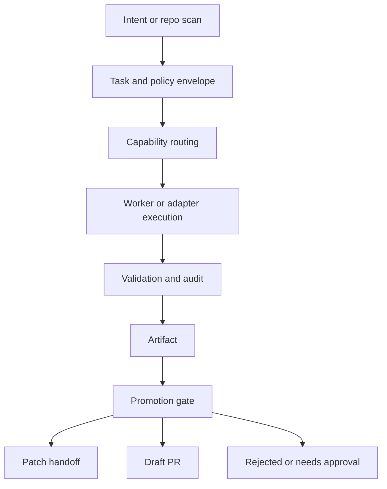

# Architecture

[Simplified Chinese](architecture.zh-CN.md)

This document is the canonical architecture handoff for the current `autonomous-agent-stack` repository. It describes the system that exists now, not the older aspirational diagrams preserved in archived reports.

If an archived document disagrees with this file, trust this file first and verify against code.

## What This Repository Is Now

Autonomous Agent Stack (AAS) is an evergreen control plane for governed agent execution. It is not an unconstrained self-editing agent and it is not a replacement for every agent framework. It sits above execution surfaces such as OpenHands, Hermes, OpenClaw, CrewAI, LangGraph, Haystack, MCP, A2A, local deterministic tools, and future adapters.

The control plane owns durable state, policy, approvals, audit, capability routing, worker leases, artifacts, and promotion. Runtimes provide execution capacity; they do not become the source of truth.

The current convergence path is:

```text
Session -> Task -> Policy/Approval -> Capability Routing -> Worker/Adapter Execution -> Audit/Event Log -> Artifact/Promotion
```

New development should target `/api/v2/*`. Legacy `/api/v1/*` and MVP governance endpoints remain only as compatibility surfaces while consumers migrate.

## Core Model

### Session

`Session` is durable execution history, not a copy of a context window. Summaries, timelines, handoff notes, prompt bundles, patches, and PR descriptions are projections from machine facts. Recovery and replay should start from facts rather than from prompt reconstruction.

### Task

`Task` captures intent and governance metadata. It is the unit that policy evaluates, approvals guard, workers claim, and users inspect. A task may have multiple runs over time, especially after retry or recovery.

### Run

`Run` is an execution projection. It records the attempt made by a worker or adapter, including status, events, artifacts, errors, and retry relationships. Retry creates a new run rather than rewriting the old one.

### Capability

`Capability` is the stable abstraction for something the system can route to: a worker-backed executor, deterministic tool, MCP server, federated peer, knowledge runtime, browser surface, or coding adapter.

### Policy

`Policy` decides boundaries: allowed paths, forbidden paths, network mode, approval requirements, risk tags, runtime limits, and promotion rules. Policies are replaceable seams, not hard-coded model assumptions.

### Artifact

`Artifact` is the result surface: patches, reports, citations, logs intended for review, generated files, or delivery payloads. Runtime state is not automatically a source artifact.

### Promotion

`Promotion` is the explicit gate that upgrades an artifact into a higher-privilege state such as a patch handoff, draft PR, release candidate, or production-facing output.

## Canonical Pipeline


```mermaid
flowchart TD
    A["Intent or repo scan"] --> B["Task and policy envelope"]
    B --> C["Capability routing"]
    C --> D["Worker or adapter execution"]
    D --> E["Validation and audit"]
    E --> F["Artifact"]
    F --> G["Promotion gate"]
    G --> H["Patch handoff"]
    G --> I["Draft PR"]
    G --> J["Rejected or needs approval"]
```

The pipeline is intentionally asymmetric:

- planning may select work,
- execution may produce a bounded result,
- validation may judge the result,
- promotion may upgrade the result,
- no single layer owns every power at once.

That separation is the primary safety mechanism.

## Zero-Trust Invariants

### Brain and Hand Separation

Planning, execution, validation, and promotion are separate responsibilities. A worker runtime can edit inside an isolated workspace, but it does not own repository authority, approval authority, or production promotion.

OpenHands, Codex, Hermes, OpenClaw, CrewAI, LangGraph, and similar integrations are execution hands. AAS remains the control plane above them.

### Patch-Only by Default

Autonomous coding work should default to patch-only execution. Workers can propose bounded source changes, but they should not directly run high-privilege git mutations such as committing, pushing, merging, rebasing, resetting, or checking out arbitrary branches.

The OpenHands worker prompt and the AEP runner both enforce this posture: produce the smallest reviewable patch inside the allowed scope, then let validation and promotion decide what happens next.

### Deny-Wins Policy Merge

Policy composition is conservative:

- forbidden paths widen,
- allowed paths narrow,
- stricter network mode wins,
- smaller mutation limits win,
- stricter approval requirements win,
- lower resource limits win.

A permissive request cannot override a stricter manifest, adapter default, or runtime policy.

### Single Writer for Mutable State

`WriterLeaseService` is the single-writer lock for dangerous mutable transitions. It is used for git promotion finalization, managed skill activation, approval-linked mutation flows, and other state changes where concurrent writers would create ambiguous history.

If a lease cannot be acquired, the system blocks rather than guessing.

### Runtime Artifacts Never Promote Implicitly

Runtime and control-plane artifacts do not become source changes by accident. Current deny prefixes include:

- `logs/`
- `.masfactory_runtime/`
- `memory/`
- `.git/`

This rule exists in both patch filtering and promotion checks. A file may only be promoted when it is intentionally part of the source artifact boundary.

### Clean Base Requirement

Draft PR promotion requires a clean base checkout. Controlled execution also refuses unsafe paths when unrelated local edits would be mixed into agent output. This prevents accidental promotion of human work, runtime debris, or unrelated local changes.

## Physical and Sandbox Topology

The implementation is designed to avoid depending on a single developer machine layout. Operators should configure paths through environment variables or repo-relative defaults rather than hard-coded absolute paths.

Recommended variables:

- `AAS_REPO_ROOT`: checkout root for this repository.
- `AAS_WORKSPACE_ROOT`: writable execution workspace root.
- `AAS_LOG_ROOT`: runtime log root.
- `AAS_CACHE_ROOT`: cache root for sandboxed tools.
- `AAS_STORAGE_ROOT`: optional external storage root.

The launcher and runbooks should refer to these variables or to paths relative to the current checkout. Machine-specific examples belong in private local notes, not public docs.

### Mount Model

The controlled execution model has two separate isolation phases:

1. Execution isolation creates a per-run baseline, writable workspace, and artifacts directory.
2. Promotion isolation creates a separate review or worktree surface before any result is upgraded.

Conceptually:

```text
host checkout
  -> runtime or container boundary
    -> configured writable workspace root
      -> per-run isolated workspace
        -> promotion worktree or patch artifact
```

The important property is not the exact host path. The important property is that source truth, execution workspace, and promotion workspace are distinct.

### Temporary Worktrees

Promotion worktrees may use salted paths under the operating system temporary directory, derived from repository identity. The salt prevents repositories with the same basename from colliding. Public docs should describe this as `$TMPDIR/<repo-id>/...` rather than embedding a developer-specific absolute path.

## Runtime and Adapter Boundary

Runtime adapters expose common lifecycle operations:

- create or bind a session,
- run work,
- stream or report progress,
- cancel when supported,
- report status,
- expose doctor information.

An adapter that cannot honestly support one of these semantics must mark the gap clearly. Mock-only runs, fake streams, no-op cancel, fake artifacts, or approval paths that only log without blocking are not stable behavior.

## Governed MCP and Tools

MCP and tool calls are routed through a governed broker. The broker is responsible for permission checks, quota checks, approval gates, audit events, and result capture before execution is treated as part of the system record.

This keeps tools below the control plane. A tool can perform useful work, but it should not silently become an independent authority boundary.

## Federation Boundary

Federation-ready v1 is intentionally bounded. It supports static peers, bilateral capability publication, worker or agent leases, quota ledgers, audit summaries, and governed task delivery.

It does not claim to implement an open marketplace, real-money settlement, dynamic bidding, or full dispute arbitration. Future market layers should reuse the same ledgers, lease records, and audit events rather than bypassing them.

## Current Code Entry Points

Start with these areas when changing behavior:

- FastAPI assembly and routers under `src/autoresearch/api/`.
- Control-plane task and run logic under `src/autoresearch/control_plane/`.
- Runtime and capability models under `src/autoresearch/agent_protocol/`.
- Worker, adapter, governance, and promotion services under `src/autoresearch/core/services/`.
- Runtime and capability configuration under `configs/`.
- Focused regression tests under `tests/` and `tests/ga/`.

## Documentation Boundary

Current public docs are language-separated:

- English canonical docs use `.md`.
- Simplified Chinese mirrors use `.zh-CN.md`.
- Historical reports and old checklists live under `docs/archive/**` and are not maintained as live architecture sources.

When updating architecture, update this file and `docs/architecture.zh-CN.md` together.
