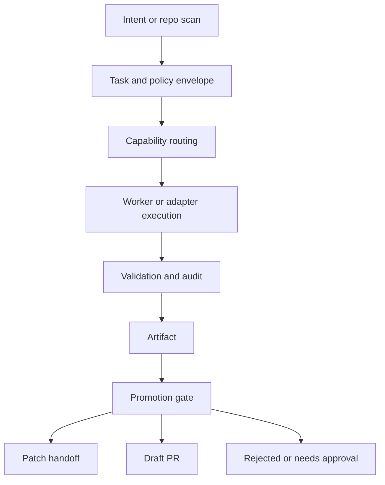

# 架构

[English](architecture.md)

本文是当前 `autonomous-agent-stack` 仓库的中文权威架构说明。它描述的是当前已经落地并应当继续维护的系统，而不是归档报告里保留的旧设想。

如果归档文档与本文不一致，优先相信本文，并回到代码中验证。

## 这个仓库现在是什么

Autonomous Agent Stack（AAS）是一套面向受治理 Agent 执行的 evergreen control plane。它不是不受约束的自我编辑 Agent，也不是要替代所有 Agent 框架。它位于 OpenHands、Hermes、OpenClaw、CrewAI、LangGraph、Haystack、MCP、A2A、本地确定性工具和未来 adapter 之上。

控制面负责 durable state、policy、approval、audit、capability routing、worker lease、artifact 和 promotion。runtime 提供执行能力，但不能成为事实源。

当前收敛路径是：

```text
Session -> Task -> Policy/Approval -> Capability Routing -> Worker/Adapter Execution -> Audit/Event Log -> Artifact/Promotion
```

新开发应优先面向 `/api/v2/*`。旧的 `/api/v1/*` 和 MVP governance endpoints 只作为迁移兼容面保留。

## 核心模型

### Session

`Session` 是持久执行历史，不是 context window 的副本。summary、timeline、handoff note、prompt bundle、patch 和 PR description 都是从机器事实投影出来的视图。恢复和 replay 应从 facts 开始，而不是从 prompt 重建开始。

### Task

`Task` 捕获意图和治理元数据。policy 会评估它，approval 会保护它，worker 会 claim 它，用户会查看它。一个 task 可以有多个 run，尤其是在 retry 或 recovery 之后。

### Run

`Run` 是一次执行投影。它记录 worker 或 adapter 的一次尝试，包括状态、事件、artifact、错误和 retry 关系。retry 应创建新的 run，而不是覆盖旧 run。

### Capability

`Capability` 是系统可路由对象的稳定抽象：worker-backed executor、deterministic tool、MCP server、federated peer、knowledge runtime、browser surface 或 coding adapter。

### Policy

`Policy` 决定边界：allowed paths、forbidden paths、network mode、approval requirements、risk tags、runtime limits 和 promotion rules。Policy 是可替换的系统缝合点，不应硬编码模型当下的能力假设。

### Artifact

`Artifact` 是结果表面：patch、report、citation、供 review 的 log、generated file 或 delivery payload。runtime state 不会自动变成 source artifact。

### Promotion

`Promotion` 是显式晋升门，用来把 artifact 升级为更高权限状态，例如 patch handoff、draft PR、release candidate 或面向生产的输出。

## 主路径



这条链路刻意保持不对称：

- planning 可以选择工作，
- execution 可以产出有边界的结果，
- validation 可以判断结果，
- promotion 可以升级结果，
- 没有任何单层同时拥有全部权力。

这种分离是主要安全机制。

## 零信任不变量

### 脑手分离

规划、执行、验证和晋升是不同职责。worker runtime 可以在隔离 workspace 中编辑，但不拥有仓库权限、审批权限或生产晋升权限。

OpenHands、Codex、Hermes、OpenClaw、CrewAI、LangGraph 等集成都是执行之手，AAS 是其上层控制面。

### 默认补丁式执行

自治 coding work 默认应是 patch-only。worker 可以提出有边界的源码改动，但不应直接运行 commit、push、merge、rebase、reset 或任意 checkout 这类高权限 git 变更。

OpenHands worker prompt 和 AEP runner 都遵守这一姿态：在 allowed scope 内生成最小可审查 patch，再由 validation 和 promotion 决定下一步。

### 更严格规则优先

Policy 合成保持保守：

- forbidden paths 变宽，
- allowed paths 变窄，
- network mode 取更严格者，
- mutation limits 取更小者，
- approval requirements 取更严格者，
- resource limits 取更低者。

一个宽松请求不能覆盖更严格的 manifest、adapter 默认值或 runtime policy。

### 可变状态单写者

`WriterLeaseService` 是危险可变状态转换的单写者锁。它用于 git promotion finalization、managed skill activation、approval-linked mutation flow，以及其他并发写入会制造歧义历史的地方。

拿不到 lease 时，系统应该阻断，而不是猜测。

### Runtime Artifact 不隐式晋升

runtime 和 control-plane artifacts 不会意外变成源码改动。当前重点拒绝前缀包括：

- `logs/`
- `.masfactory_runtime/`
- `memory/`
- `.git/`

这个规则同时存在于 patch filtering 和 promotion checks。文件只有在明确属于 source artifact 边界时才可晋升。

### 干净基线要求

Draft PR promotion 要求 base checkout 干净。Controlled execution 也会在无关本地改动可能混入 agent 输出时拒绝不安全路径。这能避免把人工改动、runtime debris 或其他无关变更错误晋升。

## 物理与沙箱拓扑

实现不应依赖单一开发机器布局。公开文档和脚本应通过环境变量或 repo-relative defaults 描述路径，而不是写死本机绝对路径。

推荐变量：

- `AAS_REPO_ROOT`：本仓库 checkout 根目录。
- `AAS_WORKSPACE_ROOT`：可写执行 workspace 根目录。
- `AAS_LOG_ROOT`：runtime log 根目录。
- `AAS_CACHE_ROOT`：沙箱工具 cache 根目录。
- `AAS_STORAGE_ROOT`：可选外部存储根目录。

launcher 和 runbook 应引用这些变量，或引用当前 checkout 的相对路径。机器专属示例应放在私有本地笔记，而不是公开文档。

### Mount Model

受控执行模型有两段隔离：

1. 执行隔离创建 per-run baseline、writable workspace 和 artifacts directory。
2. 晋升隔离在结果升级前创建独立 review 或 worktree surface。

概念上是：

```text
host checkout
  -> runtime or container boundary
    -> configured writable workspace root
      -> per-run isolated workspace
        -> promotion worktree or patch artifact
```

关键属性不是具体主机路径，而是 source truth、execution workspace 和 promotion workspace 必须彼此分离。

## Runtime、Tool 与 Federation 边界

Runtime adapter 暴露通用生命周期：create/bind session、run、stream/report、cancel、status 和 doctor。不能真实支持某项语义的 adapter 必须明确标注缺口。mock-only run、fake stream、no-op cancel、fake artifact 或只写日志不阻断的 approval path 不能标为 stable。

MCP 与 tool call 通过 governed broker 路由。broker 在执行前负责 permission、quota、approval、audit 和 result capture，避免 tool 悄悄变成独立控制面。

Federation-ready v1 只覆盖静态 peer、双边 capability publication、worker/agent lease、quota ledger、audit summary 和受治理 task delivery。它不声称实现开放市场、真实资金结算、动态竞价或完整争议仲裁。

## 当前代码入口

修改行为时优先看这些区域：

- `src/autoresearch/api/` 下的 FastAPI 装配与 routers。
- `src/autoresearch/control_plane/` 下的 task/run 控制面逻辑。
- `src/autoresearch/agent_protocol/` 下的 runtime/capability models。
- `src/autoresearch/core/services/` 下的 worker、adapter、governance 和 promotion services。
- `configs/` 下的 runtime/capability 配置。
- `tests/` 与 `tests/ga/` 下的聚焦回归测试。

## 文档边界

当前公开文档按语言分文件：

- 英文 canonical 使用 `.md`。
- 简体中文镜像使用 `.zh-CN.md`。
- 历史报告和旧 checklist 位于 `docs/archive/**`，不再作为当前架构事实源维护。

更新架构时，请同步更新本文和 `docs/architecture.md`。
