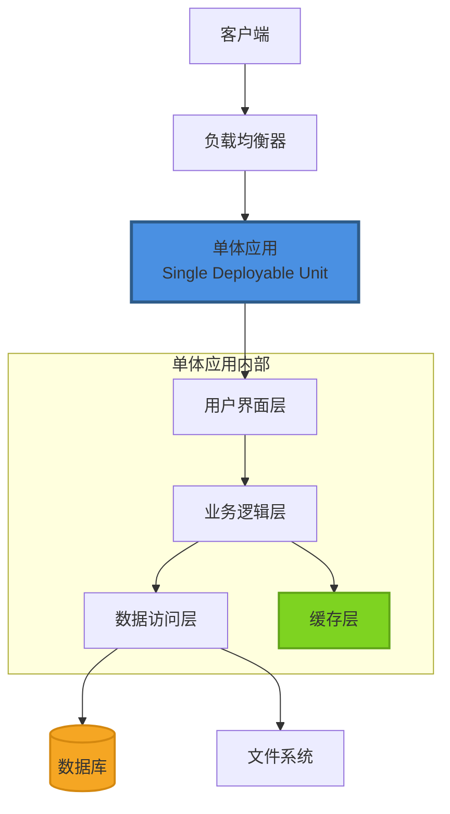
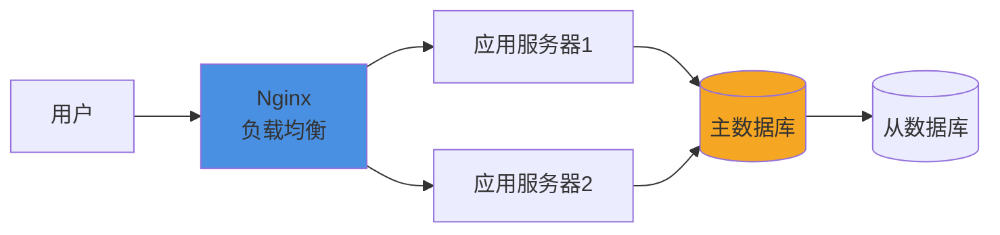

# 单体架构 (Monolithic Architecture)

## 概述

单体架构是一种将应用程序的所有功能模块打包成一个独立的、自包含的部署单元的架构模式。所有功能（用户界面、业务逻辑、数据访问等）都在同一个进程中运行。

## 架构图



## 核心组件

### 1. 用户界面层 (Presentation Layer)
- **职责**：处理 HTTP 请求、渲染视图、用户交互
- **技术**：HTML/CSS/JavaScript、模板引擎、前端框架
- **特点**：紧耦合业务逻辑，共享内存空间

### 2. 业务逻辑层 (Business Logic Layer)
- **职责**：实现核心业务规则、流程编排、数据验证
- **特点**：
  - 所有模块在同一进程内调用
  - 共享内存，性能高
  - 事务管理简单（ACID）

### 3. 数据访问层 (Data Access Layer)
- **职责**：数据持久化、查询优化、缓存管理
- **技术**：ORM 框架、SQL 数据库、NoSQL 数据库
- **特点**：直接数据库连接，统一事务边界

### 4. 缓存层 (Cache Layer)
- **职责**：减少数据库压力，提升响应速度
- **技术**：Redis、Memcached、本地缓存
- **策略**：应用级缓存、查询缓存、会话缓存

## 适用场景

### ✅ 推荐场景
1. **初创企业 / MVP 产品**
   - 快速迭代，验证商业模式
   - 团队规模小（5-10 人）
   - 开发周期短（3-6 个月）

2. **中小型项目**
   - 用户规模 < 100 万
   - QPS < 10,000
   - 业务逻辑相对简单

3. **内部工具 / 管理后台**
   - 用户群体固定
   - 性能要求不高
   - 快速交付优先

4. **对延迟敏感的应用**
   - 实时系统
   - 游戏服务器
   - 金融交易系统（低延迟）

### ❌ 不推荐场景
1. **超大规模系统**（日活千万级）
2. **需要独立扩展的模块**（如 AI 推理服务）
3. **多团队协作**（>20 人）
4. **需要高可用性**（99.99% 以上）

## 优势与劣势

### 优势 ✅

| 维度 | 说明 | 具体表现 |
|------|------|----------|
| **开发效率** | 统一代码库，简单直接 | - 代码复用容易<br/>- IDE 支持好<br/>- 调试简单 |
| **部署简单** | 一个可执行文件 | - 部署脚本简单<br/>- 版本管理清晰<br/>- 回滚快速 |
| **性能优异** | 进程内调用 | - 无网络开销<br/>- 事务简单（ACID）<br/>- 延迟低（ms 级） |
| **测试容易** | 集成测试简单 | - 端到端测试<br/>- Mock 依赖少<br/>- 测试覆盖率易达 80%+ |
| **运维成本低** | 单一部署单元 | - 监控简单<br/>- 日志集中<br/>- 故障排查容易 |
| **学习曲线平缓** | 技术栈统一 | - 新人上手快<br/>- 文档集中<br/>- 架构简单 |

### 劣势 ❌

| 维度 | 说明 | 具体表现 |
|------|------|----------|
| **可扩展性差** | 整体扩展 | - 无法按需扩展<br/>- 资源浪费<br/>- 成本高 |
| **技术栈僵化** | 统一技术选型 | - 难以引入新技术<br/>- 技术债务累积<br/>- 升级风险大 |
| **故障隔离弱** | 牵一发动全身 | - 单点故障<br/>- 内存泄漏影响全局<br/>- 重启影响所有用户 |
| **团队协作难** | 代码冲突频繁 | - 合并冲突多<br/>- 代码所有权模糊<br/>- 发布依赖强 |
| **代码腐化快** | 缺乏边界约束 | - 循环依赖<br/>- 职责混乱<br/>- 维护成本上升 |
| **部署风险高** | 全量发布 | - 回滚影响大<br/>- 发布周期长<br/>- 测试成本高 |

## 实现方案

### 1. 技术栈选型

#### 后端框架
```
Java Spring Boot / Python Django / Node.js Express / Go Gin
```

#### 数据库
```
PostgreSQL（关系型）+ Redis（缓存）
```

#### 前端框架
```
React / Vue / Angular
```

#### 部署方案
```
Docker + Nginx 反向代理
```

### 2. 代码结构（以 Spring Boot 为例）

```
src/main/java/com/example/
├── controller/          # 表现层
│   ├── UserController.java
│   └── OrderController.java
├── service/             # 业务逻辑层
│   ├── UserService.java
│   └── OrderService.java
├── repository/          # 数据访问层
│   ├── UserRepository.java
│   └── OrderRepository.java
├── model/               # 领域模型
│   ├── User.java
│   └── Order.java
├── config/              # 配置类
│   └── CacheConfig.java
└── Application.java     # 启动类
```

### 3. 关键配置

#### application.yml
```yaml
server:
  port: 8080

spring:
  datasource:
    url: jdbc:postgresql://localhost:5432/app_db
    username: app_user
    password: ${DB_PASSWORD}
    hikari:
      maximum-pool-size: 20
      minimum-idle: 5
  
  jpa:
    hibernate:
      ddl-auto: update
    show-sql: false
  
  cache:
    type: redis
    redis:
      time-to-live: 600000  # 10分钟

redis:
  host: localhost
  port: 6379
  password: ${REDIS_PASSWORD}
```

#### Dockerfile
```dockerfile
FROM openjdk:17-jdk-slim
WORKDIR /app
COPY target/app.jar app.jar
EXPOSE 8080
ENTRYPOINT ["java", "-Xms512m", "-Xmx2g", "-jar", "app.jar"]
```

## 部署方案

### 方案一：传统部署（单机/多机）



**部署步骤**：
1. 构建应用：`mvn clean package`
2. 构建 Docker 镜像：`docker build -t app:v1.0 .`
3. 部署到服务器：`docker run -d -p 8080:8080 app:v1.0`
4. 配置 Nginx 负载均衡
5. 配置数据库主从复制

### 方案二：云原生部署（Kubernetes）

```yaml
# deployment.yaml
apiVersion: apps/v1
kind: Deployment
metadata:
  name: monolithic-app
spec:
  replicas: 3
  selector:
    matchLabels:
      app: monolithic-app
  template:
    metadata:
      labels:
        app: monolithic-app
    spec:
      containers:
      - name: app
        image: app:v1.0
        ports:
        - containerPort: 8080
        resources:
          requests:
            memory: "1Gi"
            cpu: "500m"
          limits:
            memory: "2Gi"
            cpu: "1000m"
        livenessProbe:
          httpGet:
            path: /health
            port: 8080
          initialDelaySeconds: 30
          periodSeconds: 10
        readinessProbe:
          httpGet:
            path: /ready
            port: 8080
          initialDelaySeconds: 5
          periodSeconds: 5
---
apiVersion: v1
kind: Service
metadata:
  name: monolithic-app-service
spec:
  selector:
    app: monolithic-app
  ports:
  - port: 80
    targetPort: 8080
  type: LoadBalancer
```

### 方案三：无服务器部署（Serverless）

**AWS Lambda 示例**：
```yaml
# serverless.yml
service: monolithic-app

provider:
  name: aws
  runtime: java17
  region: us-east-1

functions:
  app:
    handler: com.example.Application::handleRequest
    events:
      - http:
          path: /{proxy+}
          method: ANY
    memorySize: 1024
    timeout: 30
```

## 最佳实践

### 1. 模块化设计
```java
// 使用包结构划分模块
com.example.
├── user/        // 用户模块
├── order/       // 订单模块
└── payment/     // 支付模块
```

### 2. 分层架构
```java
// 严格分层，避免跨层调用
Controller -> Service -> Repository
```

### 3. 依赖注入
```java
@Service
public class OrderService {
    private final OrderRepository orderRepo;
    private final PaymentService paymentService;
    
    // 构造器注入
    public OrderService(OrderRepository orderRepo, 
                        PaymentService paymentService) {
        this.orderRepo = orderRepo;
        this.paymentService = paymentService;
    }
}
```

### 4. 配置外部化
```yaml
# 使用环境变量和配置中心
spring:
  datasource:
    password: ${DB_PASSWORD}  # 环境变量
```

### 5. 健康检查
```java
@RestController
public class HealthController {
    @GetMapping("/health")
    public ResponseEntity<HealthStatus> health() {
        return ResponseEntity.ok(new HealthStatus("UP"));
    }
}
```

### 6. 优雅停机
```yaml
server:
  shutdown: graceful
spring:
  lifecycle:
    timeout-per-shutdown-phase: 30s
```

### 7. 日志管理
```java
// 结构化日志
log.info("Order created", 
    kv("order_id", orderId), 
    kv("user_id", userId), 
    kv("amount", amount));
```

### 8. 监控指标
```java
// Micrometer 指标
@Timed(value = "order.create", description = "Order creation time")
public Order createOrder(OrderRequest request) {
    // ...
}
```

## 性能优化

### 1. 数据库优化
- 使用连接池（HikariCP）
- 添加索引
- 查询优化（避免 N+1 问题）
- 读写分离

### 2. 缓存策略
```java
@Cacheable(value = "users", key = "#userId")
public User getUserById(Long userId) {
    return userRepository.findById(userId);
}

@CacheEvict(value = "users", key = "#user.id")
public void updateUser(User user) {
    userRepository.save(user);
}
```

### 3. 异步处理
```java
@Async
public CompletableFuture<Void> sendNotification(Long userId) {
    // 异步发送通知
}
```

### 4. 批量操作
```java
@Transactional
public void batchInsert(List<Order> orders) {
    orderRepository.saveAll(orders);  // 批量插入
}
```

## 扩展策略

### 垂直扩展（Scale Up）
- 增加服务器配置（CPU/内存）
- 优化 JVM 参数
- 使用更快的存储（SSD）

### 水平扩展（Scale Out）
- 部署多个实例
- 负载均衡（Nginx/HAProxy）
- 会话共享（Redis Session）

### 数据库扩展
- 主从复制（读写分离）
- 分库分表（Sharding）
- 使用缓存减少数据库压力

## 监控与运维

### 监控指标
1. **应用指标**：QPS、响应时间、错误率
2. **系统指标**：CPU、内存、磁盘、网络
3. **业务指标**：订单量、用户活跃度

### 日志聚合
```yaml
# logback-spring.xml
<appender name="JSON" class="ch.qos.logback.core.ConsoleAppender">
    <encoder class="net.logstash.logback.encoder.LogstashEncoder">
        <includeMdcKeyName>traceId</includeMdcKeyName>
    </encoder>
</appender>
```

### 告警规则
- 响应时间 > 1s 持续 5 分钟
- 错误率 > 5% 持续 3 分钟
- CPU 使用率 > 80% 持续 10 分钟

## 何时演进到微服务

### 触发条件（满足 3+ 项）
1. ✅ 团队规模 > 20 人
2. ✅ 用户规模 > 100 万
3. ✅ 代码量 > 10 万行
4. ✅ 部署频率 > 每周 2 次
5. ✅ 单个模块需要独立扩展
6. ✅ 不同模块技术栈需求不同
7. ✅ 故障隔离要求高

### 演进步骤
1. **模块化重构**（1-3 个月）
2. **服务拆分**（按业务边界）
3. **引入 API 网关**
4. **分布式事务处理**
5. **独立部署和监控**

## 案例分析

### 成功案例
- **Stack Overflow**：单体架构支撑数千万用户
- **Basecamp**：Rails 单体应用，团队 50+ 人
- **Shopify**：早期单体，后期渐进式拆分

### 关键经验
1. **不要过早优化**：先验证业务
2. **保持模块化**：为未来拆分做准备
3. **监控先行**：性能瓶颈早发现
4. **技术债务管理**：定期重构

## 总结

单体架构适合：
- 🎯 **快速启动**：3-6 个月上线
- 🎯 **中小规模**：用户 < 100 万
- 🎯 **小团队**：5-10 人
- 🎯 **简单业务**：模块耦合度高

**核心原则**：
- 从简单开始，按需演进
- 保持代码质量，避免腐化
- 监控驱动优化，数据说话
- 模块化设计，为拆分留后路

---

**下一步**：[微服务架构 →](./02-microservices-architecture.md)
