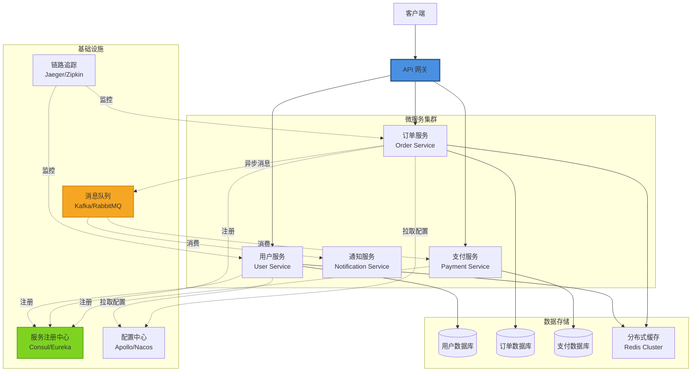
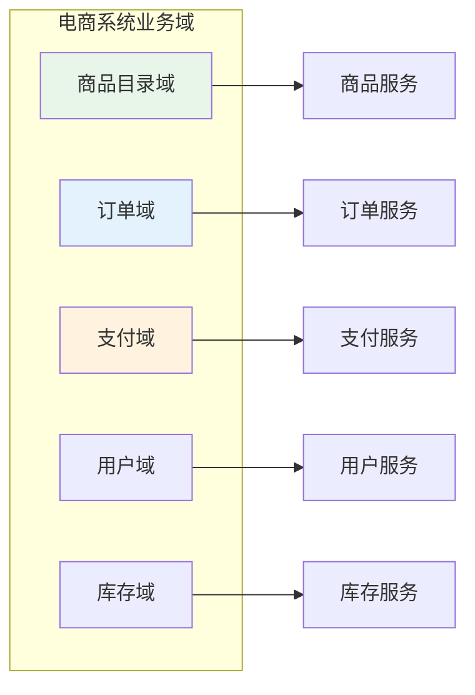
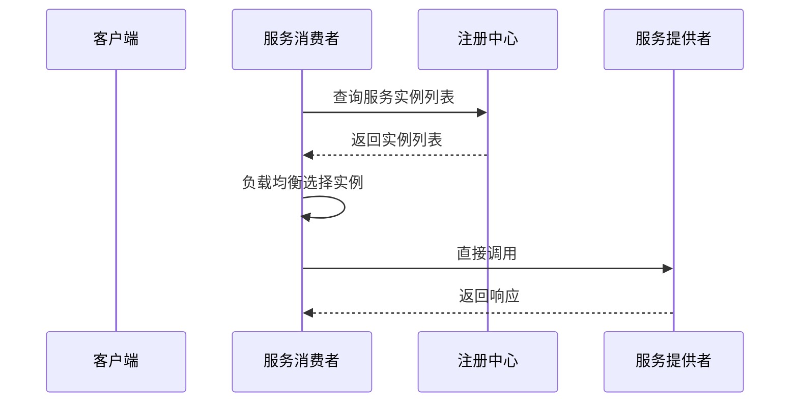
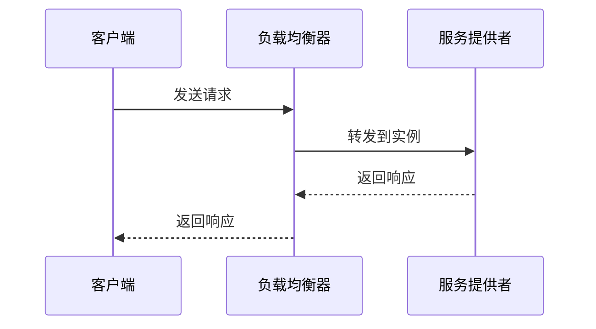
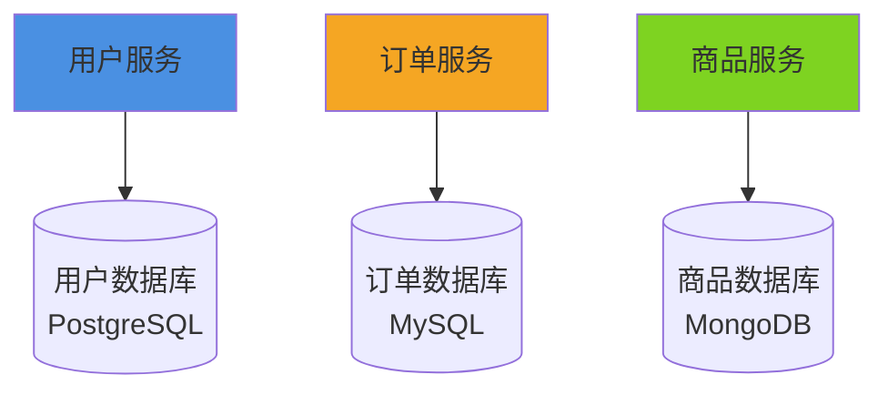
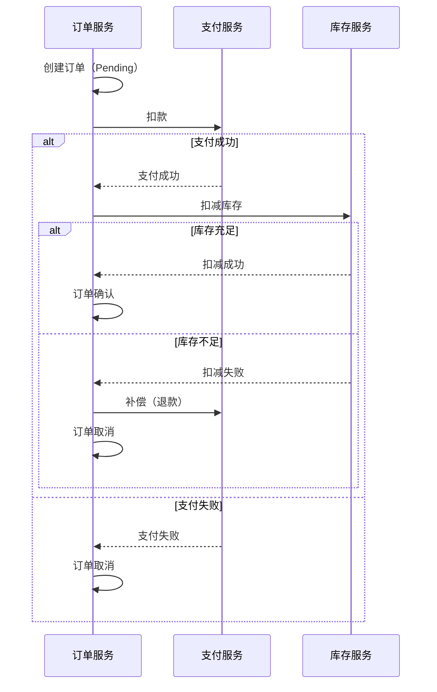
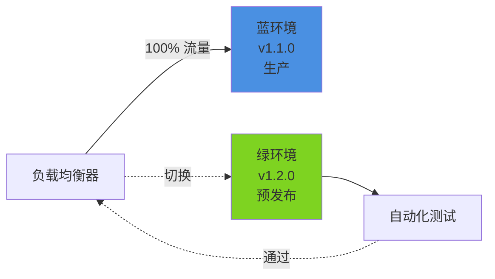
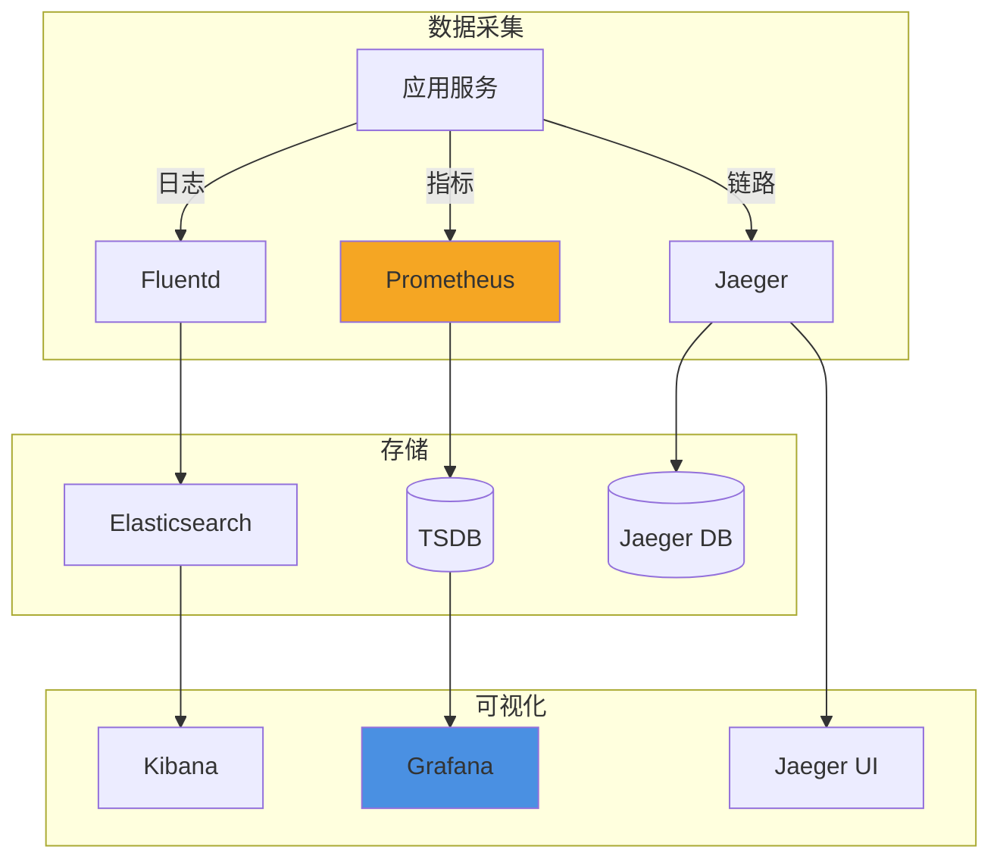

# 微服务架构 (Microservices Architecture)

## 概述

微服务架构是一种将应用程序拆分为多个小型、独立服务的架构模式。每个服务运行在自己的进程中，通过轻量级通信机制（通常是 HTTP/REST 或消息队列）进行交互，可以独立部署、扩展和维护。

## 架构图



## 核心组件

### 1. API 网关 (API Gateway)
- **职责**：
  - 路由转发
  - 负载均衡
  - 认证授权
  - 限流熔断
  - 日志聚合
- **技术选型**：Kong、Nginx、Spring Cloud Gateway、Traefik

### 2. 服务注册与发现
- **职责**：
  - 服务注册
  - 健康检查
  - 服务发现
  - 负载均衡策略
- **技术选型**：Consul、Eureka、Nacos、Zookeeper

### 3. 配置中心
- **职责**：
  - 集中配置管理
  - 动态配置更新
  - 环境隔离
  - 配置版本控制
- **技术选型**：Apollo、Nacos、Spring Cloud Config

### 4. 消息队列
- **职责**：
  - 异步通信
  - 解耦服务
  - 削峰填谷
  - 事件驱动
- **技术选型**：Kafka、RabbitMQ、RocketMQ、ActiveMQ

### 5. 链路追踪
- **职责**：
  - 请求链路追踪
  - 性能分析
  - 故障定位
  - 依赖分析
- **技术选型**：Jaeger、Zipkin、SkyWalking

### 6. 分布式缓存
- **职责**：
  - 数据缓存
  - 会话共享
  - 分布式锁
  - 消息发布订阅
- **技术选型**：Redis Cluster、Memcached

## 服务拆分策略

### 1. 按业务能力拆分（Domain-Driven Design）



**拆分原则**：
- 高内聚：同一业务逻辑聚合在一个服务
- 低耦合：服务间通过接口通信
- 单一职责：每个服务只负责一个业务能力
- 独立部署：服务可以独立开发、测试、部署

### 2. 按子域拆分（Bounded Context）

```java
// 限界上下文示例
public class OrderContext {
    // 订单上下文
    - Order Aggregate
    - OrderItem Entity
    - OrderService Domain Service
}

public class PaymentContext {
    // 支付上下文
    - Payment Aggregate
    - PaymentMethod Entity
    - PaymentService Domain Service
}
```

### 3. 服务粒度指南

| 指标 | 小粒度服务 | 中粒度服务 | 大粒度服务 |
|------|-----------|-----------|-----------|
| **代码行数** | 1,000-5,000 | 5,000-20,000 | 20,000-50,000 |
| **团队规模** | 2-3 人 | 3-5 人 | 5-8 人 |
| **功能数量** | 1-2 个 | 3-5 个 | 5-10 个 |
| **数据库表** | 1-3 张 | 3-10 张 | 10-20 张 |
| **适用场景** | 工具类服务 | 业务服务 | 核心业务 |

**经验法则**：
- ✅ 一个服务 = 一个业务能力
- ✅ 可以被一个小团队（Two-Pizza Team）独立维护
- ✅ 频繁变更的功能独立成服务
- ❌ 避免纳米服务（Nanoseconds，过于细粒度）
- ❌ 避免分布式单体（服务间强耦合）

## 通信机制

### 1. 同步通信（REST/gRPC）

#### REST API
```java
@RestController
@RequestMapping("/api/orders")
public class OrderController {
    
    @GetMapping("/{orderId}")
    public ResponseEntity<OrderDTO> getOrder(@PathVariable String orderId) {
        Order order = orderService.findById(orderId);
        return ResponseEntity.ok(OrderMapper.toDTO(order));
    }
    
    @PostMapping
    public ResponseEntity<OrderDTO> createOrder(@RequestBody CreateOrderRequest request) {
        Order order = orderService.create(request);
        return ResponseEntity
            .created(URI.create("/api/orders/" + order.getId()))
            .body(OrderMapper.toDTO(order));
    }
}
```

#### gRPC（高性能场景）
```protobuf
// order.proto
syntax = "proto3";

service OrderService {
    rpc GetOrder (GetOrderRequest) returns (OrderResponse);
    rpc CreateOrder (CreateOrderRequest) returns (OrderResponse);
}

message GetOrderRequest {
    string order_id = 1;
}

message OrderResponse {
    string order_id = 1;
    string user_id = 2;
    double total_amount = 3;
    repeated OrderItem items = 4;
}
```

### 2. 异步通信（消息队列）

#### 事件驱动通信
```java
// 订单服务发布事件
@Service
public class OrderService {
    
    @Autowired
    private KafkaTemplate<String, OrderEvent> kafkaTemplate;
    
    public Order createOrder(CreateOrderRequest request) {
        Order order = // 创建订单
        
        // 发布订单创建事件
        OrderEvent event = new OrderEvent(
            "ORDER_CREATED",
            order.getId(),
            order.getUserId(),
            order.getTotalAmount()
        );
        
        kafkaTemplate.send("order-events", order.getId(), event);
        
        return order;
    }
}

// 支付服务订阅事件
@KafkaListener(topics = "order-events")
public void handleOrderEvent(OrderEvent event) {
    if ("ORDER_CREATED".equals(event.getType())) {
        // 处理支付逻辑
        processPayment(event);
    }
}
```

### 3. 服务间通信模式

| 模式 | 优点 | 缺点 | 适用场景 |
|------|------|------|----------|
| **同步 REST** | 简单直接、调试容易 | 耦合度高、故障传播 | 查询类请求 |
| **gRPC** | 性能高、强类型 | 学习曲线、调试复杂 | 内部高频调用 |
| **消息队列** | 解耦、异步、削峰 | 复杂性增加、调试难 | 业务流程、事件通知 |
| **事件溯源** | 完整审计、可重放 | 复杂性高 | 金融、审计场景 |

## 服务发现

### 1. 客户端发现（Client-Side Discovery）



**实现**：Spring Cloud LoadBalancer + Eureka

```java
@Service
public class UserServiceClient {
    
    @LoadBalanced
    private final RestTemplate restTemplate;
    
    public UserDTO getUser(String userId) {
        return restTemplate.getForObject(
            "http://user-service/api/users/" + userId,
            UserDTO.class
        );
    }
}
```

### 2. 服务端发现（Server-Side Discovery）



**实现**：Kubernetes Service + Ingress、Nginx

### 3. 服务注册中心对比

| 特性 | Consul | Eureka | Nacos | Zookeeper |
|------|--------|--------|-------|-----------|
| **CAP 定理** | CP | AP | AP/CP | CP |
| **健康检查** | TCP/HTTP/Script | 心跳 | TCP/HTTP/MySQL | 会话 |
| **配置中心** | ✅ | ❌ | ✅ | ❌ |
| **多数据中心** | ✅ | ❌ | ✅ | ❌ |
| **学习曲线** | 中 | 低 | 低 | 高 |
| **性能** | 高 | 中 | 高 | 中 |

**推荐**：
- Spring Cloud 生态 → **Nacos**（注册+配置）
- Kubernetes → **Consul** 或原生 Service
- 大规模 → **Consul**

## 负载均衡

### 1. 客户端负载均衡

```java
@Configuration
public class LoadBalancerConfig {
    
    @Bean
    @LoadBalanced
    public RestTemplate restTemplate() {
        return new RestTemplate();
    }
    
    @Bean
    public ReactorLoadBalancer<ServiceInstance> randomLoadBalancer(
            Environment environment, 
            LoadBalancerClientFactory factory) {
        String serviceId = environment.getProperty(LoadBalancerClientFactory.PROPERTY_NAME);
        return new RandomLoadBalancer(
            factory.getLazyProvider(serviceId, ServiceInstanceListSupplier.class),
            serviceId
        );
    }
}
```

### 2. 负载均衡策略

| 策略 | 说明 | 适用场景 |
|------|------|----------|
| **轮询（Round Robin）** | 按顺序分配 | 服务器性能相近 |
| **随机（Random）** | 随机分配 | 服务器性能相近 |
| **加权轮询** | 按权重分配 | 服务器性能不同 |
| **最少连接** | 分配给连接最少的服务器 | 长连接场景 |
| **一致性哈希** | 相同请求路由到同一服务器 | 缓存场景 |

### 3. 服务端负载均衡（Nginx）

```nginx
upstream order_service {
    least_conn;  # 最少连接策略
    
    server 10.0.1.1:8080 weight=3;
    server 10.0.1.2:8080 weight=2;
    server 10.0.1.3:8080 weight=1;
    
    keepalive 32;  # 保持连接数
}

server {
    listen 80;
    
    location /api/orders/ {
        proxy_pass http://order_service;
        proxy_http_version 1.1;
        proxy_set_header Connection "";
    }
}
```

## 数据管理

### 1. 数据库 per 服务模式



**优势**：
- 数据隔离
- 独立扩展
- 技术选型灵活
- 故障隔离

**挑战**：
- 跨服务查询（需要聚合）
- 分布式事务
- 数据一致性

### 2. 分布式事务解决方案

#### 2.1 两阶段提交（2PC）
```java
// XA 事务（不推荐，性能差）
@Transactional
public void createOrderWithPayment(OrderRequest request) {
    // 阶段1：准备
    orderService.prepareOrder(request);
    paymentService.preparePayment(request);
    
    // 阶段2：提交
    orderService.commitOrder();
    paymentService.commitPayment();
}
```

#### 2.2 Saga 模式（推荐）



**实现**：
```java
// Saga 编排器
@Service
public class OrderSagaOrchestrator {
    
    public void createOrder(OrderRequest request) {
        // 步骤1：创建订单
        Order order = orderService.createOrder(request);
        
        try {
            // 步骤2：扣款
            paymentService.charge(order);
            
            // 步骤3：扣减库存
            inventoryService.deduct(order.getItems());
            
            // 步骤4：确认订单
            orderService.confirm(order.getId());
            
        } catch (PaymentException e) {
            // 补偿：取消订单
            orderService.cancel(order.getId());
        } catch (InventoryException e) {
            // 补偿：退款 + 取消订单
            paymentService.refund(order);
            orderService.cancel(order.getId());
        }
    }
}
```

#### 2.3 TCC（Try-Confirm-Cancel）

```java
public interface PaymentService {
    // Try：预留资源
    void tryReserve(Order order);
    
    // Confirm：确认扣款
    void confirmDeduct(Order order);
    
    // Cancel：释放资源
    void cancelReserve(Order order);
}
```

### 3. API 组合模式（CQRS 查询）

```java
// 跨服务查询示例：订单详情
@Service
public class OrderQueryService {
    
    @Autowired
    private OrderServiceClient orderClient;
    
    @Autowired
    private UserServiceClient userClient;
    
    @Autowired
    private ProductServiceClient productClient;
    
    public OrderDetailDTO getOrderDetail(String orderId) {
        // 并行调用多个服务
        CompletableFuture<OrderDTO> orderFuture = 
            CompletableFuture.supplyAsync(() -> orderClient.getOrder(orderId));
        
        CompletableFuture<UserDTO> userFuture = 
            orderFuture.thenApplyAsync(order -> 
                userClient.getUser(order.getUserId()));
        
        CompletableFuture<List<ProductDTO>> productsFuture = 
            orderFuture.thenApplyAsync(order -> 
                productClient.getProducts(order.getProductIds()));
        
        // 组装结果
        return CompletableFuture.allOf(userFuture, productsFuture)
            .thenApply(v -> {
                OrderDetailDTO detail = new OrderDetailDTO();
                detail.setOrder(orderFuture.join());
                detail.setUser(userFuture.join());
                detail.setProducts(productsFuture.join());
                return detail;
            })
            .join();
    }
}
```

## 部署策略

### 1. Kubernetes 部署

```yaml
# order-service-deployment.yaml
apiVersion: apps/v1
kind: Deployment
metadata:
  name: order-service
  labels:
    app: order-service
spec:
  replicas: 3
  selector:
    matchLabels:
      app: order-service
  template:
    metadata:
      labels:
        app: order-service
        version: v1.2.0
    spec:
      containers:
      - name: order-service
        image: registry.example.com/order-service:v1.2.0
        ports:
        - containerPort: 8080
        env:
        - name: SPRING_PROFILES_ACTIVE
          value: "prod"
        - name: DB_HOST
          valueFrom:
            configMapKeyRef:
              name: order-service-config
              key: database.host
        - name: DB_PASSWORD
          valueFrom:
            secretKeyRef:
              name: order-service-secret
              key: database.password
        resources:
          requests:
            memory: "512Mi"
            cpu: "250m"
          limits:
            memory: "1Gi"
            cpu: "500m"
        livenessProbe:
          httpGet:
            path: /actuator/health/liveness
            port: 8080
          initialDelaySeconds: 60
          periodSeconds: 10
        readinessProbe:
          httpGet:
            path: /actuator/health/readiness
            port: 8080
          initialDelaySeconds: 30
          periodSeconds: 5
---
apiVersion: v1
kind: Service
metadata:
  name: order-service
spec:
  selector:
    app: order-service
  ports:
  - port: 80
    targetPort: 8080
  type: ClusterIP
---
apiVersion: autoscaling/v2
kind: HorizontalPodAutoscaler
metadata:
  name: order-service-hpa
spec:
  scaleTargetRef:
    apiVersion: apps/v1
    kind: Deployment
    name: order-service
  minReplicas: 3
  maxReplicas: 10
  metrics:
  - type: Resource
    resource:
      name: cpu
      target:
        type: Utilization
        averageUtilization: 70
  - type: Resource
    resource:
      name: memory
      target:
        type: Utilization
        averageUtilization: 80
```

### 2. 灰度发布（Canary Deployment）

```yaml
# 稳定版本
apiVersion: apps/v1
kind: Deployment
metadata:
  name: order-service-stable
spec:
  replicas: 9  # 90% 流量
  template:
    metadata:
      labels:
        app: order-service
        version: v1.1.0
---
# 灰度版本
apiVersion: apps/v1
kind: Deployment
metadata:
  name: order-service-canary
spec:
  replicas: 1  # 10% 流量
  template:
    metadata:
      labels:
        app: order-service
        version: v1.2.0
---
# Istio 流量切分
apiVersion: networking.istio.io/v1beta1
kind: VirtualService
metadata:
  name: order-service
spec:
  hosts:
  - order-service
  http:
  - route:
    - destination:
        host: order-service
        subset: stable
      weight: 90
    - destination:
        host: order-service
        subset: canary
      weight: 10
```

### 3. 蓝绿部署（Blue-Green Deployment）



## 监控与可观测性

### 1. 三大支柱

#### 日志（Logging）
```java
// 结构化日志
@Slf4j
@Service
public class OrderService {
    
    public Order createOrder(OrderRequest request) {
        MDC.put("orderId", orderId);
        MDC.put("userId", userId);
        
        log.info("Creating order",
            kv("orderId", orderId),
            kv("userId", userId),
            kv("amount", request.getAmount()));
        
        try {
            Order order = // 创建订单
            log.info("Order created successfully");
            return order;
        } catch (Exception e) {
            log.error("Failed to create order", e);
            throw e;
        } finally {
            MDC.clear();
        }
    }
}
```

#### 指标（Metrics）
```java
// Micrometer 指标
@Service
public class OrderService {
    
    private final Counter orderCounter;
    private final Timer orderTimer;
    
    public OrderService(MeterRegistry registry) {
        this.orderCounter = Counter.builder("orders.created")
            .description("Total orders created")
            .tag("service", "order-service")
            .register(registry);
        
        this.orderTimer = Timer.builder("order.creation.time")
            .description("Order creation time")
            .register(registry);
    }
    
    @Timed(value = "order.create", percentiles = {0.5, 0.95, 0.99})
    public Order createOrder(OrderRequest request) {
        orderCounter.increment();
        return orderTimer.record(() -> {
            // 创建订单逻辑
        });
    }
}
```

#### 链路追踪（Tracing）
```java
// Spring Cloud Sleuth
@Service
public class OrderService {
    
    @Autowired
    private Tracer tracer;
    
    public Order createOrder(OrderRequest request) {
        Span span = tracer.nextSpan().name("create-order");
        try (Tracer.SpanInScope ws = tracer.withSpan(span.start())) {
            span.tag("userId", request.getUserId());
            span.tag("amount", String.valueOf(request.getAmount()));
            
            // 创建订单
            Order order = // ...
            
            span.tag("orderId", order.getId());
            return order;
        } finally {
            span.end();
        }
    }
}
```

### 2. 监控架构



## 安全性

### 1. API 网关认证

```java
@Configuration
public class SecurityConfig {
    
    @Bean
    public SecurityFilterChain filterChain(HttpSecurity http) throws Exception {
        http
            .csrf().disable()
            .authorizeHttpRequests(auth -> auth
                .requestMatchers("/api/public/**").permitAll()
                .requestMatchers("/api/**").authenticated()
            )
            .oauth2ResourceServer(oauth2 -> oauth2.jwt());
        
        return http.build();
    }
}
```

### 2. 服务间认证（mTLS）

```yaml
# Istio mTLS 配置
apiVersion: security.istio.io/v1beta1
kind: PeerAuthentication
metadata:
  name: default
  namespace: production
spec:
  mtls:
    mode: STRICT  # 强制 mTLS
```

### 3. JWT Token 传递

```java
@Service
public class AuthTokenFilter {
    
    public void doFilter(ServletRequest request, ServletResponse response, FilterChain chain) {
        String token = extractToken(request);
        
        if (validateToken(token)) {
            UsernamePasswordAuthenticationToken auth = 
                new UsernamePasswordAuthenticationToken(
                    getUserFromToken(token),
                    null,
                    getAuthorities(token)
                );
            
            SecurityContextHolder.getContext().setAuthentication(auth);
        }
        
        chain.doFilter(request, response);
    }
}
```

## 最佳实践

### 1. 服务设计原则
- ✅ 单一职责：一个服务只做一件事
- ✅ 高内聚低耦合
- ✅ 无状态设计
- ✅ 幂等性设计
- ✅ 失败隔离（熔断、降级）

### 2. 数据管理原则
- ✅ 数据库隔离
- ✅ 事件驱动最终一致性
- ✅ 避免分布式事务
- ✅ 使用 Saga 模式

### 3. 通信原则
- ✅ 优先异步通信
- ✅ 定义清晰的 API 契约
- ✅ 版本化 API
- ✅ 超时和重试机制

### 4. 运维原则
- ✅ 自动化部署
- ✅ 完善的监控
- ✅ 快速回滚
- ✅ 混沌工程

## 常见陷阱

### ❌ 反模式
1. **分布式单体**：服务间强耦合，改一个服务影响多个服务
2. **纳米服务**：服务过于细粒度，增加复杂性
3. **共享数据库**：多个服务共享数据库，失去隔离性
4. **同步调用链过长**：性能差、故障传播快
5. **忽略运维复杂性**：低估微服务运维成本

### ✅ 解决方案
1. 定期重构，解耦服务
2. 合并过小的服务
3. 严格数据库隔离
4. 使用异步通信 + 事件溯源
5. 投入自动化运维工具

## 何时使用微服务

### 适用场景 ✅
- 大型复杂系统
- 多团队协作（>20 人）
- 需要独立扩展的模块
- 不同技术栈需求
- 高可用性要求

### 不适用场景 ❌
- 初创企业 / MVP
- 小型项目
- 单团队开发
- 简单业务逻辑
- 对延迟极度敏感

## 总结

微服务架构是一把双刃剑：
- ✅ **优势**：独立部署、技术灵活、故障隔离、可扩展性强
- ❌ **挑战**：复杂性高、分布式问题、运维成本、数据一致性

**核心建议**：
1. 从单体开始，按需演进
2. 服务拆分遵循业务边界
3. 投入基础设施建设
4. 拥抱运维文化（DevOps）
5. 监控驱动架构演进

---

**下一步**：[事件驱动架构 →](./03-event-driven-architecture.md)
