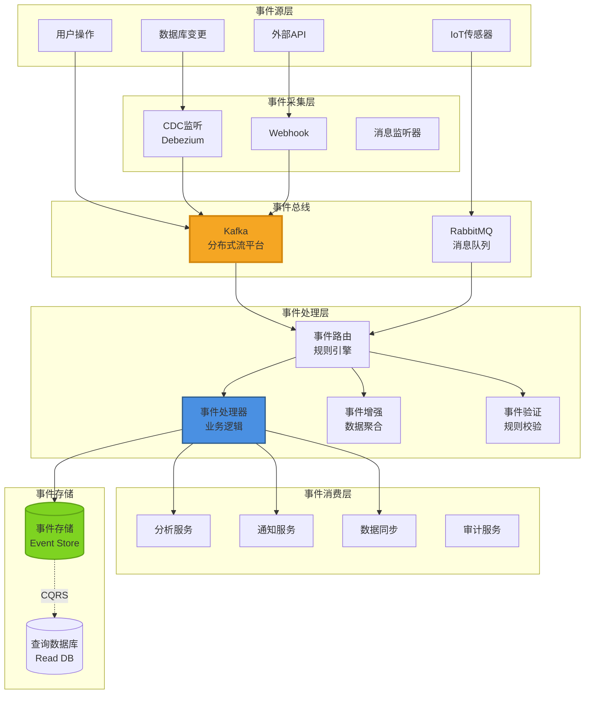
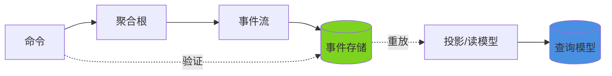
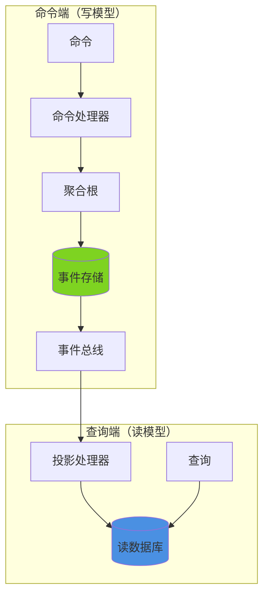
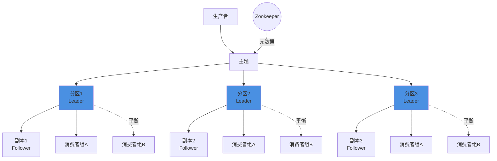
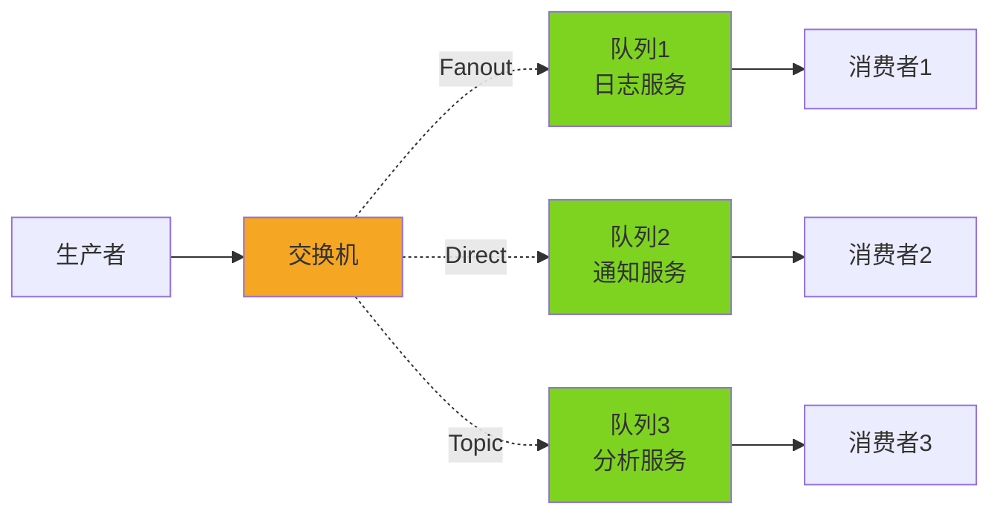
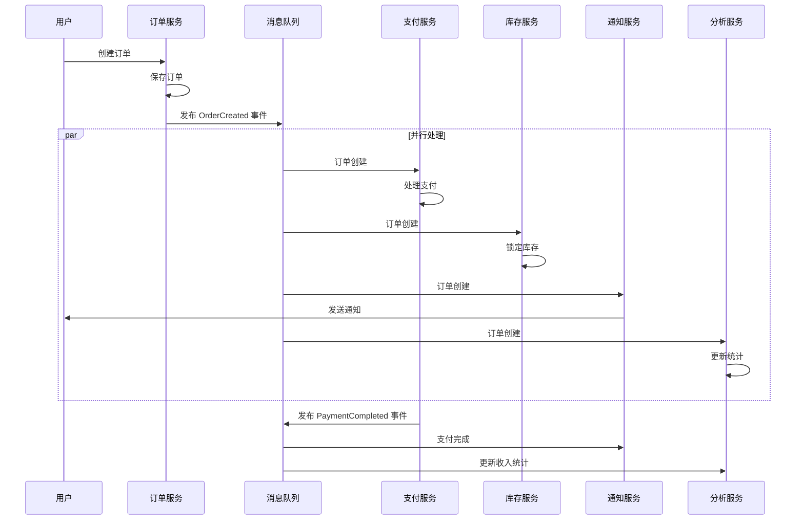

# 事件驱动架构 (Event-Driven Architecture)

## 概述

事件驱动架构（EDA）是一种以事件为核心的异步分布式架构模式。系统中的各个组件通过事件进行通信，当某个重要状态发生变化时，会产生事件并通知所有订阅者。这种架构模式实现了松耦合、高可扩展性和异步处理能力。

## 架构图



## 核心概念

### 1. 事件（Event）

**定义**：系统中发生的重要状态变化。

```java
// 事件基类
public abstract class DomainEvent {
    private final String eventId;
    private final LocalDateTime occurredAt;
    private final String eventType;
    private final String aggregateId;
}

// 具体事件示例
public class OrderCreatedEvent extends DomainEvent {
    private final String orderId;
    private final String userId;
    private final List<OrderItem> items;
    private final BigDecimal totalAmount;
    private final LocalDateTime createdAt;
}

// 领域事件注解
@DomainEvent
public class PaymentCompletedEvent extends DomainEvent {
    private final String paymentId;
    private final String orderId;
    private final BigDecimal amount;
    private final String paymentMethod;
}
```

### 2. 事件总线（Event Bus）

**职责**：
- 事件发布/订阅管理
- 消息路由和分发
- 可靠性保证（持久化、重试）
- 性能优化（批量处理、压缩）

**技术选型对比**：

| 特性 | Kafka | RabbitMQ | RocketMQ | Pulsar |
|------|-------|----------|----------|--------|
| **吞吐量** | 极高（百万级/秒） | 中高（万级/秒） | 高（十万级/秒） | 极高 |
| **延迟** | ms 级 | μs 级 | ms 级 | ms 级 |
| **消息保留** | 可配置（支持永久） | 短期 | 可配置 | 可配置（分层存储） |
| **顺序保证** | 分区内有序 | 队列内有序 | 队列内有序 | 分段内有序 |
| **协议** | 自有协议 | AMQP | 自有协议 | 自有协议 |
| **适用场景** | 大数据、日志处理 | 企业消息、工作流 | 电商、金融 | 大规模流处理 |

**推荐选择**：
- 日志收集、实时分析 → **Kafka**
- 工作流、任务队列 → **RabbitMQ**
- 金融、电商订单 → **RocketMQ**
- 大规模多租户 → **Pulsar**

### 3. 事件溯源（Event Sourcing）

**核心思想**：不存储当前状态，而是存储所有状态变更事件。



**实现示例**：

```java
// 聚合根
@Entity
public class Order {
    private String orderId;
    private OrderStatus status;
    private List<OrderEvent> events = new ArrayList<>();
    
    // 应用事件重建状态
    public void applyEvent(OrderEvent event) {
        switch (event.getEventType()) {
            case "OrderCreated":
                this.status = OrderStatus.CREATED;
                break;
            case "PaymentCompleted":
                this.status = OrderStatus.PAID;
                break;
            case "OrderShipped":
                this.status = OrderStatus.SHIPPED;
                break;
        }
        this.events.add(event);
    }
    
    // 业务操作生成事件
    public OrderCreatedEvent createOrder(CreateOrderCommand command) {
        OrderCreatedEvent event = new OrderCreatedEvent(
            command.getOrderId(),
            command.getUserId(),
            command.getItems()
        );
        applyEvent(event);
        return event;
    }
}

// 事件存储
@Repository
public interface EventStoreRepository extends JpaRepository<OrderEvent, Long> {
    List<OrderEvent> findByAggregateIdOrderByVersionAsc(String aggregateId);
}

// 事件重放构建聚合
@Service
public class OrderRepository {
    
    @Autowired
    private EventStoreRepository eventStore;
    
    public Order getOrder(String orderId) {
        List<OrderEvent> events = eventStore.findByAggregateIdOrderByVersionAsc(orderId);
        
        Order order = new Order();
        events.forEach(order::applyEvent);
        
        return order;
    }
}
```

**优势**：
- ✅ 完整的审计日志
- ✅ 可以重放历史事件
- ✅ 时间机器调试
- ✅ 事件可以作为集成接口

**劣势**：
- ❌ 查询复杂（需要投影）
- ❌ 事件版本管理
- ❌ 学习曲线陡峭

### 4. CQRS（Command Query Responsibility Segregation）

**核心思想**：将命令（写操作）和查询（读操作）分离。



**实现示例**：

```java
// 命令端
public record CreateOrderCommand(
    String orderId,
    String userId,
    List<OrderItem> items
) {}

@Component
public class CreateOrderCommandHandler {
    
    @Autowired
    private OrderRepository orderRepository;
    
    @Autowired
    private ApplicationEventPublisher eventPublisher;
    
    @Transactional
    public void handle(CreateOrderCommand command) {
        // 1. 创建聚合
        Order order = new Order(command.getOrderId());
        
        // 2. 执行业务逻辑
        OrderCreatedEvent event = order.createOrder(command);
        
        // 3. 保存事件
        orderRepository.save(event);
        
        // 4. 发布事件
        eventPublisher.publishEvent(event);
    }
}

// 查询端
@Entity
@Table(name = "order_view")
public class OrderView {
    private String orderId;
    private String userName;
    private String status;
    private BigDecimal totalAmount;
    private LocalDateTime createdAt;
    
    // 为查询优化的反范式化设计
    private String productName;  // 冗余字段
    private String productImage; // 冗余字段
}

@Repository
public interface OrderViewRepository extends JpaRepository<OrderView, String> {
    
    // 为查询场景优化的方法
    List<OrderView> findByUserIdAndStatus(String userId, String status);
    
    @Query("SELECT o FROM OrderView o WHERE o.createdAt > :date")
    List<OrderView> findRecentOrders(@Param("date") LocalDateTime date);
}

// 投影处理器
@Component
public class OrderProjector {
    
    @Autowired
    private OrderViewRepository viewRepository;
    
    @Autowired
    private UserRepository userRepository;
    
    @EventListener
    public void onOrderCreated(OrderCreatedEvent event) {
        User user = userRepository.findById(event.getUserId());
        
        OrderView view = new OrderView();
        view.setOrderId(event.getOrderId());
        view.setUserName(user.getName());
        view.setStatus("CREATED");
        view.setTotalAmount(event.getTotalAmount());
        view.setCreatedAt(event.getCreatedAt());
        
        // 冗余查询优化字段
        view.setProductName(event.getItems().get(0).getProductName());
        view.setProductImage(event.getItems().get(0).getProductImage());
        
        viewRepository.save(view);
    }
}
```

## 事件模式

### 1. 事件通知（Event Notification）

**特点**：事件仅表示"某事发生了"，不携带业务数据。

```java
// 事件通知示例
public class OrderPlacedNotification extends DomainEvent {
    private final String orderId;
    private final String userId;
    // 仅包含 ID，不包含订单详情
}

// 消费者需要自行查询数据
@EventListener
public void handleOrderPlaced(OrderPlacedNotification notification) {
    Order order = orderRepository.findById(notification.getOrderId());
    User user = userRepository.findById(notification.getUserId());
    
    // 发送通知
    sendEmail(user.getEmail(), "订单已创建", order);
}
```

**优点**：
- 事件简单、稳定
- 解耦性强
- 便于版本管理

**缺点**：
- 消费者需要额外的 API 调用
- 可能导致不一致性

### 2. 事件携带状态（Event-Carried State Transfer）

**特点**：事件包含完整的状态数据。

```java
// 携带状态的事件
public class OrderPlacedEvent extends DomainEvent {
    private final String orderId;
    private final String userId;
    private final String userName;      // 携带用户名
    private final String userEmail;     // 携带用户邮箱
    private final List<OrderItem> items; // 携带订单项
    private final BigDecimal totalAmount;
    private final LocalDateTime createdAt;
}

// 消费者直接使用事件数据，无需额外查询
@EventListener
public void handleOrderPlaced(OrderPlacedEvent event) {
    // 直接发送邮件，无需查询数据库
    sendEmail(
        event.getUserEmail(), 
        "订单已创建", 
        event.getTotalAmount()
    );
}

// 更新读模型
@EventListener
public void updateOrderView(OrderPlacedEvent event) {
    OrderView view = new OrderView();
    view.setOrderId(event.getOrderId());
    view.setUserName(event.getUserName());
    view.setTotalAmount(event.getTotalAmount());
    viewRepository.save(view);
}
```

**优点**：
- 消费者无需额外查询
- 性能更好
- 时间点一致性（事件发生时的状态）

**缺点**：
- 事件体积较大
- 数据冗余
- 版本兼容性问题

### 3. 事件溯源（Event Sourcing）

```java
// 完整的事件流
public class Order {
    private List<DomainEvent> events = new ArrayList<>();
    
    // 命令：创建订单
    public void handle(CreateOrderCommand command) {
        // 业务规则验证
        if (command.getItems().isEmpty()) {
            throw new IllegalArgumentException("订单不能为空");
        }
        
        // 生成事件
        OrderCreatedEvent event = new OrderCreatedEvent(
            command.getOrderId(),
            command.getUserId(),
            command.getItems()
        );
        
        // 应用事件
        applyEvent(event);
    }
    
    // 应用事件
    private void applyEvent(OrderCreatedEvent event) {
        this.orderId = event.getOrderId();
        this.status = OrderStatus.CREATED;
        this.events.add(event);
    }
    
    // 获取未提交事件
    public List<DomainEvent> getUncommittedEvents() {
        return new ArrayList<>(events);
    }
    
    // 标记事件已提交
    public void markEventsAsCommitted() {
        events.clear();
    }
}
```

## 消息队列方案

### 1. Kafka 架构



**核心概念**：
- **Topic（主题）**：消息的分类
- **Partition（分区）**：主题的物理分割
- **Offset（偏移量）**：消息在分区中的位置
- **Consumer Group（消费者组）**：逻辑消费者组

**Spring Boot 集成**：

```java
// 生产者
@Service
public class OrderEventProducer {
    
    @Autowired
    private KafkaTemplate<String, OrderEvent> kafkaTemplate;
    
    public void publishOrderCreated(OrderCreatedEvent event) {
        ProducerRecord<String, OrderEvent> record = 
            new ProducerRecord<>(
                "order-events",           // topic
                event.getOrderId(),       // key（用于分区路由）
                event                     // value
            );
        
        kafkaTemplate.send(record)
            .addCallback(
                success -> log.info("Event published: {}", event.getOrderId()),
                failure -> log.error("Failed to publish event", failure)
            );
    }
}

// 消费者
@Service
public class OrderEventConsumer {
    
    @KafkaListener(
        topics = "order-events",
        groupId = "notification-service",
        concurrency = "3"  // 并发消费者数
    )
    public void handleOrderCreated(
            OrderCreatedEvent event, 
            @Header(KafkaHeaders.RECEIVED_PARTITION_ID) int partition,
            @Header(KafkaHeaders.OFFSET) long offset) {
        
        log.info("Received event: {}, partition: {}, offset: {}", 
            event.getOrderId(), partition, offset);
        
        try {
            // 处理事件
            sendNotification(event);
            
        } catch (Exception e) {
            log.error("Failed to process event", e);
            throw e;  // 抛出异常触发重试
        }
    }
}

// 配置
@Configuration
public class KafkaConfig {
    
    @Bean
    public ProducerFactory<String, OrderEvent> producerFactory() {
        Map<String, Object> config = new HashMap<>();
        config.put(ProducerConfig.BOOTSTRAP_SERVERS_CONFIG, "localhost:9092");
        config.put(ProducerConfig.KEY_SERIALIZER_CLASS_CONFIG, StringSerializer.class);
        config.put(ProducerConfig.VALUE_SERIALIZER_CLASS_CONFIG, JsonSerializer.class);
        config.put(ProducerConfig.ACKS_CONFIG, "all");  // 确保可靠性
        config.put(ProducerConfig.RETRIES_CONFIG, 3);
        return new DefaultKafkaProducerFactory<>(config);
    }
    
    @Bean
    public ConsumerFactory<String, OrderEvent> consumerFactory() {
        Map<String, Object> config = new HashMap<>();
        config.put(ConsumerConfig.BOOTSTRAP_SERVERS_CONFIG, "localhost:9092");
        config.put(ConsumerConfig.GROUP_ID_CONFIG, "notification-service");
        config.put(ConsumerConfig.KEY_DESERIALIZER_CLASS_CONFIG, StringDeserializer.class);
        config.put(ConsumerConfig.VALUE_DESERIALIZER_CLASS_CONFIG, JsonDeserializer.class);
        config.put(ConsumerConfig.AUTO_OFFSET_RESET_CONFIG, "earliest");
        config.put(ConsumerConfig.ENABLE_AUTO_COMMIT_CONFIG, false);  // 手动提交
        return new DefaultKafkaConsumerFactory<>(config);
    }
}
```

### 2. RabbitMQ 架构



**交换机类型**：

| 类型 | 说明 | 适用场景 |
|------|------|----------|
| **Direct** | 精确路由键 | 点对点、特定任务队列 |
| **Fanout** | 广播到所有队列 | 日志、通知、缓存失效 |
| **Topic** | 模式匹配路由 | 复杂路由规则、多租户 |
| **Headers** | 基于头信息路由 | 复杂条件匹配 |

**Spring Boot 集成**：

```java
// 配置
@Configuration
public class RabbitMQConfig {
    
    public static final String ORDER_EXCHANGE = "order.exchange";
    public static final String ORDER_QUEUE = "order.queue";
    public static final String ORDER_ROUTING_KEY = "order.created";
    
    @Bean
    public TopicExchange orderExchange() {
        return new TopicExchange(ORDER_EXCHANGE);
    }
    
    @Bean
    public Queue orderQueue() {
        return QueueBuilder.durable(ORDER_QUEUE).build();
    }
    
    @Bean
    public Binding orderBinding() {
        return BindingBuilder
            .bind(orderQueue())
            .to(orderExchange())
            .with(ORDER_ROUTING_KEY);
    }
}

// 生产者
@Service
public class OrderEventPublisher {
    
    @Autowired
    private RabbitTemplate rabbitTemplate;
    
    public void publishOrderCreated(OrderCreatedEvent event) {
        rabbitTemplate.convertAndSend(
            RabbitMQConfig.ORDER_EXCHANGE,
            RabbitMQConfig.ORDER_ROUTING_KEY,
            event
        );
    }
}

// 消费者
@Component
public class OrderEventReceiver {
    
    @RabbitListener(queues = RabbitMQConfig.ORDER_QUEUE)
    public void handleOrderCreated(OrderCreatedEvent event) {
        log.info("Received order created event: {}", event.getOrderId());
        
        try {
            processOrder(event);
        } catch (Exception e) {
            log.error("Failed to process event", e);
            throw e;  // 抛出异常触发重试
        }
    }
    
    // 死信队列配置
    @RabbitListener(queues = "order.dlq")
    public void handleDeadLetter(OrderCreatedEvent event) {
        log.error("Event moved to DLQ: {}", event.getOrderId());
        // 人工干预或特殊处理
    }
}
```

### 3. 可靠性保证

#### 消息持久化
```java
// Kafka 配置
properties.put(ProducerConfig.ACKS_CONFIG, "all");           // 确认所有副本
properties.put(ProducerConfig.ENABLE_IDEMPOTENCE_CONFIG, true);  // 幂等性
properties.put(ProducerConfig.MAX_IN_FLIGHT_REQUESTS_PER_CONNECTION, 5);

// RabbitMQ 配置
@Bean
public Queue durableQueue() {
    return QueueBuilder
        .durable(true)           // 持久化
        .withArgument("x-delivery-limit", 3)  // 重试次数限制
        .build();
}
```

#### 死信队列（DLQ）
```java
// RabbitMQ 死信配置
@Bean
public Queue deadLetterQueue() {
    return QueueBuilder
        .durable("order.dlq")
        .build();
}

@Bean
public Queue mainQueue() {
    return QueueBuilder
        .durable("order.queue")
        .withArgument("x-dead-letter-exchange", "dlx.exchange")
        .withArgument("x-dead-letter-routing-key", "order.dlq")
        .build();
}
```

#### 重试策略
```java
@RetryableTopic(
    attempts = "3",
    backoff = @Backoff(delay = 1000, multiplier = 2),
    autoCreateTopics = "false"
)
@KafkaListener(topics = "order-events")
public void handleOrderCreated(OrderCreatedEvent event) {
    processEvent(event);
}

// 或使用 Resilience4j
@CircuitBreaker(name = "orderEvent", fallbackMethod = "fallback")
@Retry(name = "orderEvent")
public void processOrderEvent(OrderCreatedEvent event) {
    // 处理逻辑
}

private void fallback(OrderCreatedEvent event, Exception e) {
    log.error("Circuit breaker opened, using fallback");
}
```

## 应用场景

### 1. 电商系统



### 2. 物联网（IoT）

```java
// 传感器事件
public class SensorReadingEvent {
    private String deviceId;
    private String sensorType;
    private double value;
    private LocalDateTime timestamp;
    private Map<String, Object> metadata;
}

// 事件处理管道
@Service
public class IoTEventProcessor {
    
    @KafkaListener(topics = "sensor-readings")
    public void processReading(SensorReadingEvent event) {
        // 1. 验证数据
        if (event.getValue() > getThreshold(event.getSensorType())) {
            // 2. 发布告警事件
            AlertEvent alert = new AlertEvent(
                event.getDeviceId(),
                "传感器值异常",
                event.getValue()
            );
            kafkaTemplate.send("alerts", alert);
        }
        
        // 3. 存储原始数据
        dataStore.save(event);
        
        // 4. 更新实时统计
        updateRealtimeStats(event);
    }
}
```

### 3. 金融系统

```java
// 账户事件
public class AccountEvent {
    private String accountId;
    private String eventType;  // DEPOSIT, WITHDRAW, TRANSFER
    private BigDecimal amount;
    private String referenceId;
    private LocalDateTime timestamp;
}

// 事件溯源 + CQRS
@Service
public class AccountService {
    
    @Transactional
    public void deposit(DepositCommand command) {
        // 1. 重建聚合
        Account account = accountRepository.getAccount(command.getAccountId());
        
        // 2. 执行业务逻辑
        MoneyDepositedEvent event = account.deposit(command.getAmount());
        
        // 3. 保存事件
        eventStore.append(event);
        
        // 4. 发布事件
        eventPublisher.publish(event);
    }
}

// 审计服务（事件溯源消费者）
@Service
public class AuditService {
    
    @EventListener
    public void onMoneyDeposited(MoneyDepositedEvent event) {
        AuditLog log = new AuditLog(
            event.getEventType(),
            event.getAccountId(),
            event.getAmount(),
            event.getTimestamp()
        );
        auditRepository.save(log);
    }
}
```

## 最佳实践

### 1. 事件设计原则
- ✅ 事件不可变（Immutable）
- ✅ 事件命名使用过去式（OrderCreated, PaymentCompleted）
- ✅ 事件包含时间戳
- ✅ 事件包含唯一标识
- ✅ 事件版本化（添加版本号）

### 2. 消息处理原则
- ✅ 幂等性设计（重复消费不影响结果）
- ✅ 超时机制（避免无限等待）
- ✅ 优雅降级（部分失败不影响整体）
- ✅ 监控告警（消息堆积、处理延迟）

### 3. 性能优化
```java
// 批量处理
@KafkaListener(topics = "events", batch = "true")
public void handleBatch(List<OrderEvent> events) {
    // 批量插入数据库
    orderRepository.saveAll(events);
}

// 异步处理
@Async("eventProcessingExecutor")
public CompletableFuture<Void> processEventAsync(OrderEvent event) {
    processEvent(event);
    return CompletableFuture.completedFuture(null);
}

// 配置批量处理
spring.kafka.consumer.batch-consumer=true
spring.kafka.consumer.max-poll-records=500
```

### 4. 监控指标
- **消息堆积**：消费者 Lag
- **处理延迟**：端到端延迟
- **吞吐量**：消息/秒
- **错误率**：失败消息比例
- **消费者健康**：活跃消费者数

## 常见陷阱

### ❌ 反模式
1. **事件地狱**：事件之间循环依赖
2. **消息丢失**：未正确配置持久化
3. **消费者堵塞**：处理逻辑过慢
4. **重复消费**：缺少幂等性设计
5. **过度使用**：简单场景也用 EDA

### ✅ 解决方案
1. 明确事件边界，避免循环
2. 配置持久化 + 确认机制
3. 使用线程池 + 批量处理
4. 设计幂等性接口
5. 评估场景，合理选择

## 总结

事件驱动架构的核心价值：
- ✅ **解耦**：生产者和消费者独立演化
- ✅ **异步**：提升系统吞吐量和响应速度
- ✅ **可扩展**：易于添加新的消费者
- ✅ **事件溯源**：完整的审计和调试能力

**关键挑战**：
- ❌ 复杂性增加
- ❌ 最终一致性
- ❌ 调试困难
- ❌ 运维成本

**适用场景**：
- 高并发、大流量系统
- 需要异步处理的场景
- 多系统集成
- 需要完整审计的金融/政务系统

---

**下一步**：[分层架构 →](./04-layered-architecture.md)
