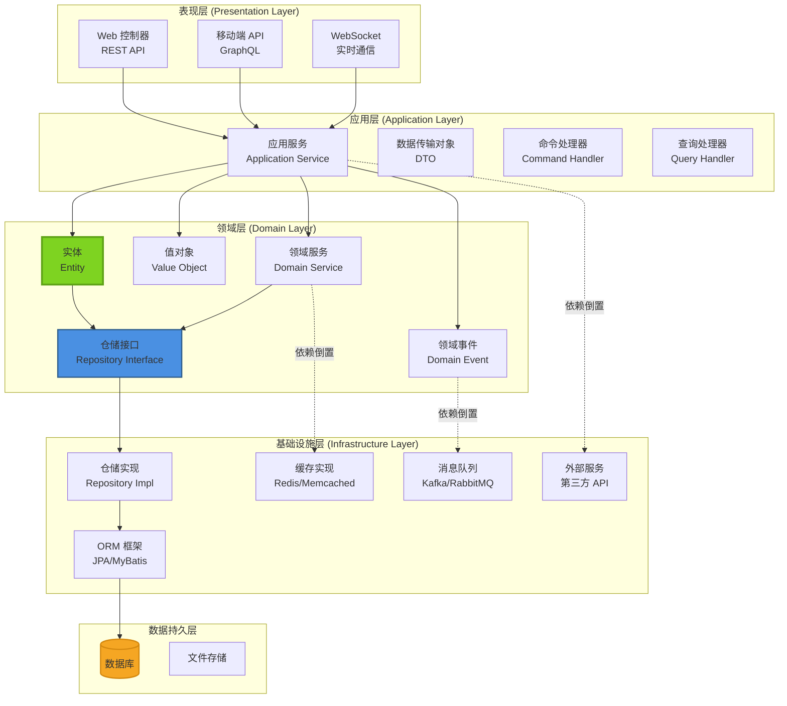
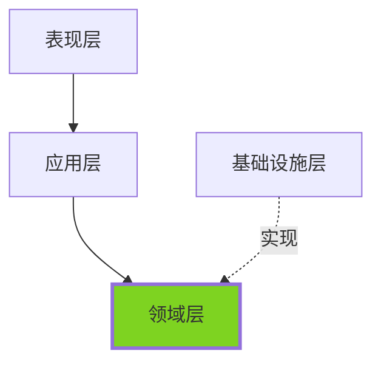

# 分层架构 (Layered Architecture)

## 概述

分层架构是最经典、最广泛使用的软件架构模式之一。它将应用程序按职责划分为多个层次，每一层只与相邻的层交互，形成了清晰的职责边界和依赖关系。这种架构模式强调"关注点分离"（Separation of Concerns）原则。

## 架构图



## 各层详解

### 1. 表现层 (Presentation Layer)

**职责**：
- 处理 HTTP 请求/响应
- 路由和参数验证
- 会话管理
- 返回格式化数据（JSON/XML）
- API 文档生成

**技术栈**：
- Spring MVC / Jakarta EE
- GraphQL (Apollo, GraphQL Java)
- gRPC
- WebSocket (Socket.io, STOMP)

**实现示例**：

```java
@RestController
@RequestMapping("/api/orders")
@Tag(name = "订单管理", description = "订单相关操作")
public class OrderController {
    
    @Autowired
    private OrderApplicationService orderService;
    
    @GetMapping("/{orderId}")
    @Operation(summary = "获取订单详情")
    public ResponseEntity<OrderDTO> getOrder(
            @PathVariable String orderId,
            @RequestHeader("X-User-Id") String userId) {
        
        OrderQuery query = new OrderQuery(orderId, userId);
        OrderDTO order = orderService.getOrder(query);
        
        return ResponseEntity.ok(order);
    }
    
    @PostMapping
    @Operation(summary = "创建订单")
    public ResponseEntity<OrderDTO> createOrder(
            @Valid @RequestBody CreateOrderRequest request,
            @RequestHeader("X-User-Id") String userId) {
        
        CreateOrderCommand command = new CreateOrderCommand(userId, request);
        OrderDTO order = orderService.createOrder(command);
        
        return ResponseEntity
            .created(URI.create("/api/orders/" + order.getOrderId()))
            .body(order);
    }
    
    @PatchMapping("/{orderId}/cancel")
    @Operation(summary = "取消订单")
    public ResponseEntity<Void> cancelOrder(
            @PathVariable String orderId,
            @RequestHeader("X-User-Id") String userId) {
        
        CancelOrderCommand command = new CancelOrderCommand(orderId, userId);
        orderService.cancelOrder(command);
        
        return ResponseEntity.noContent().build();
    }
    
    @GetMapping("/search")
    @Operation(summary = "搜索订单")
    public ResponseEntity<Page<OrderDTO>> searchOrders(
            @RequestParam(required = false) String status,
            @RequestParam(required = false) String keyword,
            @RequestParam(defaultValue = "0") int page,
            @RequestParam(defaultValue = "20") int size) {
        
        OrderSearchQuery query = new OrderSearchQuery(status, keyword, page, size);
        Page<OrderDTO> orders = orderService.searchOrders(query);
        
        return ResponseEntity.ok(orders);
    }
}
```

### 2. 应用层 (Application Layer)

**职责**：
- 编排业务流程
- 事务边界管理
- 权限验证
- DTO 转换
- 调用领域服务

**关键模式**：
- **Application Service**：应用服务
- **Command Handler**：命令处理器（写操作）
- **Query Handler**：查询处理器（读操作）
- **DTO**：数据传输对象

**实现示例**：

```java
// 应用服务
@Service
@Transactional
public class OrderApplicationService {
    
    @Autowired
    private OrderRepository orderRepository;
    
    @Autowired
    private ProductRepository productRepository;
    
    @Autowired
    private PaymentServiceClient paymentService;
    
    @Autowired
    private ApplicationEventPublisher eventPublisher;
    
    // 命令处理（写操作）
    public OrderDTO createOrder(CreateOrderCommand command) {
        // 1. 权限验证
        if (!command.getUserId().equals(command.getRequestUserId())) {
            throw new UnauthorizedException("无权操作");
        }
        
        // 2. 查询聚合根
        User user = userRepository.findById(command.getUserId());
        
        // 3. 创建订单（领域逻辑）
        Order order = Order.create(user, command.getItems());
        
        // 4. 验证库存（领域服务）
        order.validateInventory(productRepository);
        
        // 5. 保存订单
        orderRepository.save(order);
        
        // 6. 发布领域事件
        eventPublisher.publishEvent(new OrderCreatedEvent(order));
        
        // 7. 转换为 DTO
        return OrderMapper.toDTO(order);
    }
    
    // 查询处理（读操作）
    @Transactional(readOnly = true)
    public OrderDTO getOrder(OrderQuery query) {
        Order order = orderRepository.findById(query.getOrderId());
        
        // 权限验证
        if (!order.canAccess(query.getUserId())) {
            throw new UnauthorizedException("无权查看");
        }
        
        return OrderMapper.toDTO(order);
    }
    
    // 复杂业务流程编排
    public OrderDTO processPayment(ProcessPaymentCommand command) {
        // 1. 获取订单
        Order order = orderRepository.findById(command.getOrderId());
        
        // 2. 调用支付服务（基础设施层）
        PaymentResult result = paymentService.charge(
            order.getTotalAmount(),
            command.getPaymentMethod()
        );
        
        // 3. 更新订单状态（领域逻辑）
        if (result.isSuccess()) {
            order.completePayment(result.getTransactionId());
        } else {
            order.failPayment(result.getErrorCode());
        }
        
        // 4. 保存订单
        orderRepository.save(order);
        
        // 5. 发布事件
        if (result.isSuccess()) {
            eventPublisher.publishEvent(new PaymentCompletedEvent(order));
        }
        
        return OrderMapper.toDTO(order);
    }
}

// 命令对象
public record CreateOrderCommand(
    String userId,
    String requestUserId,
    List<OrderItemRequest> items
) {}

public record CancelOrderCommand(
    String orderId,
    String userId
) {}

// 查询对象
public record OrderQuery(
    String orderId,
    String userId
) {}

public record OrderSearchQuery(
    String status,
    String keyword,
    int page,
    int size
) {}

// DTO
public class OrderDTO {
    private String orderId;
    private String status;
    private BigDecimal totalAmount;
    private LocalDateTime createdAt;
    private List<OrderItemDTO> items;
    // 用于查询优化的冗余字段
    private String productName;
    private String productImage;
}
```

### 3. 领域层 (Domain Layer)

**职责**：
- 封装核心业务规则
- 领域模型（实体、值对象）
- 领域服务
- 领域事件
- 仓储接口（仅接口）

**关键元素**：

#### 实体 (Entity)
```java
@Entity
public class Order {
    
    @Id
    private String orderId;
    
    private String userId;
    private OrderStatus status;
    private BigDecimal totalAmount;
    private LocalDateTime createdAt;
    
    @OneToMany(cascade = CascadeType.ALL)
    private List<OrderItem> items = new ArrayList<>();
    
    @Transient
    private List<DomainEvent> domainEvents = new ArrayList<>();
    
    // 构造函数（保护直接实例化）
    protected Order() {}
    
    // 工厂方法
    public static Order create(User user, List<OrderItemRequest> itemRequests) {
        Order order = new Order();
        order.orderId = UUID.randomUUID().toString();
        order.userId = user.getId();
        order.status = OrderStatus.PENDING;
        order.createdAt = LocalDateTime.now();
        
        // 创建订单项
        List<OrderItem> items = itemRequests.stream()
            .map(req -> OrderItem.create(req.getProductId(), req.getQuantity()))
            .collect(Collectors.toList());
        
        order.items = items;
        
        // 计算总金额
        order.totalAmount = items.stream()
            .map(OrderItem::getSubtotal)
            .reduce(BigDecimal.ZERO, BigDecimal::add);
        
        // 业务规则验证
        order.validate();
        
        // 记录领域事件
        order.registerEvent(new OrderCreatedEvent(order));
        
        return order;
    }
    
    // 领域逻辑
    public void completePayment(String transactionId) {
        if (this.status != OrderStatus.PENDING) {
            throw new IllegalStateException("订单状态不正确");
        }
        
        this.status = OrderStatus.PAID;
        this.transactionId = transactionId;
        
        registerEvent(new PaymentCompletedEvent(this));
    }
    
    public void cancel(String userId) {
        if (!this.userId.equals(userId)) {
            throw new UnauthorizedException("无权取消订单");
        }
        
        if (this.status != OrderStatus.PENDING) {
            throw new IllegalStateException("只有待支付订单可以取消");
        }
        
        this.status = OrderStatus.CANCELLED;
        
        registerEvent(new OrderCancelledEvent(this));
    }
    
    // 业务规则验证
    private void validate() {
        if (items.isEmpty()) {
            throw new BusinessException("订单不能为空");
        }
        
        if (totalAmount.compareTo(BigDecimal.ZERO) <= 0) {
            throw new BusinessException("订单金额必须大于0");
        }
    }
    
    // 库存验证（使用领域服务）
    public void validateInventory(ProductRepository productRepository) {
        InventoryService inventoryService = new InventoryService(productRepository);
        inventoryService.validateStock(this.items);
    }
    
    // 领域事件管理
    private void registerEvent(DomainEvent event) {
        this.domainEvents.add(event);
    }
    
    public List<DomainEvent> getDomainEvents() {
        return Collections.unmodifiableList(domainEvents);
    }
    
    public void clearDomainEvents() {
        this.domainEvents.clear();
    }
}
```

#### 值对象 (Value Object)
```java
@Embeddable
public class Money {
    
    @Column(name = "amount")
    private BigDecimal amount;
    
    @Column(name = "currency")
    private String currency;
    
    protected Money() {}
    
    public Money(BigDecimal amount, String currency) {
        if (amount == null || amount.compareTo(BigDecimal.ZERO) < 0) {
            throw new IllegalArgumentException("金额必须大于等于0");
        }
        this.amount = amount;
        this.currency = currency;
    }
    
    // 值对象不可变
    public Money add(Money other) {
        if (!this.currency.equals(other.currency)) {
            throw new IllegalArgumentException("货币单位不同");
        }
        return new Money(this.amount.add(other.amount), this.currency);
    }
    
    public Money multiply(BigDecimal multiplier) {
        return new Money(this.amount.multiply(multiplier), this.currency);
    }
    
    @Override
    public boolean equals(Object o) {
        if (this == o) return true;
        if (!(o instanceof Money)) return false;
        Money money = (Money) o;
        return Objects.equals(amount, money.amount) && 
               Objects.equals(currency, money.currency);
    }
    
    @Override
    public int hashCode() {
        return Objects.hash(amount, currency);
    }
}

// 使用值对象
@Entity
public class OrderItem {
    @Id
    private String id;
    
    private String productId;
    private int quantity;
    
    @Embedded
    private Money unitPrice;
    
    @Embedded
    private Money subtotal;
    
    public static OrderItem create(String productId, int quantity, Money unitPrice) {
        OrderItem item = new OrderItem();
        item.id = UUID.randomUUID().toString();
        item.productId = productId;
        item.quantity = quantity;
        item.unitPrice = unitPrice;
        item.subtotal = unitPrice.multiply(BigDecimal.valueOf(quantity));
        return item;
    }
}
```

#### 领域服务 (Domain Service)
```java
// 当业务逻辑不属于某个实体或值对象时，使用领域服务
@Service
public class InventoryService {
    
    @Autowired
    private ProductRepository productRepository;
    
    // 库存验证（跨实体逻辑）
    public void validateStock(List<OrderItem> items) {
        for (OrderItem item : items) {
            Product product = productRepository.findById(item.getProductId());
            
            if (product.getStock() < item.getQuantity()) {
                throw new InsufficientStockException(
                    "商品库存不足: " + product.getName()
                );
            }
        }
    }
    
    // 价格计算（复杂业务规则）
    public Money calculatePrice(Product product, int quantity, User user) {
        Money basePrice = product.getPrice();
        
        // 会员折扣
        if (user.isVip()) {
            basePrice = basePrice.multiply(BigDecimal.valueOf(0.9));
        }
        
        // 批量折扣
        if (quantity >= 10) {
            basePrice = basePrice.multiply(BigDecimal.valueOf(0.95));
        }
        
        return basePrice.multiply(BigDecimal.valueOf(quantity));
    }
}
```

#### 领域事件 (Domain Event)
```java
public abstract class DomainEvent {
    private final String eventId;
    private final LocalDateTime occurredAt;
    private final String aggregateId;
    
    protected DomainEvent(String aggregateId) {
        this.eventId = UUID.randomUUID().toString();
        this.occurredAt = LocalDateTime.now();
        this.aggregateId = aggregateId;
    }
}

public class OrderCreatedEvent extends DomainEvent {
    private final String orderId;
    private final String userId;
    private final BigDecimal totalAmount;
    
    public OrderCreatedEvent(Order order) {
        super(order.getOrderId());
        this.orderId = order.getOrderId();
        this.userId = order.getUserId();
        this.totalAmount = order.getTotalAmount();
    }
}

// 事件处理器（可以放在应用层或基础设施层）
@Component
public class OrderEventHandler {
    
    @Autowired
    private NotificationService notificationService;
    
    @Autowired
    private AnalyticsService analyticsService;
    
    @EventListener
    public void handleOrderCreated(OrderCreatedEvent event) {
        // 发送通知
        notificationService.sendOrderConfirmation(
            event.getUserId(),
            event.getOrderId()
        );
        
        // 更新统计
        analyticsService.recordOrder(event);
    }
}
```

#### 仓储接口 (Repository Interface)
```java
// 仓储接口（领域层定义）
public interface OrderRepository {
    
    Order findById(String orderId);
    
    List<Order> findByUserId(String userId);
    
    Page<Order> search(OrderSearchCriteria criteria, Pageable pageable);
    
    void save(Order order);
    
    void delete(Order order);
}
```

### 4. 基础设施层 (Infrastructure Layer)

**职责**：
- 仓储接口实现
- 数据持久化
- 外部服务集成
- 技术性服务（缓存、消息队列）

**实现示例**：

```java
// 仓储实现
@Repository
public class OrderRepositoryImpl implements OrderRepository {
    
    @PersistenceContext
    private EntityManager entityManager;
    
    @Autowired
    private CacheManager cacheManager;
    
    @Override
    @Cacheable(value = "orders", key = "#orderId")
    public Order findById(String orderId) {
        Order order = entityManager.find(Order.class, orderId);
        if (order == null) {
            throw new OrderNotFoundException(orderId);
        }
        return order;
    }
    
    @Override
    @CacheEvict(value = "user_orders", key = "#order.userId")
    public void save(Order order) {
        if (order.getId() == null) {
            entityManager.persist(order);
        } else {
            entityManager.merge(order);
        }
        
        // 发布领域事件
        publishDomainEvents(order);
    }
    
    private void publishDomainEvents(Order order) {
        List<DomainEvent> events = order.getDomainEvents();
        
        for (DomainEvent event : events) {
            applicationContext.publishEvent(event);
        }
        
        order.clearDomainEvents();
    }
    
    @Override
    @SuppressWarnings("unchecked")
    public Page<Order> search(OrderSearchCriteria criteria, Pageable pageable) {
        CriteriaBuilder cb = entityManager.getCriteriaBuilder();
        CriteriaQuery<Order> query = cb.createQuery(Order.class);
        Root<Order> root = query.from(Order.class);
        
        // 动态构建查询条件
        List<Predicate> predicates = new ArrayList<>();
        
        if (criteria.getStatus() != null) {
            predicates.add(cb.equal(root.get("status"), criteria.getStatus()));
        }
        
        if (criteria.getUserId() != null) {
            predicates.add(cb.equal(root.get("userId"), criteria.getUserId()));
        }
        
        if (criteria.getKeyword() != null) {
            predicates.add(cb.like(
                root.get("orderId"), 
                "%" + criteria.getKeyword() + "%"
            ));
        }
        
        query.where(predicates.toArray(new Predicate[0]));
        
        // 分页查询
        TypedQuery<Order> typedQuery = entityManager.createQuery(query);
        typedQuery.setFirstResult((int) pageable.getOffset());
        typedQuery.setMaxResults(pageable.getPageSize());
        
        List<Order> results = typedQuery.getResultList();
        
        // 查询总数
        CriteriaQuery<Long> countQuery = cb.createQuery(Long.class);
        Root<Order> countRoot = countQuery.from(Order.class);
        countQuery.select(cb.count(countRoot));
        countQuery.where(predicates.toArray(new Predicate[0]));
        
        Long total = entityManager.createQuery(countQuery).getSingleResult();
        
        return new PageImpl<>(results, pageable, total);
    }
}

// 外部服务集成
@Service
public class PaymentServiceClient {
    
    @Value("${payment.service.url}")
    private String paymentServiceUrl;
    
    @Autowired
    private RestTemplate restTemplate;
    
    public PaymentResult charge(Money amount, String paymentMethod) {
        try {
            PaymentRequest request = new PaymentRequest(
                amount.getAmount(),
                amount.getCurrency(),
                paymentMethod
            );
            
            PaymentResponse response = restTemplate.postForObject(
                paymentServiceUrl + "/api/payments",
                request,
                PaymentResponse.class
            );
            
            return PaymentResult.success(response.getTransactionId());
            
        } catch (RestClientException e) {
            log.error("支付服务调用失败", e);
            return PaymentResult.failure("PAYMENT_SERVICE_ERROR");
        }
    }
}

// 缓存配置
@Configuration
@EnableCaching
public class CacheConfig {
    
    @Bean
    public CacheManager cacheManager() {
        RedisCacheManager.Builder builder = RedisCacheManager
            .RedisCacheManagerBuilder
            .fromConnectionFactory(redisConnectionFactory())
            .cacheDefaults(cacheConfiguration());
        
        return builder.build();
    }
    
    private RedisCacheConfiguration cacheConfiguration() {
        return RedisCacheConfiguration.defaultCacheConfig()
            .entryTtl(Duration.ofMinutes(10))
            .disableCachingNullValues()
            .serializeKeysWith(RedisSerializationContext.SerializationPair
                .fromSerializer(new StringRedisSerializer()))
            .serializeValuesWith(RedisSerializationContext.SerializationPair
                .fromSerializer(new GenericJackson2JsonRedisSerializer()));
    }
}
```

## 依赖规则

### 依赖倒置原则 (Dependency Inversion Principle)



**核心规则**：
- ✅ 依赖方向自上而下
- ✅ 上层可以依赖下层
- ✅ 下层不能依赖上层
- ✅ 基础设施层依赖领域层（依赖倒置）

**实际应用**：
```java
// 领域层定义接口
public interface OrderRepository {
    Order findById(String orderId);
    void save(Order order);
}

// 基础设施层实现接口
@Repository
public class OrderRepositoryImpl implements OrderRepository {
    // 实现细节
}

// 应用层依赖接口（不依赖实现）
@Service
public class OrderApplicationService {
    @Autowired
    private OrderRepository orderRepository;  // 依赖接口，不依赖实现
}
```

## 优势与劣势

### 优势 ✅

| 维度 | 说明 |
|------|------|
| **关注点分离** | 每层职责清晰，易于理解和维护 |
| **可测试性** | 各层可独立测试，易于 Mock |
| **可维护性** | 修改一层不影响其他层 |
| **可重用性** | 下层可被多个上层复用 |
| **团队协作** | 不同团队可并行开发不同层 |
| **技术灵活性** | 各层可选择不同技术栈 |

### 劣势 ❌

| 维度 | 说明 | 解决方案 |
|------|------|----------|
| **层级过多** | 代码层级深，调试困难 | 减少层级（3-4 层最佳） |
| **性能开销** | 多层调用，性能损耗 | 使用缓存、异步处理 |
| **变更成本高** | 接口变更影响所有层 | 稳定接口、版本化 |
| **过度设计** | 简单项目也分层 | 根据项目规模调整 |

## 实践建议

### 1. 层级精简

```java
// ✅ 推荐：3-4 层
Presentation → Application → Domain ← Infrastructure

// ❌ 避免：5+ 层
Presentation → Business → Application → Domain → Infrastructure → Data
```

### 2. 严格依赖管理

```java
// ✅ 正确：应用层调用领域层
@Service
public class OrderApplicationService {
    @Autowired
    private OrderRepository orderRepository;  // 领域层接口
}

// ❌ 错误：领域层调用应用层
@Entity
public class Order {
    @Autowired
    private OrderApplicationService applicationService;  // 错误！
}
```

### 3. DTO 使用规范

```java
// ✅ 正确：DTO 用于跨层数据传输
public class OrderDTO {
    private String orderId;
    private String status;
    // 用于前端展示的字段
    private String statusText;
    private String formattedAmount;
}

// ❌ 错误：在领域层使用 DTO
@Entity
public class Order {
    private OrderDTO orderDTO;  // 错误！应该使用领域模型
}
```

### 4. 异常处理

```java
// 表现层：捕获异常，返回友好错误
@RestControllerAdvice
public class GlobalExceptionHandler {
    
    @ExceptionHandler(BusinessException.class)
    public ResponseEntity<ErrorResponse> handleBusinessException(BusinessException e) {
        ErrorResponse error = new ErrorResponse(e.getCode(), e.getMessage());
        return ResponseEntity.badRequest().body(error);
    }
}

// 领域层：抛出业务异常
public class Order {
    public void cancel() {
        if (this.status != OrderStatus.PENDING) {
            throw new BusinessException("ORDER_INVALID_STATUS", "订单状态不正确");
        }
    }
}
```

## 测试策略

### 1. 单元测试（领域层）

```java
class OrderTest {
    
    @Test
    void should_create_order_successfully() {
        // Given
        User user = new User("user1");
        List<OrderItemRequest> items = List.of(
            new OrderItemRequest("product1", 2)
        );
        
        // When
        Order order = Order.create(user, items);
        
        // Then
        assertThat(order.getOrderId()).isNotEmpty();
        assertThat(order.getStatus()).isEqualTo(OrderStatus.PENDING);
        assertThat(order.getDomainEvents()).hasSize(1);
    }
    
    @Test
    void should_fail_when_order_is_empty() {
        // Given
        User user = new User("user1");
        List<OrderItemRequest> items = List.of();
        
        // When & Then
        assertThatThrownBy(() -> Order.create(user, items))
            .isInstanceOf(BusinessException.class)
            .hasMessage("订单不能为空");
    }
}
```

### 2. 集成测试（应用层）

```java
@SpringBootTest
@Transactional
class OrderApplicationServiceTest {
    
    @Autowired
    private OrderApplicationService orderService;
    
    @MockBean
    private PaymentServiceClient paymentService;
    
    @Test
    void should_create_order_and_publish_event() {
        // Given
        CreateOrderCommand command = new CreateOrderCommand("user1", List.of(
            new OrderItemRequest("product1", 2)
        ));
        
        // When
        OrderDTO order = orderService.createOrder(command);
        
        // Then
        assertThat(order.getOrderId()).isNotEmpty();
        assertThat(order.getStatus()).isEqualTo("PENDING");
    }
}
```

## 总结

分层架构是软件架构的基石：
- ✅ **清晰**：职责明确，易于理解
- ✅ **灵活**：易于替换技术实现
- ✅ **可维护**：关注点分离，便于维护
- ✅ **可测试**：各层独立测试

**核心原则**：
1. 依赖方向自上而下
2. 领域层不依赖任何层
3. 基础设施层实现领域层接口
4. 严格边界，不跨层调用

**适用场景**：
- 大多数业务系统
- 需要长期维护的项目
- 多人协作的团队
- 需要高可测试性的系统

---

**下一步**：[管道架构 →](./05-pipeline-architecture.md)
