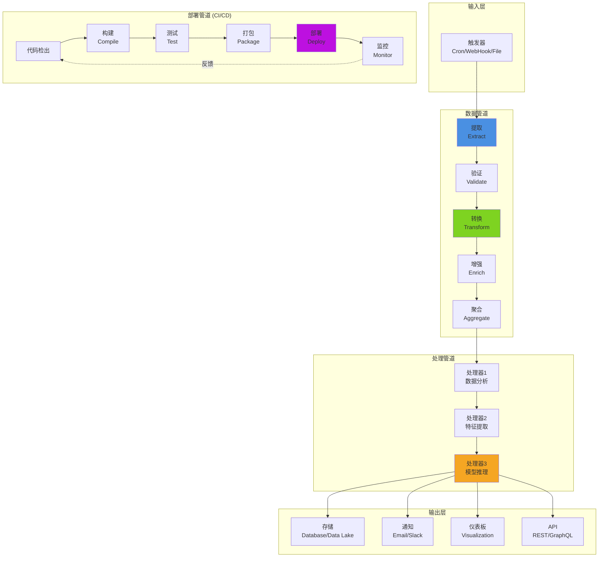
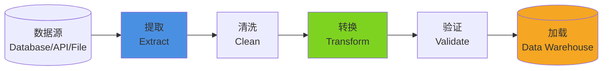
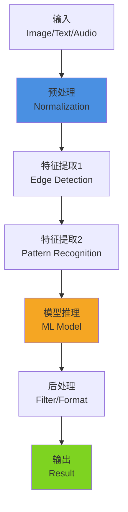
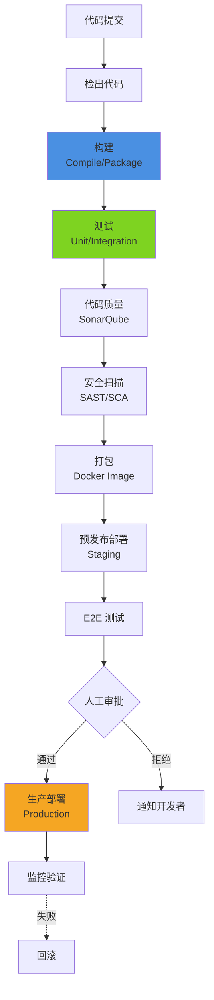

# 管道架构 (Pipeline Architecture)

## 概述

管道架构是一种将处理流程分解为多个独立阶段的架构模式。每个阶段负责特定的处理任务，数据像流水线一样依次通过各个阶段。这种架构模式强调"关注点分离"和"单一职责"，使复杂的处理流程变得清晰、可维护和可扩展。

## 架构图



## 核心概念

### 1. 管道阶段 (Pipeline Stages)

每个管道阶段都是一个独立的处理单元，具有以下特征：
- **单一职责**：只做一件事
- **输入输出**：接收输入，产生输出
- **无状态**：不保留中间状态
- **可组合**：可以灵活组合

```java
// 管道阶段接口
public interface PipelineStage<I, O> {
    O process(I input);
}

// 示例：数据提取阶段
public class ExtractStage implements PipelineStage<String, List<DataRecord>> {
    
    @Override
    public List<DataRecord> process(String source) {
        // 从数据源提取数据
        return dataSource.extract(source);
    }
}

// 示例：数据验证阶段
public class ValidateStage implements PipelineStage<List<DataRecord>, List<DataRecord>> {
    
    @Override
    public List<DataRecord> process(List<DataRecord> records) {
        return records.stream()
            .filter(this::isValid)
            .collect(Collectors.toList());
    }
    
    private boolean isValid(DataRecord record) {
        return record != null && record.getRequiredFields() != null;
    }
}

// 示例：数据转换阶段
public class TransformStage implements PipelineStage<List<DataRecord>, List<ProcessedData>> {
    
    @Override
    public List<ProcessedData> process(List<DataRecord> records) {
        return records.stream()
            .map(this::transform)
            .collect(Collectors.toList());
    }
    
    private ProcessedData transform(DataRecord record) {
        ProcessedData data = new ProcessedData();
        data.setFields(normalizeFields(record));
        data.setTimestamp(parseTimestamp(record));
        return data;
    }
}
```

### 2. 管道编排 (Pipeline Orchestration)

管道编排器负责管理管道的执行流程。

```java
// 管道定义
public class DataPipeline {
    
    private final List<PipelineStage> stages = new ArrayList<>();
    
    public DataPipeline addStage(PipelineStage stage) {
        stages.add(stage);
        return this;
    }
    
    public <I, O> O execute(I input) {
        Object current = input;
        
        for (PipelineStage stage : stages) {
            current = stage.process(current);
            
            // 支持中间结果检查
            if (current == null) {
                break;  // 提前终止
            }
        }
        
        return (O) current;
    }
}

// 使用示例
public class PipelineExample {
    public static void main(String[] args) {
        DataPipeline pipeline = new DataPipeline()
            .addStage(new ExtractStage())
            .addStage(new ValidateStage())
            .addStage(new TransformStage())
            .addStage(new EnrichStage())
            .addStage(new AggregateStage());
        
        String source = "s3://data-bucket/events.json";
        AggregatedResult result = pipeline.execute(source);
        
        System.out.println("Processed " + result.getCount() + " records");
    }
}
```

### 3. 错误处理与重试

```java
// 带错误处理的管道阶段
public interface FaultTolerantStage<I, O> extends PipelineStage<I, O> {
    
    default O processWithRetry(I input, int maxRetries) {
        int attempts = 0;
        Exception lastException = null;
        
        while (attempts <= maxRetries) {
            try {
                return process(input);
            } catch (Exception e) {
                lastException = e;
                attempts++;
                
                if (attempts <= maxRetries) {
                    // 指数退避
                    long waitTime = (long) Math.pow(2, attempts) * 1000;
                    Thread.sleep(waitTime);
                }
            }
        }
        
        throw new PipelineException("Stage failed after " + maxRetries + " retries", lastException);
    }
}

// 实现示例
public class ExternalApiStage implements FaultTolerantStage<String, ApiResponse> {
    
    @Override
    public ApiResponse process(String input) {
        // 调用外部 API
        return externalApiClient.call(input);
    }
}
```

## 三种管道模式

### 1. 数据管道 (Data Pipeline)

**用途**：ETL（Extract-Transform-Load）、数据处理、数据分析



**实现示例**：

```java
@Service
public class EtlPipeline {
    
    @Autowired
    private DataExtractor extractor;
    
    @Autowired
    private DataTransformer transformer;
    
    @Autowired
    private DataValidator validator;
    
    @Autowired
    private DataLoader loader;
    
    @Scheduled(cron = "0 0 2 * * ?")  // 每天凌晨 2 点执行
    public void executeDailyEtl() {
        logger.info("Starting daily ETL pipeline");
        
        try {
            // 1. 提取
            List<RawData> rawData = extractor.extractFromSource();
            logger.info("Extracted {} records", rawData.size());
            
            // 2. 转换
            List<ProcessedData> processedData = transformer.transform(rawData);
            logger.info("Transformed {} records", processedData.size());
            
            // 3. 验证
            List<ProcessedData> validData = validator.validate(processedData);
            logger.info("Valid {} records", validData.size());
            
            // 4. 加载
            loader.loadToWarehouse(validData);
            logger.info("Loaded {} records to warehouse", validData.size());
            
            logger.info("ETL pipeline completed successfully");
            
        } catch (Exception e) {
            logger.error("ETL pipeline failed", e);
            alertService.sendAlert("ETL Pipeline Failed", e.getMessage());
        }
    }
}

// 数据提取器
@Component
public class DatabaseExtractor implements DataExtractor {
    
    @Autowired
    private JdbcTemplate jdbcTemplate;
    
    @Override
    public List<RawData> extractFromSource() {
        String sql = "SELECT * FROM transactions WHERE DATE(created_at) = CURRENT_DATE";
        
        return jdbcTemplate.query(sql, (rs, rowNum) -> {
            RawData data = new RawData();
            data.setId(rs.getLong("id"));
            data.setUserId(rs.getLong("user_id"));
            data.setAmount(rs.getBigDecimal("amount"));
            data.setTimestamp(rs.getTimestamp("created_at").toLocalDateTime());
            return data;
        });
    }
}

// 数据转换器
@Component
public class TransactionTransformer implements DataTransformer {
    
    @Override
    public List<ProcessedData> transform(List<RawData> rawData) {
        return rawData.stream()
            .map(this::transformRecord)
            .collect(Collectors.toList());
    }
    
    private ProcessedData transformRecord(RawData raw) {
        ProcessedData processed = new ProcessedData();
        processed.setTransactionId(raw.getId());
        processed.setUserId(raw.getUserId());
        
        // 货币转换
        processed.setAmountUsd(convertToUsd(raw.getAmount(), raw.getCurrency()));
        
        // 时区转换
        processed.setTimestampUtc(convertToUtc(raw.getTimestamp()));
        
        // 数据分类
        processed.setCategory(classifyTransaction(raw));
        
        return processed;
    }
    
    private String classifyTransaction(RawData raw) {
        if (raw.getAmount().compareTo(new BigDecimal("100")) > 0) {
            return "HIGH_VALUE";
        } else if (raw.getAmount().compareTo(new BigDecimal("10")) > 0) {
            return "MEDIUM_VALUE";
        } else {
            return "LOW_VALUE";
        }
    }
}

// 数据验证器
@Component
public class TransactionValidator implements DataValidator {
    
    @Override
    public List<ProcessedData> validate(List<ProcessedData> data) {
        return data.stream()
            .filter(this::isValid)
            .collect(Collectors.toList());
    }
    
    private boolean isValid(ProcessedData data) {
        // 必填字段验证
        if (data.getUserId() == null) return false;
        if (data.getAmountUsd() == null) return false;
        
        // 业务规则验证
        if (data.getAmountUsd().compareTo(BigDecimal.ZERO) <= 0) return false;
        
        // 数据范围验证
        if (data.getTimestampUtc().isAfter(LocalDateTime.now())) return false;
        
        return true;
    }
}

// 数据加载器
@Component
public class WarehouseLoader implements DataLoader {
    
    @Autowired
    private JdbcTemplate warehouseTemplate;
    
    @Override
    public void loadToWarehouse(List<ProcessedData> data) {
        String sql = """
            INSERT INTO warehouse.transactions 
            (transaction_id, user_id, amount_usd, timestamp_utc, category)
            VALUES (?, ?, ?, ?, ?)
            ON CONFLICT (transaction_id) DO UPDATE SET
                amount_usd = EXCLUDED.amount_usd,
                category = EXCLUDED.category
            """;
        
        warehouseTemplate.batchUpdate(sql, data, data.size(), (ps, record) -> {
            ps.setLong(1, record.getTransactionId());
            ps.setLong(2, record.getUserId());
            ps.setBigDecimal(3, record.getAmountUsd());
            ps.setTimestamp(4, Timestamp.valueOf(record.getTimestampUtc()));
            ps.setString(5, record.getCategory());
        });
        
        logger.info("Loaded {} records to warehouse", data.size());
    }
}
```

### 2. 处理管道 (Processing Pipeline)

**用途**：图像处理、视频处理、文本处理、机器学习推理



**实现示例：图像处理管道**

```java
@Service
public class ImageProcessingPipeline {
    
    public ProcessedImage process(String imageUri) {
        // 1. 加载图像
        BufferedImage image = loadImage(imageUri);
        
        // 2. 预处理
        ImagePreprocessor preprocessor = new ImagePreprocessor();
        image = preprocessor.resize(image, 512, 512);
        image = preprocessor.normalize(image);
        
        // 3. 特征提取
        FeatureExtractor extractor = new FeatureExtractor();
        List<Feature> features = extractor.extractEdges(image);
        features.addAll(extractor.extractCorners(image));
        
        // 4. 模型推理
        MLModel model = loadModel("object-detection-v2");
        List<Detection> detections = model.predict(image, features);
        
        // 5. 后处理
        DetectionFilter filter = new DetectionFilter();
        detections = filter.filterByConfidence(detections, 0.8);
        detections = filter.applyNonMaximumSuppression(detections);
        
        // 6. 格式化输出
        ProcessedImage result = new ProcessedImage();
        result.setUri(imageUri);
        result.setDetections(detections);
        result.setProcessedAt(LocalDateTime.now());
        
        return result;
    }
}

// 特征提取器
public class FeatureExtractor {
    
    public List<Feature> extractEdges(BufferedImage image) {
        List<Feature> features = new ArrayList<>();
        
        // Canny 边缘检测
        int[][] edges = cannyEdgeDetection(image);
        
        // 提取边缘特征
        for (int y = 0; y < edges.length; y++) {
            for (int x = 0; x < edges[y].length; x++) {
                if (edges[y][x] > 0) {
                    Feature feature = new Feature();
                    feature.setType("EDGE");
                    feature.setX(x);
                    feature.setY(y);
                    feature.setStrength(edges[y][x]);
                    features.add(feature);
                }
            }
        }
        
        return features;
    }
    
    private int[][] cannyEdgeDetection(BufferedImage image) {
        // OpenCV 或自定义实现
        // ...
        return new int[0][0];
    }
}

// 机器学习模型
public class MLModel {
    
    private TensorFlowSession session;
    
    public List<Detection> predict(BufferedImage image, List<Feature> features) {
        // 1. 准备输入张量
        Tensor<Float> inputTensor = preprocessImage(image);
        
        // 2. 运行模型
        List<Tensor<?>> outputs = session.run(
            Map.of("input", inputTensor),
            List.of("output_detection", "output_confidence")
        );
        
        // 3. 解析输出
        Tensor<Float> detectionTensor = (Tensor<Float>) outputs.get(0);
        Tensor<Float> confidenceTensor = (Tensor<Float>) outputs.get(1);
        
        List<Detection> detections = parseDetections(
            detectionTensor, 
            confidenceTensor
        );
        
        return detections;
    }
}
```

### 3. 部署管道 (CI/CD Pipeline)

**用途**：持续集成、持续部署、自动化测试



**实现示例：Jenkins Pipeline**

```groovy
// Jenkinsfile
pipeline {
    agent any
    
    environment {
        DOCKER_REGISTRY = 'registry.example.com'
        IMAGE_NAME = 'myapp'
        IMAGE_TAG = "${env.BUILD_NUMBER}"
    }
    
    stages {
        stage('Checkout') {
            steps {
                checkout scm
            }
        }
        
        stage('Build') {
            steps {
                sh 'mvn clean package -DskipTests'
            }
        }
        
        stage('Unit Tests') {
            steps {
                sh 'mvn test'
                junit 'target/surefire-reports/*.xml'
            }
        }
        
        stage('Code Quality') {
            steps {
                sh 'mvn sonar:sonar \
                    -Dsonar.host.url=${SONAR_URL} \
                    -Dsonar.login=${SONAR_TOKEN}'
            }
        }
        
        stage('Security Scan') {
            steps {
                sh 'trivy image ${DOCKER_REGISTRY}/${IMAGE_NAME}:${IMAGE_TAG}'
            }
        }
        
        stage('Build Docker Image') {
            steps {
                sh """
                    docker build -t ${DOCKER_REGISTRY}/${IMAGE_NAME}:${IMAGE_TAG} .
                    docker tag ${DOCKER_REGISTRY}/${IMAGE_NAME}:${IMAGE_TAG} \
                              ${DOCKER_REGISTRY}/${IMAGE_NAME}:latest
                """
            }
        }
        
        stage('Push to Registry') {
            steps {
                withCredentials([usernamePassword(
                    credentialsId: 'docker-registry',
                    usernameVariable: 'DOCKER_USER',
                    passwordVariable: 'DOCKER_PASS'
                )]) {
                    sh """
                        echo \${DOCKER_PASS} | docker login \
                            -u \${DOCKER_USER} --password-stdin ${DOCKER_REGISTRY}
                        docker push ${DOCKER_REGISTRY}/${IMAGE_NAME}:${IMAGE_TAG}
                        docker push ${DOCKER_REGISTRY}/${IMAGE_NAME}:latest
                    """
                }
            }
        }
        
        stage('Deploy to Staging') {
            steps {
                sh """
                    kubectl set image deployment/myapp-staging \
                        myapp=${DOCKER_REGISTRY}/${IMAGE_NAME}:${IMAGE_TAG} \
                        -n staging
                """
            }
        }
        
        stage('E2E Tests') {
            steps {
                sh 'mvn verify -Denv=staging'
            }
        }
        
        stage('Manual Approval') {
            steps {
                input message: 'Deploy to Production?', ok: 'Deploy'
            }
        }
        
        stage('Deploy to Production') {
            steps {
                sh """
                    kubectl set image deployment/myapp-production \
                        myapp=${DOCKER_REGISTRY}/${IMAGE_NAME}:${IMAGE_TAG} \
                        -n production
                """
            }
        }
        
        stage('Smoke Test') {
            steps {
                sh './scripts/smoke-test.sh'
            }
        }
    }
    
    post {
        success {
            emailext(
                subject: "Pipeline Success: ${env.JOB_NAME} #${env.BUILD_NUMBER}",
                body: "The pipeline completed successfully.",
                to: '${env.CHANGE_AUTHOR_EMAIL}'
            )
        }
        failure {
            emailext(
                subject: "Pipeline Failed: ${env.JOB_NAME} #${env.BUILD_NUMBER}",
                body: "The pipeline failed. Please check the logs.",
                to: '${env.CHANGE_AUTHOR_EMAIL}'
            )
        }
    }
}
```

## 高级特性

### 1. 并行处理

```java
@Service
public class ParallelPipeline {
    
    @Autowired
    private TaskExecutor taskExecutor;
    
    public PipelineResult processParallel(InputData input) {
        CompletableFuture<ProcessedA> stageA = CompletableFuture.supplyAsync(
            () -> processStageA(input),
            taskExecutor
        );
        
        CompletableFuture<ProcessedB> stageB = CompletableFuture.supplyAsync(
            () -> processStageB(input),
            taskExecutor
        );
        
        CompletableFuture<ProcessedC> stageC = CompletableFuture.supplyAsync(
            () -> processStageC(input),
            taskExecutor
        );
        
        // 等待所有阶段完成
        CompletableFuture.allOf(stageA, stageB, stageC).join();
        
        // 聚合结果
        return aggregateResults(stageA.join(), stageB.join(), stageC.join());
    }
}
```

### 2. 条件分支

```java
public class ConditionalPipeline {
    
    public PipelineResult process(InputData input) {
        PipelineResult result = new PipelineResult();
        
        // 阶段 1：总是执行
        result.setStage1(executeStage1(input));
        
        // 阶段 2：条件执行
        if (input.requiresValidation()) {
            result.setStage2(executeStage2(result.getStage1()));
        }
        
        // 阶段 3：分支执行
        if (result.getStage2().isValid()) {
            result.setStage3(executeStage3A(result.getStage2()));
        } else {
            result.setStage3(executeStage3B(result.getStage2()));
        }
        
        return result;
    }
}
```

### 3. 状态持久化

```java
@Service
public class StatefulPipeline {
    
    @Autowired
    private PipelineStateRepository stateRepository;
    
    public PipelineResult execute(String pipelineId) {
        // 恢复之前的状态
        PipelineState state = stateRepository.findById(pipelineId)
            .orElse(new PipelineState(pipelineId));
        
        try {
            // 从上次中断的阶段继续
            if (state.getCurrentStage() < 1) {
                state.setStage1Result(executeStage1(state));
                state.setCurrentStage(1);
                stateRepository.save(state);
            }
            
            if (state.getCurrentStage() < 2) {
                state.setStage2Result(executeStage2(state.getStage1Result()));
                state.setCurrentStage(2);
                stateRepository.save(state);
            }
            
            if (state.getCurrentStage() < 3) {
                state.setStage3Result(executeStage3(state.getStage2Result()));
                state.setCurrentStage(3);
                stateRepository.save(state);
            }
            
            state.setStatus("COMPLETED");
            stateRepository.save(state);
            
            return buildResult(state);
            
        } catch (Exception e) {
            state.setStatus("FAILED");
            state.setError(e.getMessage());
            stateRepository.save(state);
            throw e;
        }
    }
}
```

## 监控与可观测性

### 1. 阶段监控

```java
@Component
public class PipelineMonitor {
    
    private final MeterRegistry meterRegistry;
    
    public PipelineMonitor(MeterRegistry meterRegistry) {
        this.meterRegistry = meterRegistry;
    }
    
    public <I, O> O monitorStage(String stageName, Supplier<O> stage) {
        Timer.Sample sample = Timer.start(meterRegistry);
        
        try {
            O result = stage.get();
            
            // 记录成功指标
            meterRegistry.counter(
                "pipeline.stage.success",
                "stage", stageName
            ).increment();
            
            sample.stop(Timer.builder("pipeline.stage.duration")
                .tag("stage", stageName)
                .tag("status", "success")
                .register(meterRegistry));
            
            return result;
            
        } catch (Exception e) {
            // 记录失败指标
            meterRegistry.counter(
                "pipeline.stage.failure",
                "stage", stageName,
                "error", e.getClass().getSimpleName()
            ).increment();
            
            sample.stop(Timer.builder("pipeline.stage.duration")
                .tag("stage", stageName)
                .tag("status", "failure")
                .register(meterRegistry));
            
            throw e;
        }
    }
}

// 使用监控
public class MonitoredPipeline {
    
    @Autowired
    private PipelineMonitor monitor;
    
    public ProcessedData process(InputData input) {
        Step1Result step1 = monitor.monitorStage("extract", () -> 
            extractData(input)
        );
        
        Step2Result step2 = monitor.monitorStage("transform", () -> 
            transformData(step1)
        );
        
        ProcessedData result = monitor.monitorStage("load", () -> 
            loadData(step2)
        );
        
        return result;
    }
}
```

### 2. 数据血缘追踪

```java
@Entity
public class PipelineExecution {
    
    @Id
    private String executionId;
    
    private String pipelineName;
    private LocalDateTime startTime;
    private LocalDateTime endTime;
    private String status;
    
    @OneToMany(mappedBy = "execution")
    private List<StageExecution> stages = new ArrayList<>();
    
    @ElementCollection
    @MapKeyColumn("stage_name")
    @Column(name = "input_hash")
    private Map<String, String> inputHashes = new HashMap<>();
    
    @ElementCollection
    @MapKeyColumn("stage_name")
    @Column(name = "output_hash")
    private Map<String, String> outputHashes = new HashMap<>();
}

@Entity
public class StageExecution {
    @Id
    private String stageExecutionId;
    
    @ManyToOne
    private PipelineExecution execution;
    
    private String stageName;
    private LocalDateTime startTime;
    private LocalDateTime endTime;
    private String status;
    
    @Column(length = 10000)
    private String inputSummary;
    
    @Column(length = 10000)
    private String outputSummary;
}
```

## 最佳实践

### 1. 幂等性设计
```java
@Component
public class IdempotentStage {
    
    @Autowired
    private CacheManager cacheManager;
    
    public ProcessedData process(InputData input) {
        // 生成唯一键
        String cacheKey = generateKey(input);
        
        // 检查缓存
        ProcessedData cached = cacheManager.getCache("stage-results")
            .get(cacheKey, ProcessedData.class);
        
        if (cached != null) {
            return cached;  // 返回缓存结果
        }
        
        // 执行处理
        ProcessedData result = doProcess(input);
        
        // 缓存结果
        cacheManager.getCache("stage-results").put(cacheKey, result);
        
        return result;
    }
}
```

### 2. 断点续传
```java
@Service
public class ResumablePipeline {
    
    public void executeLargeDataset(String datasetId) {
        List<String> processedIds = getProcessedIds(datasetId);
        
        try (Stream<DataRecord> stream = dataRepository.streamAll()) {
            stream.filter(record -> !processedIds.contains(record.getId()))
                  .forEach(record -> {
                      processRecord(record);
                      markAsProcessed(datasetId, record.getId());
                  });
        }
    }
}
```

### 3. 背压处理
```java
@Service
public class BackpressureAwarePipeline {
    
    private final BlockingQueue<InputData> queue = new ArrayBlockingQueue<>(1000);
    
    @PostConstruct
    public void init() {
        // 生产者
        Executors.newSingleThreadExecutor().submit(() -> {
            while (true) {
                InputData data = dataSource.read();
                queue.put(data);  // 队列满时阻塞
            }
        });
        
        // 消费者
        Executors.newFixedThreadPool(4).submit(() -> {
            while (true) {
                InputData data = queue.take();  // 队列空时阻塞
                processData(data);
            }
        });
    }
}
```

## 总结

管道架构的核心价值：
- ✅ **清晰**：处理流程一目了然
- ✅ **可维护**：每个阶段独立维护
- ✅ **可扩展**：易于添加新阶段
- ✅ **可复用**：阶段可组合复用
- ✅ **可测试**：每个阶段独立测试

**适用场景**：
- ETL/ELT 数据处理
- 机器学习推理流程
- CI/CD 自动化部署
- 图像/视频/音频处理
- 日志处理和分析
- 实时流处理

**关键原则**：
1. 单一职责：每个阶段只做一件事
2. 无状态设计：便于并行和重试
3. 幂等性：支持重复执行
4. 监控可观测：追踪每个阶段的性能
5. 错误处理：优雅降级和重试

---

**架构文档总结**：[总结报告 →](./README.md)
