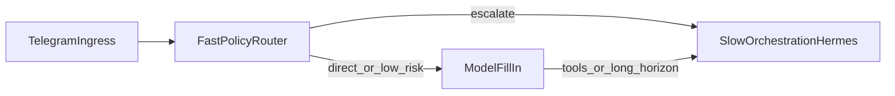

# fast-policy-router-and-slow-orchestration-v1

**决策日期 | Decision date:** 2026-04-24  
**状态 | Status:** Active（文档先行；代码演进分 PR | Doc-first; code evolution in separate PRs）  
**适用范围 | Applies to:** Telegram 管家入口、worker 队列、Hermes/OpenClaw 运行时、capability 治理

---

## 目标 | Goal

**中文：** 把「快策略路由（fast policy router）」与「慢编排（slow orchestration）」在 AAS 中写成一等概念：明确管家不是「纯规则」，而是**规则优先、模型补位、复杂事才上 Hermes**；并为 capability registry、quota/budget、direct route vs escalation 提供可演进的文档基线。

**English:** Make **fast policy routing** and **slow orchestration** first-class concepts in AAS: the butler is **not** “rules-only”; it is **rules-first, model fill-in, Hermes for heavy work**; and document a baseline for capability registry fields, quota/budget, and direct route vs escalation.

**外部参考（命题对齐 | External reference (concept alignment):）**  
`codex/fast-slow-governance-router` 提交 `30b7d51`（*docs: propose fast policy router orchestration split*）与 `autonomous-agent-stack/autonomous-agent-stack#80` 所提出的拆分：**fast path 做策略与 gate，slow path 做长程编排与工具执行**。本决策把该命题吸收为 AAS 侧词汇与边界，不绑定某一外部仓库实现细节。

---

## 当前事实 | Current Truth

**中文：**

- Telegram 入口：[`ButlerIntentRouter`](../../src/autoresearch/core/services/butler_router.py) 为**关键词分类**，文档写明 *no LLM*；`UNKNOWN` 后进入 [`gateway_telegram`](../../src/autoresearch/api/routers/gateway_telegram.py) 的 session + `worker_scheduler.enqueue`，默认由 `telegram_dispatch_runtime_id` 等配置落到 **Hermes worker 队列**（慢编排）。
- 少数意图（如 Excel audit）在 gateway 内**硬编码**异步路径，不走通用队列。
- 完成回写：worker `report_run` 终态 → API `report_worker_run` → 在 `telegram_completion_via_api` 下 **`editMessageText` 同一条 ack 气泡**；RUNNING 期间可有**节流** live 编辑（非每条报告一次 Telegram 编辑）。
- **自动化未覆盖**：控制面进程「整体重启」后，同一条任务链（ack → 可选节流 RUNNING → 终态卡）的端到端恢复。

**English:**

- Telegram ingress uses **keyword-only** [`ButlerIntentRouter`](../../src/autoresearch/core/services/butler_router.py); on `UNKNOWN`, [`gateway_telegram`](../../src/autoresearch/api/routers/gateway_telegram.py) enqueues to the worker scheduler → **Hermes** by settings (slow orchestration).
- Some intents (e.g. Excel audit) are **hard-coded** async branches.
- Completion path: terminal `report_run` → `report_worker_run` → **same ack bubble** via `editMessageText` when `telegram_completion_via_api`; RUNNING updates are **throttled**, not one Telegram edit per report.
- **Tests do not** today simulate a **full control-plane process restart** for that chain.

---

## 目标架构（演进方向）| Target architecture (evolution)

**中文：** 三层分工；**当前代码 ≈ Fast-only + 默认落 Hermes**，缺少中间的「模型补位」与显式 escalation 策略。

**English:** Three layers; **today ≈ fast-only + default Hermes**, missing an explicit **model fill-in** tier and escalation policy.

| 层 | 职责 | 典型输出 |
|----|------|----------|
| **Fast policy router** | 规则、字典、结构化 gate；低延迟、可审计 | 分类标签、是否允许直答、是否必须升级 |
| **Model 补位** | 规则未覆盖或置信不足时；短输出、强约束 prompt | 短回复、二选一「是否上 Hermes」、摘要 |
| **Slow orchestration** | Session、队列、Hermes/OpenClaw、工具、完成卡 | `WorkerQueueItem`、runtime run、终态卡片 |

| Layer | Role | Typical output |
|-------|------|----------------|
| **Fast policy router** | Rules, lexicon, structured gates; low latency, auditable | Labels, allow direct reply, must escalate |
| **Model fill-in** | When rules miss or confidence is low; short, constrained outputs | Short answer, escalate yes/no, summary |
| **Slow orchestration** | Session, queue, Hermes/OpenClaw, tools, completion card | Queue items, runtime runs, terminal card |

---

## AAS 抽象能力（文档 schema）| AAS capability abstractions (doc schema)

**中文：** 下列字段/维度作为 **capability registry** 与路由文档的推荐检查清单（实现可分期落地）。

**English:** Use as a **checklist** for capability registry and routing docs (implementation can land in phases).

- **trust_boundary**：能力触及的数据/仓库边界。
- **credential_boundary**：凭据是否出站、是否可委派给 worker。
- **recoverability**：中断后是否可从 session/queue 恢复。
- **latency_cost**：预期时延与调用成本（token / API / GPU）。
- **approval_requirement**：是否需要人审或策略批准。
- **quota_budget**：每用户、每 chat、每 session 的预算与速率限制。
- **resource_governance**：GPU-time、并发槽位、磁盘与网络配额（与慢编排调度联动）。
- **direct_route vs escalation**：何时在 fast+model 内闭环；何时必须入队 Hermes（例如多文件 patch、长上下文工具链）。

与 [`docs/roadmap.md`](../roadmap.md) 中「Sandbox / Tool / Worker 统一视为 hands」一致：registry 面向 **hands**，编排策略面向 **brain**。

---

## 范围 | Scope（本决策 v1）

**中文：**

- 固定术语与边界：fast router / slow orchestration / direct vs escalate。
- 说明当前实现与目标的差距，以及 Telegram **同气泡节流**与「全量每条消息上屏」的非目标关系。
- 附录：重启与转发的**手工验收矩阵**；可选 pytest 尖刺在附录中标注为 follow-up。

**English:**

- Fix vocabulary and boundaries: fast router / slow orchestration / direct vs escalate.
- Document gap vs goal and relation to Telegram **same-bubble throttling** vs “every line to chat”.
- Appendix: **manual** acceptance matrix for restart/forwarding; optional pytest spike called out as follow-up.

---

## 非目标 | Non-goals（v1 文档不写死实现）

**中文：** 不在本文件所在 PR 内承诺完成：生产级 LLM 补位分类器、全量 quota 引擎、或取消 Telegram 节流的多气泡刷屏。

**English:** Not committing in the same doc-only slice: production LLM fill-in router, full quota engine, or unthrottled multi-message streaming.

---

## 验收 | Acceptance

**中文：**

- 读者能回答：管家当前是「规则 + 默认 Hermes」，目标三层是什么；为何 RUNNING 不是「每条必达 Telegram」。
- Roadmap 可从 README 链到本决策。
- 附录矩阵可被 SRE/开发用于发版前手工回归（直至有自动化替代）。

**English:**

- Readers can state: today is **rules + default Hermes**; target three layers; why RUNNING is not “every report = one Telegram edit”.
- README links here.
- Appendix supports manual release checks until automated tests exist.

---

## 状态 | Status

**中文：** 文档 v1 已落库；代码侧 `ButlerIntentRouter` / gateway 三层路由为后续独立 PR。

**English:** Doc v1 landed; code changes for a three-tier butler path are **follow-up PRs**.

---

## 附录 A：服务重启与消息转发验收矩阵 | Appendix A: Restart and forwarding matrix

**说明 | Note：** 当前仓库**无**模拟「杀掉 FastAPI 再拉起」的默认 pytest；下列以**手工或 staging**为主。自动化尖刺（enqueue 后重置内存服务单例等）见附录 B。

**中文矩阵：**

| 场景 | 操作 | 预期 |
|------|------|------|
| API 冷重启 | 用户已收到排队 ack；重启 API；worker 继续 `report_run` | 队列持久在 SQLite 则终态仍可写回；若进程内队列未持久则失败（已知风险） |
| Worker 重启 | 任务已 claim；杀 worker 再起 | 租约/超时后应可重新 claim 或失败可观测；完成卡不重复污染（依赖幂等） |
| 重复 `update_id` | Telegram 重放同一 webhook | 若启用 dedup 则应不重复入队；见 `telegram_webhook_dedup` 相关实现与配置 |
| RUNNING 风暴 | 高频 `report_run(RUNNING)` | Telegram **节流**：非每条对应 `editMessageText`；用户应仍见周期性或终态更新 |
| 终态顺序 | 先多次 RUNNING 再 COMPLETED | 终态完成卡应最终覆盖 ack 气泡；内容含结果摘要 |

**English matrix:**

| Scenario | Action | Expectation |
|----------|--------|-------------|
| API cold restart | Ack sent; restart API; worker keeps reporting | If queue is SQLite-durable, terminal card still applies; in-memory queue would lose work |
| Worker restart | Task claimed; kill worker | Lease/timeout allows reclaim or visible failure; idempotent completion |
| Duplicate `update_id` | Telegram retries same update | Dedup prevents duplicate enqueue when enabled |
| RUNNING storm | Many RUNNING reports | **Throttling**: not one Telegram edit per report; user still sees periodic or terminal updates |
| Ordering | RUNNING then COMPLETED | Final completion edit wins on the ack bubble |

---

## 附录 B：可选自动化 follow-up | Appendix B: Optional automated follow-up

**中文：** 低优先级尖刺示例：（1）`TestClient` 入队后替换/重建 scheduler 单例（若依赖注入允许），再调 `report_worker_run` 验证完成卡路径；（2）`pytest` `slow` 标记下子进程起 uvicorn 再 SIGKILL——成本高，仅当生产强需求。

**English:** Low-priority spikes: (1) after enqueue, reset/rebuild scheduler singleton if DI allows, then call `report_worker_run`; (2) subprocess uvicorn + SIGKILL under a `slow` marker—high cost, only if production demands it.

---

## 相关链接 | Related links

- [mac-standby-worker-v1.md](./mac-standby-worker-v1.md) — worker 控制面基线
- [distributed-control-plane-architecture-v1.md](./distributed-control-plane-architecture-v1.md) — 多 hands / registry 思想
- [docs/worker-inventory.md](../worker-inventory.md) — 管家查询与盘点入口
- [`gateway_telegram.py`](../../src/autoresearch/api/routers/gateway_telegram.py)、[`butler_router.py`](../../src/autoresearch/core/services/butler_router.py)
