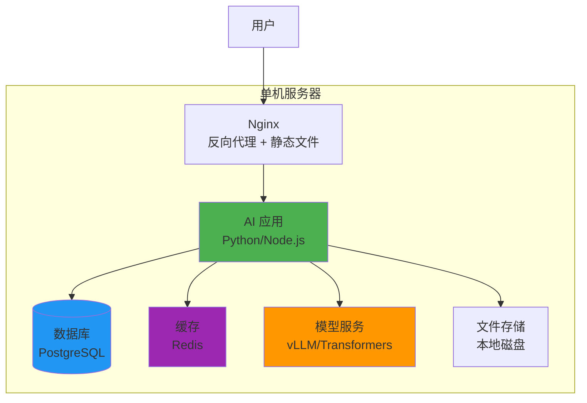

# 单机部署方案

## 📋 方案概述

**适用场景：**
- 开发测试环境
- 小型项目（< 1000 用户）
- 原型验证
- 资源受限场景
- 快速部署需求

**优势：**
- ✅ 部署简单快速
- ✅ 成本低廉
- ✅ 运维复杂度低
- ✅ 适合快速迭代

**限制：**
- ⚠️ 单点故障风险
- ⚠️ 扩展能力有限
- ⚠️ 性能瓶颈明显

---

## 🏗️ 架构设计



**组件说明：**

| 组件 | 推荐配置 | 用途 |
|------|---------|------|
| **服务器** | 4-8 核 CPU, 16-32GB RAM, 100GB SSD | 基础运行环境 |
| **Nginx** | 2 核, 4GB RAM | 反向代理、负载均衡、静态文件 |
| **应用** | 2-4 核, 8-16GB RAM | 业务逻辑处理 |
| **数据库** | 2 核, 8GB RAM | 数据持久化 |
| **缓存** | 1 核, 4GB RAM | 会话、热点数据 |
| **模型服务** | 4-8 核 GPU, 16-32GB VRAM | AI 推理 |

---

## 📦 部署步骤

### 1. 系统准备

```bash
# Ubuntu/Debian
sudo apt update
sudo apt install -y nginx postgresql redis-server python3 python3-venv nodejs npm

# CentOS/RHEL
sudo yum install -y nginx postgresql-server redis python3 nodejs npm
```

### 2. 项目部署

```bash
# 克隆代码
git clone https://github.com/your-org/ai-system.git
cd ai-system

# 创建虚拟环境
python3 -m venv venv
source venv/bin/activate

# 安装依赖
pip install -r requirements.txt

# 配置环境变量
cp .env.example .env
vim .env  # 修改配置
```

### 3. 数据库初始化

```bash
# PostgreSQL
sudo -u postgres createdb ai_system
sudo -u postgres psql -c "CREATE USER ai_user WITH PASSWORD 'secure_password';"
sudo -u postgres psql -c "GRANT ALL PRIVILEGES ON DATABASE ai_system TO ai_user;"

# 运行迁移
python manage.py migrate
python manage.py createsuperuser
```

### 4. Nginx 配置

```nginx
# /etc/nginx/sites-available/ai-system
server {
    listen 80;
    server_name ai.example.com;
    
    client_max_body_size 100M;
    
    location / {
        proxy_pass http://127.0.0.1:8000;
        proxy_set_header Host $host;
        proxy_set_header X-Real-IP $remote_addr;
        proxy_set_header X-Forwarded-For $proxy_add_x_forwarded_for;
        proxy_set_header X-Forwarded-Proto $scheme;
    }
    
    location /static {
        alias /opt/ai-system/static;
    }
    
    location /media {
        alias /opt/ai-system/media;
    }
}

# 启用配置
sudo ln -s /etc/nginx/sites-available/ai-system /etc/nginx/sites-enabled/
sudo nginx -t
sudo systemctl reload nginx
```

### 5. Systemd 服务配置

```ini
# /etc/systemd/system/ai-app.service
[Unit]
Description=AI Application
After=network.target postgresql.service redis.service

[Service]
Type=simple
User=aiuser
WorkingDirectory=/opt/ai-system
Environment="PATH=/opt/ai-system/venv/bin"
ExecStart=/opt/ai-system/venv/bin/gunicorn \
    --workers 4 \
    --bind 127.0.0.1:8000 \
    --timeout 120 \
    --access-logfile /var/log/ai-app/access.log \
    --error-logfile /var/log/ai-app/error.log \
    config.wsgi:application

Restart=always
RestartSec=10

[Install]
WantedBy=multi-user.target
```

```bash
# 启动服务
sudo systemctl daemon-reload
sudo systemctl enable ai-app
sudo systemctl start ai-app
```

---

## 📊 监控配置

### 1. 基础监控

```bash
# 安装监控工具
sudo apt install -y htop iotop nethogs

# 配置日志轮转
sudo vim /etc/logrotate.d/ai-system
```

```text
# /etc/logrotate.d/ai-system
/var/log/ai-app/*.log {
    daily
    missingok
    rotate 14
    compress
    delaycompress
    notifempty
    create 0640 aiuser aiuser
    sharedscripts
    postrotate
        systemctl reload ai-app > /dev/null 2>&1 || true
    endscript
}
```

### 2. 性能监控脚本

```bash
#!/bin/bash
# /opt/scripts/monitor.sh

LOG_FILE="/var/log/ai-system/monitor.log"
mkdir -p $(dirname $LOG_FILE)

while true; do
    echo "=== $(date) ===" >> $LOG_FILE
    
    # CPU & 内存
    echo "CPU: $(top -bn1 | grep 'Cpu(s)' | awk '{print $2}' | cut -d'%' -f1)%" >> $LOG_FILE
    echo "Memory: $(free | grep Mem | awk '{printf("%.2f%%\n", $3/$2 * 100.0)}')" >> $LOG_FILE
    
    # 磁盘
    echo "Disk: $(df -h / | awk 'NR==2 {print $5}')" >> $LOG_FILE
    
    # 服务状态
    systemctl is-active ai-app >> $LOG_FILE
    systemctl is-active postgresql >> $LOG_FILE
    systemctl is-active redis >> $LOG_FILE
    systemctl is-active nginx >> $LOG_FILE
    
    sleep 300  # 每5分钟检查一次
done
```

### 3. 告警配置

```bash
# /opt/scripts/alert.sh
THRESHOLD_CPU=80
THRESHOLD_MEM=90
THRESHOLD_DISK=85

CPU_USAGE=$(top -bn1 | grep 'Cpu(s)' | awk '{print $2}' | cut -d'%' -f1)
MEM_USAGE=$(free | grep Mem | awk '{printf("%.0f", $3/$2 * 100.0)}')
DISK_USAGE=$(df -h / | awk 'NR==2 {print $5}' | cut -d'%' -f1)

if (( $(echo "$CPU_USAGE > $THRESHOLD_CPU" | bc -l) )); then
    echo "⚠️ CPU Alert: ${CPU_USAGE}%"
fi

if (( MEM_USAGE > THRESHOLD_MEM )); then
    echo "⚠️ Memory Alert: ${MEM_USAGE}%"
fi

if (( DISK_USAGE > THRESHOLD_DISK )); then
    echo "⚠️ Disk Alert: ${DISK_USAGE}%"
fi
```

---

## 🔧 维护方案

### 日常维护

| 任务 | 频率 | 操作 |
|------|------|------|
| 日志检查 | 每日 | 查看错误日志、访问日志 |
| 备份检查 | 每日 | 验证备份完整性 |
| 性能监控 | 每日 | CPU、内存、磁盘使用率 |
| 安全更新 | 每周 | 系统补丁、依赖更新 |
| 数据库维护 | 每周 | VACUUM、索引优化 |
| 容量规划 | 每月 | 评估资源使用趋势 |

### 备份策略

```bash
#!/bin/bash
# /opt/scripts/backup.sh

BACKUP_DIR="/backup/ai-system"
DATE=$(date +%Y%m%d_%H%M%S)

mkdir -p $BACKUP_DIR

# 数据库备份
pg_dump -U ai_user ai_system | gzip > $BACKUP_DIR/db_$DATE.sql.gz

# 文件备份
tar -czf $BACKUP_DIR/files_$DATE.tar.gz /opt/ai-system/media

# 配置备份
tar -czf $BACKUP_DIR/config_$DATE.tar.gz /opt/ai-system/.env /etc/nginx/sites-available/ai-system

# 保留最近 7 天的备份
find $BACKUP_DIR -mtime +7 -delete

echo "Backup completed: $DATE"
```

### 日志管理

```bash
# 日志分析
grep ERROR /var/log/ai-app/error.log | tail -100
grep "50[0-9]" /var/log/nginx/access.log | tail -100

# 日志统计
awk '{print $1}' /var/log/nginx/access.log | sort | uniq -c | sort -rn | head -20
```

---

## 🧪 测试方案

### 1. 功能测试

```bash
#!/bin/bash
# /opt/scripts/test.sh

BASE_URL="http://localhost"

echo "Testing API endpoints..."

# 健康检查
curl -f $BASE_URL/health || exit 1

# API 测试
curl -f $BASE_URL/api/v1/models || exit 1
curl -f $BASE_URL/api/v1/status || exit 1

echo "All tests passed!"
```

### 2. 性能测试

```bash
# 使用 Apache Bench
ab -n 1000 -c 10 http://localhost/api/v1/ping

# 使用 wrk
wrk -t4 -c100 -d30s http://localhost/api/v1/chat
```

### 3. 负载测试

```python
import requests
import concurrent.futures

def test_request():
    response = requests.post('http://localhost/api/v1/generate', json={
        'prompt': '测试请求',
        'max_tokens': 100
    })
    return response.status_code == 200

with concurrent.futures.ThreadPoolExecutor(max_workers=50) as executor:
    futures = [executor.submit(test_request) for _ in range(1000)]
    results = [f.result() for f in concurrent.futures.as_completed(futures)]
    
success_rate = sum(results) / len(results) * 100
print(f"Success rate: {success_rate:.2f}%")
```

---

## 🔄 回滚方案

### 1. 代码回滚

```bash
# 查看版本
git log --oneline -10

# 回滚到指定版本
git checkout <commit-hash>

# 重启服务
sudo systemctl restart ai-app
```

### 2. 数据库回滚

```bash
# 恢复备份
gunzip -c /backup/ai-system/db_20240320_120000.sql.gz | psql -U ai_user ai_system

# 或使用迁移回滚
python manage.py migrate app 0003_previous_migration
```

### 3. 快速回滚脚本

```bash
#!/bin/bash
# /opt/scripts/rollback.sh

echo "Rolling back to previous version..."

# 停止服务
sudo systemctl stop ai-app

# 恢复代码
cd /opt/ai-system
git checkout HEAD~1

# 恢复依赖
source venv/bin/activate
pip install -r requirements.txt

# 恢复配置
cp /backup/config/last.env .env

# 恢复数据库（可选）
# gunzip -c /backup/latest/db.sql.gz | psql -U ai_user ai_system

# 启动服务
sudo systemctl start ai-app

echo "Rollback completed!"
```

---

## 📈 容量规划

### 用户规模估算

| 用户数 | 并发请求 | CPU | 内存 | 存储 | 带宽 |
|--------|---------|-----|------|------|------|
| 100 | 5-10 | 2核 | 8GB | 50GB | 10Mbps |
| 500 | 20-50 | 4核 | 16GB | 100GB | 50Mbps |
| 1000 | 50-100 | 8核 | 32GB | 200GB | 100Mbps |

### 扩展时机

当出现以下情况时，考虑升级架构：
- CPU 使用率持续 > 80%
- 内存使用率持续 > 85%
- 响应时间 > 3秒
- 并发用户 > 100
- 磁盘使用率 > 90%

---

## 🎯 最佳实践

1. **安全性**
   - 使用 HTTPS（Let's Encrypt）
   - 配置防火墙（ufw）
   - 定期更新系统补丁
   - 强密码策略
   - 禁用 root 登录

2. **性能优化**
   - 启用 gzip 压缩
   - 配置缓存策略
   - 数据库索引优化
   - 静态资源 CDN

3. **可维护性**
   - 版本控制
   - 配置管理
   - 文档完善
   - 监控告警

---

## 📚 相关文档

- [容器化部署方案](./02-container-deployment.md)
- [Kubernetes 部署方案](./03-kubernetes-deployment.md)
- [监控方案](../monitoring/README.md)
- [安全最佳实践](../security/README.md)
