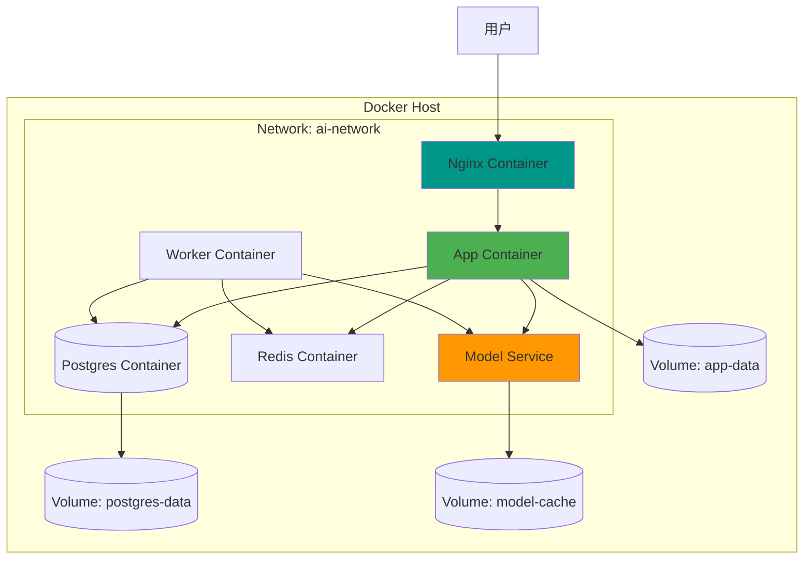

# 容器化部署方案

## 📋 方案概述

**适用场景：**
- 中小型项目（100 - 10000 用户）
- 需要快速部署和扩展
- 多环境一致性要求
- 微服务架构
- CI/CD 集成

**优势：**
- ✅ 环境一致性
- ✅ 快速部署
- ✅ 资源隔离
- ✅ 易于扩展
- ✅ 版本管理方便

**限制：**
- ⚠️ 需要容器运行时
- ⚠️ 学习曲线
- ⚠️ 网络配置复杂度

---

## 🏗️ 架构设计



---

## 🐳 Docker 部署

### 1. Dockerfile - 应用容器

```dockerfile
# /Dockerfile
FROM python:3.11-slim

WORKDIR /app

# 安装系统依赖
RUN apt-get update && apt-get install -y \
    gcc \
    g++ \
    && rm -rf /var/lib/apt/lists/*

# 安装 Python 依赖
COPY requirements.txt .
RUN pip install --no-cache-dir -r requirements.txt

# 复制应用代码
COPY . .

# 创建非 root 用户
RUN useradd -m -u 1000 appuser && \
    chown -R appuser:appuser /app
USER appuser

# 健康检查
HEALTHCHECK --interval=30s --timeout=10s --start-period=40s --retries=3 \
    CMD curl -f http://localhost:8000/health || exit 1

EXPOSE 8000

CMD ["gunicorn", "--config", "gunicorn.conf.py", "config.wsgi:application"]
```

### 2. Dockerfile - Nginx 容器

```dockerfile
# /docker/nginx/Dockerfile
FROM nginx:alpine

# 复制配置文件
COPY nginx.conf /etc/nginx/nginx.conf
COPY default.conf /etc/nginx/conf.d/default.conf

# 创建目录
RUN mkdir -p /var/log/nginx && \
    chown -R nginx:nginx /var/log/nginx

EXPOSE 80 443

CMD ["nginx", "-g", "daemon off;"]
```

### 3. 完整配置文件

```nginx
# /docker/nginx/nginx.conf
user nginx;
worker_processes auto;
error_log /var/log/nginx/error.log warn;
pid /var/run/nginx.pid;

events {
    worker_connections 2048;
    use epoll;
    multi_accept on;
}

http {
    include /etc/nginx/mime.types;
    default_type application/octet-stream;

    # 日志格式
    log_format main '$remote_addr - $remote_user [$time_local] "$request" '
                    '$status $body_bytes_sent "$http_referer" '
                    '"$http_user_agent" "$http_x_forwarded_for"';

    access_log /var/log/nginx/access.log main;

    # 性能优化
    sendfile on;
    tcp_nopush on;
    tcp_nodelay on;
    keepalive_timeout 65;
    types_hash_max_size 2048;
    client_max_body_size 100M;

    # Gzip 压缩
    gzip on;
    gzip_vary on;
    gzip_proxied any;
    gzip_comp_level 6;
    gzip_types text/plain text/css text/xml text/javascript 
               application/json application/javascript application/xml+rss;

    # 包含站点配置
    include /etc/nginx/conf.d/*.conf;
}
```

```nginx
# /docker/nginx/default.conf
upstream app_server {
    least_conn;
    server app:8000 max_fails=3 fail_timeout=30s;
}

server {
    listen 80;
    server_name localhost;

    client_max_body_size 100M;

    # 静态文件
    location /static {
        alias /app/static;
        expires 30d;
        add_header Cache-Control "public, immutable";
    }

    location /media {
        alias /app/media;
        expires 7d;
    }

    # API 代理
    location / {
        proxy_pass http://app_server;
        proxy_set_header Host $host;
        proxy_set_header X-Real-IP $remote_addr;
        proxy_set_header X-Forwarded-For $proxy_add_x_forwarded_for;
        proxy_set_header X-Forwarded-Proto $scheme;
        
        # 超时设置
        proxy_connect_timeout 60s;
        proxy_send_timeout 60s;
        proxy_read_timeout 300s;
        
        # 缓冲设置
        proxy_buffering on;
        proxy_buffer_size 4k;
        proxy_buffers 8 4k;
        proxy_busy_buffers_size 8k;
    }

    # 健康检查
    location /health {
        access_log off;
        return 200 "healthy\n";
        add_header Content-Type text/plain;
    }
}
```

---

## 🔧 Docker Compose 编排

### 完整 docker-compose.yml

```yaml
# /docker-compose.yml
version: '3.8'

services:
  # Nginx 反向代理
  nginx:
    build:
      context: ./docker/nginx
      dockerfile: Dockerfile
    container_name: ai-nginx
    ports:
      - "80:80"
      - "443:443"
    volumes:
      - ./static:/app/static:ro
      - ./media:/app/media:ro
      - nginx-logs:/var/log/nginx
    depends_on:
      - app
    restart: unless-stopped
    networks:
      - ai-network

  # 应用服务
  app:
    build:
      context: .
      dockerfile: Dockerfile
    container_name: ai-app
    environment:
      - DATABASE_URL=postgresql://ai_user:${POSTGRES_PASSWORD}@db:5432/ai_system
      - REDIS_URL=redis://redis:6379/0
      - MODEL_SERVICE_URL=http://model:8001
      - DJANGO_SETTINGS_MODULE=config.settings
      - PYTHONUNBUFFERED=1
    volumes:
      - ./static:/app/static
      - ./media:/app/media
      - app-logs:/app/logs
    depends_on:
      - db
      - redis
      - model
    restart: unless-stopped
    networks:
      - ai-network
    healthcheck:
      test: ["CMD", "curl", "-f", "http://localhost:8000/health"]
      interval: 30s
      timeout: 10s
      retries: 3
      start_period: 40s

  # 后台 Worker
  worker:
    build:
      context: .
      dockerfile: Dockerfile
    container_name: ai-worker
    command: celery -A config worker -l info -c 4
    environment:
      - DATABASE_URL=postgresql://ai_user:${POSTGRES_PASSWORD}@db:5432/ai_system
      - REDIS_URL=redis://redis:6379/0
      - MODEL_SERVICE_URL=http://model:8001
    volumes:
      - ./media:/app/media
      - worker-logs:/app/logs
    depends_on:
      - db
      - redis
      - model
    restart: unless-stopped
    networks:
      - ai-network
    deploy:
      replicas: 2
      resources:
        limits:
          cpus: '2'
          memory: 4G

  # 定时任务
  beat:
    build:
      context: .
      dockerfile: Dockerfile
    container_name: ai-beat
    command: celery -A config beat -l info --scheduler django_celery_beat.schedulers:DatabaseScheduler
    environment:
      - DATABASE_URL=postgresql://ai_user:${POSTGRES_PASSWORD}@db:5432/ai_system
      - REDIS_URL=redis://redis:6379/0
    depends_on:
      - db
      - redis
    restart: unless-stopped
    networks:
      - ai-network
    volumes:
      - beat-logs:/app/logs

  # PostgreSQL 数据库
  db:
    image: postgres:15-alpine
    container_name: ai-postgres
    environment:
      - POSTGRES_DB=ai_system
      - POSTGRES_USER=ai_user
      - POSTGRES_PASSWORD=${POSTGRES_PASSWORD}
    volumes:
      - postgres-data:/var/lib/postgresql/data
      - ./docker/postgres/init.sql:/docker-entrypoint-initdb.d/init.sql
    ports:
      - "5432:5432"
    restart: unless-stopped
    networks:
      - ai-network
    healthcheck:
      test: ["CMD-SHELL", "pg_isready -U ai_user -d ai_system"]
      interval: 10s
      timeout: 5s
      retries: 5
    shm_size: 128mb

  # Redis 缓存
  redis:
    image: redis:7-alpine
    container_name: ai-redis
    command: redis-server --appendonly yes --requirepass ${REDIS_PASSWORD}
    volumes:
      - redis-data:/data
    ports:
      - "6379:6379"
    restart: unless-stopped
    networks:
      - ai-network
    healthcheck:
      test: ["CMD", "redis-cli", "ping"]
      interval: 10s
      timeout: 5s
      retries: 5

  # 模型服务
  model:
    image: vllm/vllm-openai:latest
    container_name: ai-model
    command: >
      --model Qwen/Qwen2-7B-Instruct
      --host 0.0.0.0
      --port 8001
      --tensor-parallel-size 1
      --gpu-memory-utilization 0.9
      --max-model-len 4096
      --dtype auto
    environment:
      - PYTHONUNBUFFERED=1
    volumes:
      - model-cache:/root/.cache
    ports:
      - "8001:8001"
    restart: unless-stopped
    networks:
      - ai-network
    deploy:
      resources:
        reservations:
          devices:
            - driver: nvidia
              count: 1
              capabilities: [gpu]
    healthcheck:
      test: ["CMD", "curl", "-f", "http://localhost:8001/health"]
      interval: 30s
      timeout: 10s
      retries: 3
      start_period: 60s

# 网络配置
networks:
  ai-network:
    driver: bridge
    ipam:
      config:
        - subnet: 172.20.0.0/16

# 卷配置
volumes:
  postgres-data:
    driver: local
  redis-data:
    driver: local
  model-cache:
    driver: local
  app-logs:
    driver: local
  worker-logs:
    driver: local
  beat-logs:
    driver: local
  nginx-logs:
    driver: local
```

### 环境变量配置

```bash
# /.env
POSTGRES_PASSWORD=your_secure_password_here
REDIS_PASSWORD=your_redis_password_here
SECRET_KEY=your_django_secret_key_here
DEBUG=False
ALLOWED_HOSTS=your-domain.com,localhost
```

---

## 🚀 部署脚本

### 1. 快速部署脚本

```bash
#!/bin/bash
# /scripts/deploy.sh

set -e

echo "🚀 Starting AI System Deployment..."

# 检查环境
if ! command -v docker &> /dev/null; then
    echo "❌ Docker is not installed. Please install Docker first."
    exit 1
fi

if ! command -v docker-compose &> /dev/null; then
    echo "❌ Docker Compose is not installed. Please install Docker Compose first."
    exit 1
fi

# 创建必要的目录
mkdir -p static media logs

# 复制环境变量
if [ ! -f .env ]; then
    cp .env.example .env
    echo "⚠️  Please configure .env file before continuing!"
    exit 1
fi

# 生成随机密码
if grep -q "your_secure_password_here" .env; then
    echo "🔑 Generating secure passwords..."
    POSTGRES_PASSWORD=$(openssl rand -base64 32)
    REDIS_PASSWORD=$(openssl rand -base64 32)
    SECRET_KEY=$(openssl rand -base64 64)
    
    sed -i "s/your_secure_password_here/$POSTGRES_PASSWORD/" .env
    sed -i "s/your_redis_password_here/$REDIS_PASSWORD/" .env
    sed -i "s/your_django_secret_key_here/$SECRET_KEY/" .env
fi

# 构建镜像
echo "📦 Building Docker images..."
docker-compose build

# 启动服务
echo "▶️  Starting services..."
docker-compose up -d

# 等待服务就绪
echo "⏳ Waiting for services to be ready..."
sleep 30

# 运行数据库迁移
echo "🗄️  Running database migrations..."
docker-compose exec app python manage.py migrate

# 创建超级用户（如果需要）
# docker-compose exec app python manage.py createsuperuser

# 收集静态文件
echo "📁 Collecting static files..."
docker-compose exec app python manage.py collectstatic --noinput

# 检查服务状态
echo "✅ Checking service status..."
docker-compose ps

echo "🎉 Deployment completed successfully!"
echo ""
echo "📊 Service URLs:"
echo "  - Application: http://localhost"
echo "  - API: http://localhost/api/v1/"
echo "  - Admin: http://localhost/admin"
echo ""
echo "📝 Logs:"
echo "  docker-compose logs -f [service_name]"
```

### 2. 健康检查脚本

```bash
#!/bin/bash
# /scripts/health-check.sh

SERVICES=("nginx" "app" "worker" "db" "redis" "model")
ALL_HEALTHY=true

for service in "${SERVICES[@]}"; do
    if docker-compose ps | grep -q "ai-$service.*Up"; then
        echo "✅ $service is running"
    else
        echo "❌ $service is not running"
        ALL_HEALTHY=false
    fi
done

if [ "$ALL_HEALTHY" = true ]; then
    echo "🎉 All services are healthy!"
    exit 0
else
    echo "⚠️  Some services are not healthy!"
    exit 1
fi
```

### 3. 备份脚本

```bash
#!/bin/bash
# /scripts/backup.sh

BACKUP_DIR="/backup/docker"
DATE=$(date +%Y%m%d_%H%M%S)

mkdir -p $BACKUP_DIR

echo "📦 Starting backup..."

# 数据库备份
echo "🗄️  Backing up PostgreSQL..."
docker-compose exec -T db pg_dump -U ai_user ai_system | gzip > $BACKUP_DIR/db_$DATE.sql.gz

# Redis 备份
echo "📊 Backing up Redis..."
docker-compose exec -T redis redis-cli --rdb - > $BACKUP_DIR/redis_$DATE.rdb

# 文件备份
echo "📁 Backing up files..."
tar -czf $BACKUP_DIR/files_$DATE.tar.gz ./media ./static

# 配置备份
echo "⚙️  Backing up configuration..."
tar -czf $BACKUP_DIR/config_$DATE.tar.gz .env docker-compose.yml

# 清理旧备份（保留 7 天）
echo "🧹 Cleaning old backups..."
find $BACKUP_DIR -mtime +7 -delete

echo "✅ Backup completed: $BACKUP_DIR/ai-system_$DATE.tar.gz"
```

---

## 📊 监控配置

### 1. 容器监控

```bash
#!/bin/bash
# /scripts/monitor.sh

while true; do
    clear
    echo "=== AI System Container Monitor ==="
    echo "Time: $(date)"
    echo ""
    
    # 容器状态
    echo "📦 Container Status:"
    docker-compose ps
    echo ""
    
    # 资源使用
    echo "📊 Resource Usage:"
    docker stats --no-stream --format "table {{.Name}}\t{{.CPUPerc}}\t{{.MemUsage}}\t{{.NetIO}}\t{{.BlockIO}}"
    echo ""
    
    # 日志摘要
    echo "📝 Recent Errors:"
    docker-compose logs --tail=10 app | grep -i error || echo "No errors found"
    echo ""
    
    sleep 60
done
```

### 2. 日志管理

```yaml
# 添加到 docker-compose.yml 的服务配置
logging:
  driver: "json-file"
  options:
    max-size: "10m"
    max-file: "3"
```

### 3. 性能监控

```python
# /scripts/metrics_collector.py
import docker
import time
import json

client = docker.from_env()

def collect_metrics():
    containers = client.containers.list()
    metrics = []
    
    for container in containers:
        stats = container.stats(stream=False)
        metrics.append({
            'name': container.name,
            'cpu_percent': calculate_cpu_percent(stats),
            'memory_usage': stats['memory_stats']['usage'],
            'memory_limit': stats['memory_stats']['limit'],
            'network_rx': stats['networks']['eth0']['rx_bytes'],
            'network_tx': stats['networks']['eth0']['tx_bytes'],
        })
    
    return metrics

def calculate_cpu_percent(stats):
    cpu_delta = stats['cpu_stats']['cpu_usage']['total_usage'] - \
                stats['precpu_stats']['cpu_usage']['total_usage']
    system_delta = stats['cpu_stats']['system_cpu_usage'] - \
                   stats['precpu_stats']['system_cpu_usage']
    return (cpu_delta / system_delta) * 100.0

if __name__ == '__main__':
    while True:
        metrics = collect_metrics()
        print(json.dumps(metrics, indent=2))
        time.sleep(60)
```

---

## 🧪 测试方案

### 1. 容器测试

```bash
#!/bin/bash
# /scripts/test.sh

echo "🧪 Running container tests..."

# 测试所有容器是否运行
docker-compose ps | grep "Exit" && {
    echo "❌ Some containers are not running!"
    exit 1
}

# 测试网络连通性
docker-compose exec app ping -c 3 db
docker-compose exec app ping -c 3 redis

# 测试 API 健康检查
curl -f http://localhost/health || exit 1
curl -f http://localhost/api/v1/status || exit 1

# 测试数据库连接
docker-compose exec app python manage.py dbshell -c "SELECT 1;"

echo "✅ All tests passed!"
```

### 2. 压力测试

```python
# /scripts/load_test.py
import requests
import time
from concurrent.futures import ThreadPoolExecutor

def make_request(prompt):
    start = time.time()
    try:
        response = requests.post('http://localhost/api/v1/generate', json={
            'prompt': prompt,
            'max_tokens': 100
        }, timeout=30)
        elapsed = time.time() - start
        return {
            'success': response.status_code == 200,
            'status': response.status_code,
            'time': elapsed
        }
    except Exception as e:
        return {
            'success': False,
            'error': str(e),
            'time': time.time() - start
        }

def run_load_test(num_requests=1000, concurrent=50):
    prompts = ["测试提示词"] * num_requests
    
    start_time = time.time()
    results = []
    
    with ThreadPoolExecutor(max_workers=concurrent) as executor:
        results = list(executor.map(make_request, prompts))
    
    total_time = time.time() - start_time
    
    successful = sum(1 for r in results if r['success'])
    avg_time = sum(r['time'] for r in results) / len(results)
    
    print(f"Total requests: {num_requests}")
    print(f"Successful: {successful} ({successful/num_requests*100:.1f}%)")
    print(f"Total time: {total_time:.2f}s")
    print(f"Average response time: {avg_time:.2f}s")
    print(f"Requests per second: {num_requests/total_time:.2f}")

if __name__ == '__main__':
    run_load_test()
```

---

## 🔄 回滚方案

### 1. 快速回滚

```bash
#!/bin/bash
# /scripts/rollback.sh

BACKUP_VERSION=$1

if [ -z "$BACKUP_VERSION" ]; then
    echo "Usage: ./rollback.sh <backup_version>"
    echo "Available versions:"
    ls -lt /backup/docker/ | head -10
    exit 1
fi

echo "🔄 Rolling back to $BACKUP_VERSION..."

# 停止服务
docker-compose down

# 恢复数据库
echo "🗄️  Restoring database..."
gunzip -c /backup/docker/db_$BACKUP_VERSION.sql.gz | \
    docker-compose -f docker-compose.yml up -d db && \
    docker-compose exec -T db psql -U ai_user ai_system

# 恢复文件
echo "📁 Restoring files..."
tar -xzf /backup/docker/files_$BACKUP_VERSION.tar.gz

# 恢复配置
echo "⚙️  Restoring configuration..."
tar -xzf /backup/docker/config_$BACKUP_VERSION.tar.gz

# 重启服务
echo "▶️  Restarting services..."
docker-compose up -d

echo "✅ Rollback completed!"
```

### 2. 版本回滚

```bash
# 查看镜像版本
docker images | grep ai-app

# 回滚到上一个镜像版本
docker tag ai-app:previous ai-app:latest
docker-compose restart app
```

---

## 🎯 最佳实践

### 1. 镜像优化

```dockerfile
# 多阶段构建
FROM python:3.11-slim as builder

WORKDIR /app
COPY requirements.txt .
RUN pip install --user --no-cache-dir -r requirements.txt

FROM python:3.11-slim

COPY --from=builder /root/.local /root/.local
ENV PATH=/root/.local/bin:$PATH

WORKDIR /app
COPY . .

CMD ["gunicorn", "config.wsgi:application"]
```

### 2. 安全配置

```bash
# 使用非 root 用户运行
RUN addgroup -g 1000 appgroup && \
    adduser -u 1000 -G appgroup -s /bin/sh -D appuser

# 限制容器权限
cap_drop:
  - ALL
cap_add:
  - NET_BIND_SERVICE
  - CHOWN
```

### 3. 资源限制

```yaml
deploy:
  resources:
    limits:
      cpus: '2'
      memory: 4G
    reservations:
      cpus: '1'
      memory: 2G
```

---

## 📚 相关文档

- [单机部署方案](./01-standalone-deployment.md)
- [Kubernetes 部署方案](./03-kubernetes-deployment.md)
- [Docker 官方文档](https://docs.docker.com/)
- [Docker Compose 文档](https://docs.docker.com/compose/)
