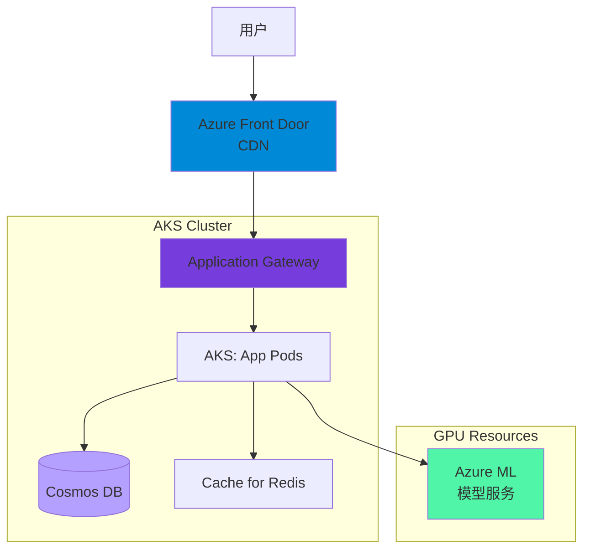
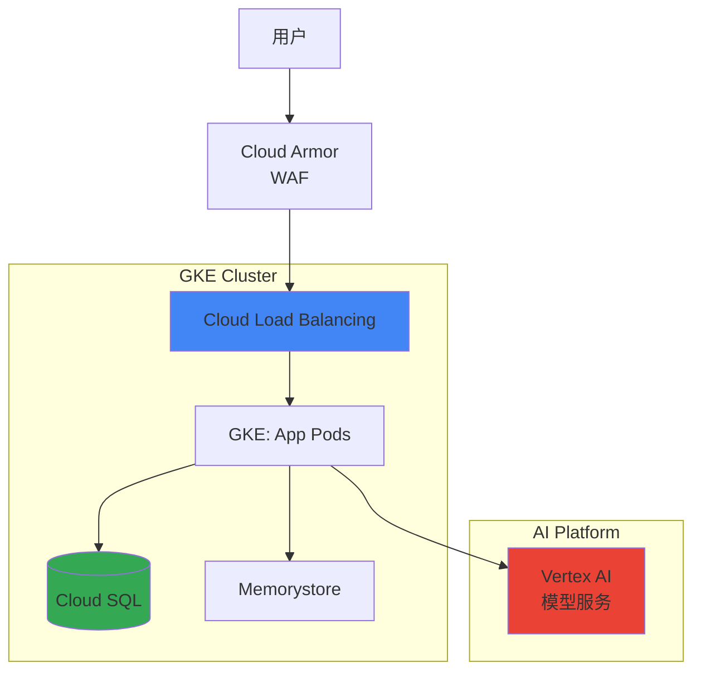

```mermaid
graph TB
    User[用户] --> CloudFront[CloudFront<br/>CDN]
    CloudFront --> ALB[ALB<br/>负载均衡]
    
    subgraph "Public Subnets"
        ALB --> EC2_1[EC2: App 1]
        ALB --> EC2_2[EC2: App 2]
    end
    
    subgraph "Private Subnets"
        EC2_1 --> RDS[(RDS PostgreSQL)]
        EC2_2 --> RDS
        EC2_1 --> ElastiCache[ElastiCache Redis]
        EC2_2 --> ElastiCache
        EC2_1 --> S3_S3[S3: Models]
    end
    
    subgraph "GPU Instances"
        EC2_1 --> SageMaker[SageMaker<br/>模型服务]
    end
    
    CloudFront --> WAF[WAF<br/>防火墙]
    
    style CloudFront fill:#FF9900
    style ALB fill:#232F3E
    style RDS fill:#3B48CC
    style SageMaker fill:#8C4FFF
```

# 云服务部署方案

## 📋 方案概述

**适用场景：**
- 需要快速扩展
- 降低运维成本
- 全球部署需求
- 高可用性要求
- 企业级应用

**优势：**
- ✅ 按需付费
- ✅ 快速部署
- ✅ 全球基础设施
- ✅ 托管服务
- ✅ 自动扩展

---

## 🌐 AWS 部署

### 架构设计



### 部署配置

```yaml
# terraform/aws/main.tf
terraform {
  required_version = ">= 1.0"
  required_providers {
    aws = {
      source  = "hashicorp/aws"
      version = "~> 5.0"
    }
  }
}

provider "aws" {
  region = var.aws_region
}

# VPC
resource "aws_vpc" "main" {
  cidr_block           = "10.0.0.0/16"
  enable_dns_hostnames = true
  enable_dns_support   = true
  
  tags = {
    Name        = "${var.project_name}-vpc"
    Environment = var.environment
  }
}

# Public Subnets
resource "aws_subnet" "public" {
  count             = length(var.availability_zones)
  vpc_id            = aws_vpc.main.id
  cidr_block        = "10.0.${count.index}.0/24"
  availability_zone = var.availability_zones[count.index]
  
  map_public_ip_on_launch = true
  
  tags = {
    Name = "${var.project_name}-public-${count.index}"
    Type = "Public"
  }
}

# Private Subnets
resource "aws_subnet" "private" {
  count             = length(var.availability_zones)
  vpc_id            = aws_vpc.main.id
  cidr_block        = "10.0.${count.index + 10}.0/24"
  availability_zone = var.availability_zones[count.index]
  
  tags = {
    Name = "${var.project_name}-private-${count.index}"
    Type = "Private"
  }
}

# Internet Gateway
resource "aws_internet_gateway" "main" {
  vpc_id = aws_vpc.main.id
  
  tags = {
    Name = "${var.project_name}-igw"
  }
}

# NAT Gateway
resource "aws_eip" "nat" {
  count  = length(var.availability_zones)
  domain = "vpc"
  
  tags = {
    Name = "${var.project_name}-nat-eip-${count.index}"
  }
  
  depends_on = [aws_internet_gateway.main]
}

resource "aws_nat_gateway" "main" {
  count         = length(var.availability_zones)
  allocation_id = aws_eip.nat[count.index].id
  subnet_id     = aws_subnet.public[count.index].id
  
  tags = {
    Name = "${var.project_name}-nat-${count.index}"
  }
  
  depends_on = [aws_internet_gateway.main]
}

# RDS PostgreSQL
resource "aws_db_instance" "postgres" {
  identifier           = "${var.project_name}-postgres"
  engine              = "postgres"
  engine_version      = "15.4"
  instance_class      = "db.r6g.xlarge"
  allocated_storage   = 100
  storage_encrypted   = true
  db_name             = "ai_system"
  username            = "ai_user"
  password            = var.db_password
  
  vpc_security_group_ids = [aws_security_group.db.id]
  db_subnet_group_name   = aws_db_subnet_group.main.name
  
  multi_az               = true
  backup_retention_period = 7
  backup_window          = "03:00-04:00"
  maintenance_window     = "Mon:04:00-Mon:05:00"
  
  performance_insights_enabled = true
  monitoring_interval         = 60
  monitoring_role_arn        = aws_iam_role.rds_monitoring.arn
  
  tags = {
    Name = "${var.project_name}-postgres"
  }
}

# ElastiCache Redis
resource "aws_elasticache_subnet_group" "main" {
  name       = "${var.project_name}-redis-subnet"
  subnet_ids = aws_subnet.private[*].id
}

resource "aws_elasticache_replication_group" "redis" {
  replication_group_id          = "${var.project_name}-redis"
  replication_group_description = "Redis cluster for AI system"
  
  node_type            = "cache.r6g.large"
  port                 = 6379
  parameter_group_name = "default.redis7"
  engine               = "redis"
  engine_version       = "7.0"
  num_cache_clusters   = length(var.availability_zones)
  
  subnet_group_name  = aws_elasticache_subnet_group.main.name
  security_group_ids = [aws_security_group.redis.id]
  
  automatic_failover_enabled = true
  multi_az_enabled          = true
  
  at_rest_encryption_enabled = true
  transit_encryption_enabled = true
  auth_token                = var.redis_password
  
  tags = {
    Name = "${var.project_name}-redis"
  }
}

# EC2 Launch Template
resource "aws_launch_template" "app" {
  name_prefix   = "${var.project_name}-app-"
  image_id      = data.aws_ami.amazon_linux_2.id
  instance_type = "c6g.2xlarge"
  
  key_name = var.ssh_key_name
  
  network_interfaces {
    associate_public_ip_address = false
    security_groups             = [aws_security_group.app.id]
  }
  
  iam_instance_profile {
    name = aws_iam_instance_profile.app.name
  }
  
  user_data = base64encode(templatefile("${path.module}/user-data.sh", {
    db_host     = aws_db_instance.postgres.endpoint
    redis_host  = aws_elasticache_replication_group.redis.primary_endpoint_address
    s3_bucket   = aws_s3_bucket.models.id
    project_name = var.project_name
  }))
  
  tag_specifications {
    resource_type = "instance"
    tags = {
      Name = "${var.project_name}-app"
    }
  }
}

# Auto Scaling Group
resource "aws_autoscaling_group" "app" {
  desired_capacity    = 2
  max_size           = 10
  min_size           = 2
  vpc_zone_identifier = aws_subnet.private[*].id
  
  target_group_arns = [aws_lb_target_group.app.arn]
  
  launch_template {
    id      = aws_launch_template.app.id
    version = "$Latest"
  }
  
  tag {
    key                 = "Name"
    value               = "${var.project_name}-app"
    propagate_at_launch = true
  }
}

# Application Load Balancer
resource "aws_lb" "main" {
  name               = "${var.project_name}-alb"
  internal           = false
  load_balancer_type = "application"
  security_groups    = [aws_security_group.alb.id]
  subnets           = aws_subnet.public[*].id
  
  enable_deletion_protection = false
  enable_http2             = true
  
  tags = {
    Name = "${var.project_name}-alb"
  }
}

resource "aws_lb_target_group" "app" {
  name     = "${var.project_name}-tg"
  port     = 8000
  protocol = "HTTP"
  vpc_id   = aws_vpc.main.id
  
  health_check {
    path                = "/health"
    interval            = 30
    timeout             = 5
    healthy_threshold   = 2
    unhealthy_threshold = 3
  }
}

resource "aws_lb_listener" "http" {
  load_balancer_arn = aws_lb.main.arn
  port             = 80
  protocol         = "HTTP"
  
  default_action {
    type = "redirect"
    
    redirect {
      port        = "443"
      protocol    = "HTTPS"
      status_code = "301"
    }
  }
}

resource "aws_lb_listener" "https" {
  load_balancer_arn = aws_lb.main.arn
  port             = 443
  protocol         = "HTTPS"
  certificate_arn  = aws_acm_certificate.main.arn
  
  default_action {
    type             = "forward"
    target_group_arn = aws_lb_target_group.app.arn
  }
}

# SageMaker Endpoint
resource "aws_sagemaker_endpoint" "main" {
  name = "${var.project_name}-endpoint"
  
  endpoint_config_name = aws_sagemaker_endpoint_config.main.name
}

# S3 Bucket for Models
resource "aws_s3_bucket" "models" {
  bucket = "${var.project_name}-models-${random_string.suffix.result}"
  
  tags = {
    Name = "${var.project_name}-models"
  }
}

resource "aws_s3_bucket_versioning" "models" {
  bucket = aws_s3_bucket.models.id
  
  versioning_configuration {
    status = "Enabled"
  }
}

resource "aws_s3_bucket_server_side_encryption_configuration" "models" {
  bucket = aws_s3_bucket.models.id
  
  rule {
    apply_server_side_encryption_by_default {
      sse_algorithm = "AES256"
    }
  }
}

# CloudFront Distribution
resource "aws_cloudfront_distribution" "main" {
  enabled             = true
  is_ipv6_enabled    = true
  price_class        = "PriceClass_100"
  
  origin {
    domain_name = aws_lb.main.dns_name
    origin_id   = "alb"
    
    custom_origin_config {
      http_port              = 80
      https_port             = 443
      origin_protocol_policy = "https-only"
      origin_ssl_protocols   = ["TLSv1.2"]
    }
  }
  
  default_cache_behavior {
    target_origin_id       = "alb"
    viewer_protocol_policy = "redirect-to-https"
    
    allowed_methods = ["GET", "HEAD", "OPTIONS", "PUT", "POST", "PATCH", "DELETE"]
    cached_methods  = ["GET", "HEAD"]
    
    forwarded_values {
      query_string = false
      cookies {
        forward = "none"
      }
    }
    
    min_ttl     = 0
    default_ttl = 3600
    max_ttl     = 86400
    
    compress               = true
    viewer_protocol_policy = "redirect-to-https"
  }
  
  restrictions {
    geo_restriction {
      restriction_type = "none"
    }
  }
  
  viewer_certificate {
    acm_certificate_arn      = aws_acm_certificate.main.arn
    ssl_support_method       = "sni-only"
    minimum_protocol_version = "TLSv1.2_2021"
  }
}

# WAF
resource "aws_wafv2_web_acl" "main" {
  name        = "${var.project_name}-waf"
  description = "WAF for AI system"
  scope       = "REGIONAL"
  
  default_action {
    allow {}
  }
  
  rule {
    name     = "AWSManagedRulesCommonRuleSet"
    priority = 1
    
    override_action {
      none {}
    }
    
    statement {
      managed_rule_group_statement {
        name        = "AWSManagedRulesCommonRuleSet"
        vendor_name = "AWS"
      }
    }
    
    visibility_config {
      cloudwatch_metrics_enabled = true
      metric_name               = "CommonRuleSet"
      sampled_requests_enabled  = true
    }
  }
  
  visibility_config {
    cloudwatch_metrics_enabled = true
    metric_name               = "${var.project_name}-waf"
    sampled_requests_enabled  = true
  }
}
```

### 部署脚本

```bash
#!/bin/bash
# scripts/aws-deploy.sh

set -e

PROJECT_NAME="ai-system"
ENVIRONMENT="production"
AWS_REGION="us-east-1"

echo "🚀 Deploying to AWS..."

# 初始化 Terraform
cd terraform/aws
terraform init

# 规划变更
echo "📋 Planning infrastructure changes..."
terraform plan \
  -var="project_name=$PROJECT_NAME" \
  -var="environment=$ENVIRONMENT" \
  -var="aws_region=$AWS_REGION" \
  -out=tfplan

# 应用变更
echo "🔨 Applying infrastructure changes..."
terraform apply tfplan

# 获取输出
ALB_DNS=$(terraform output -raw alb_dns_name)
API_ENDPOINT="https://$ALB_DNS"

echo "✅ Infrastructure deployed!"
echo ""
echo "📊 Service URLs:"
echo "  - API: $API_ENDPOINT"
echo "  - Health: $API_ENDPOINT/health"

# 等待 ALB 就绪
echo "⏳ Waiting for ALB to be ready..."
timeout 300 bash -c "until curl -f $API_ENDPOINT/health; do sleep 5; done"

echo "🎉 Deployment completed successfully!"
```

---

## 🔷 Azure 部署

### 架构设计



### 部署配置

```hcl
# terraform/azure/main.tf
terraform {
  required_providers {
    azurerm = {
      source  = "hashicorp/azurerm"
      version = "~> 3.0"
    }
  }
}

provider "azurerm" {
  features {}
}

# Resource Group
resource "azurerm_resource_group" "main" {
  name     = "${var.project_name}-rg"
  location = var.azure_region
  
  tags = {
    Environment = var.environment
    Project     = var.project_name
  }
}

# AKS Cluster
resource "azurerm_kubernetes_cluster" "main" {
  name                = "${var.project_name}-aks"
  location            = azurerm_resource_group.main.location
  resource_group_name = azurerm_resource_group.main.name
  dns_prefix          = "${var.project_name}-aks"
  
  kubernetes_version  = "1.28.0"
  
  default_node_pool {
    name       = "default"
    node_count = 3
    vm_size    = "Standard_D4s_v5"
    
    vnet_subnet_id = azurerm_subnet.aks.id
    
    temporary_name_for_rotation = "temp"
  }
  
  identity {
    type = "SystemAssigned"
  }
  
  network_profile {
    network_plugin = "azure"
    network_policy = "azure"
  }
  
  tags = {
    Environment = var.environment
  }
}

# Cosmos DB
resource "azurerm_cosmosdb_account" "main" {
  name                = "${var.project_name}-cosmos"
  location            = azurerm_resource_group.main.location
  resource_group_name = azurerm_resource_group.main.name
  offer_type         = "Standard"
  kind               = "GlobalDocumentDB"
  
  enable_automatic_failover = false
  
  consistency_policy {
    consistency_level       = "Session"
    max_interval_in_seconds = 5
    max_staleness_prefix    = 100
  }
  
  geo_location {
    location          = azurerm_resource_group.main.location
    failover_priority = 0
  }
  
  tags = {
    Environment = var.environment
  }
}

# Azure Cache for Redis
resource "azurerm_redis_cache" "main" {
  name                = "${var.project_name}-redis"
  location            = azurerm_resource_group.main.location
  resource_group_name = azurerm_resource_group.main.name
  capacity            = 2
  family              = "C"
  sku_name            = "Standard"
  enable_non_ssl_port = false
  minimum_tls_version = "1.2"
  
  tags = {
    Environment = var.environment
  }
}

# Application Gateway
resource "azurerm_application_gateway" "main" {
  name                = "${var.project_name}-agw"
  resource_group_name = azurerm_resource_group.main.name
  location            = azurerm_resource_group.main.location
  
  sku {
    name     = "Standard_v2"
    tier     = "Standard_v2"
    capacity = 2
  }
  
  gateway_ip_configuration {
    subnet_id = azurerm_subnet.app_gateway.id
  }
  
  frontend_port {
    name = "http-port"
    port = 80
  }
  
  frontend_port {
    name = "https-port"
    port = 443
  }
  
  frontend_ip_configuration {
    name                 = "frontend-ip-config"
    public_ip_address_id = azurerm_public_ip.app_gateway.id
  }
  
  backend_address_pool {
    name = "aks-backend"
  }
  
  backend_http_settings {
    name                  = "http-setting"
    cookie_based_affinity = "Disabled"
    port                  = 80
    protocol              = "Http"
    request_timeout       = 60
  }
  
  http_listener {
    name                           = "http-listener"
    frontend_ip_configuration_name = "frontend-ip-config"
    frontend_port_name             = "http-port"
    protocol                       = "Http"
  }
  
  request_routing_rule {
    name                       = "routing-rule"
    rule_type                  = "Basic"
    http_listener_name         = "http-listener"
    backend_address_pool_name  = "aks-backend"
    backend_http_settings_name = "http-setting"
  }
  
  tags = {
    Environment = var.environment
  }
}

# Azure Machine Learning
resource "azurerm_machine_learning_workspace" "main" {
  name                    = "${var.project_name}-ml"
  location                = azurerm_resource_group.main.location
  resource_group_name     = azurerm_resource_group.main.name
  application_insight_id  = azurerm_application_insights.main.id
  key_vault_id            = azurerm_key_vault.main.id
  storage_account_id      = azurerm_storage_account.main.id
  
  identity {
    type = "SystemAssigned"
  }
  
  tags = {
    Environment = var.environment
  }
}
```

---

## 🔵 GCP 部署

### 架构设计



### 部署配置

```hcl
# terraform/gcp/main.tf
terraform {
  required_providers {
    google = {
      source  = "hashicorp/google"
      version = "~> 5.0"
    }
  }
}

provider "google" {
  region  = var.gcp_region
  project = var.gcp_project
}

# VPC
resource "google_compute_network" "main" {
  name                    = "${var.project_name}-vpc"
  auto_create_subnetworks = false
}

# Subnets
resource "google_compute_subnetwork" "private" {
  name          = "${var.project_name}-private"
  ip_cidr_range = "10.0.0.0/18"
  region        = var.gcp_region
  network       = google_compute_network.main.id
  
  private_ip_google_access = true
  
  secondary_ip_range {
    range_name    = "pods"
    ip_cidr_range = "10.48.0.0/14"
  }
  
  secondary_ip_range {
    range_name    = "services"
    ip_cidr_range = "10.52.0.0/20"
  }
}

# GKE Cluster
resource "google_container_cluster" "main" {
  name     = "${var.project_name}-gke"
  location = var.gcp_region
  
  network    = google_compute_network.main.name
  subnetwork = google_compute_subnetwork.private.name
  
  deletion_protection = false
  
  remove_default_node_pool = true
  initial_node_count       = 1
  
  release_channel {
    channel = "REGULAR"
  }
  
  ip_allocation_policy {
    cluster_secondary_range_name  = "pods"
    services_secondary_range_name = "services"
  }
  
  addons_config {
    http_load_balancing {
      disabled = false
    }
    
    horizontal_pod_autoscaling {
      disabled = false
    }
  }
  
  private_cluster_config {
    enable_private_endpoint = true
    enable_private_nodes    = true
    master_ipv4_cidr_block  = "172.16.0.0/28"
  }
  
  workload_identity_config {
    workload_pool = "${var.gcp_project}.svc.id.goog"
  }
}

# Node Pool
resource "google_container_node_pool" "app" {
  name    = "app-pool"
  cluster = google_container_cluster.main.id
  
  node_count = 3
  
  node_config {
    machine_type = "e2-standard-4"
    
    oauth_scopes = [
      "https://www.googleapis.com/auth/cloud-platform"
    ]
    
    workload_metadata_config {
      mode = "GKE_METADATA"
    }
  }
  
  management {
    auto_repair  = true
    auto_upgrade = true
  }
  
  autoscaling {
    min_node_count = 3
    max_node_count = 10
  }
}

# Cloud SQL
resource "google_sql_database_instance" "main" {
  name             = "${var.project_name}-sql"
  database_version = "POSTGRES_15"
  region           = var.gcp_region
  
  settings {
    tier              = "db-custom-4-16384"
    availability_type = "REGIONAL"
    
    database_flags {
      name  = "max_connections"
      value = "100"
    }
    
    backup_configuration {
      enabled                        = true
      point_in_time_recovery_enabled = true
      backup_retention_settings {
        retained_backups = 7
      }
    }
    
    ip_configuration {
      ipv4_enabled    = false
      private_network = google_compute_network.main.id
      
      require_ssl = true
    }
    
    location_preference {
      zone = "${var.gcp_region}-a"
    }
  }
  
  deletion_protection = false
}

# Memorystore
resource "google_redis_instance" "main" {
  name           = "${var.project_name}-redis"
  region         = var.gcp_region
  tier           = "STANDARD_HA"
  memory_size_gb = 16
  
  location_id             = "${var.gcp_region}-a"
  alternative_location_id = "${var.gcp_region}-b"
  
  authorized_network = google_compute_network.main.id
  
  redis_version     = "REDIS_7_0"
  display_name      = "${var.project_name} Redis"
  
  retention_policy {
    retention_period = "345600s"  # 4 days
  }
  
  maintenance_policy {
    weekly_maintenance_window {
      day = "SUNDAY"
      start_time {
        hours   = 2
        minutes = 0
      }
    }
  }
}

# Vertex AI Endpoint
resource "google_vertex_ai_endpoint" "main" {
  name         = "${var.project_name}-endpoint"
  display_name = "${var.project_name} Model Endpoint"
  location     = var.gcp_region
}
```

---

## ☁️ 阿里云部署

### 核心服务

```yaml
# 阿里云服务映射
services:
  计算服务:
    - ECS (Elastic Compute Service)
    - ACK (Alibaba Cloud Kubernetes)
    - ECI (Elastic Container Instance)
  
  存储服务:
    - OSS (Object Storage Service)
    - NAS (Network Attached Storage)
    - ApsaraDB RDS
  
  数据库:
    - PolarDB (云原生数据库)
    - Lindorm (多模数据库)
    - AnalyticDB (数据仓库)
  
  AI 服务:
    - PAI (Platform for AI)
    - EAS (Elastic Algorithm Service)
  
  网络:
    - SLB (Server Load Balancer)
    - ALB (Application Load Balancer)
    - CDN (Content Delivery Network)
```

---

## 🐧 腾讯云部署

### 核心服务

```yaml
# 腾讯云服务映射
services:
  计算服务:
    - CVM (Cloud Virtual Machine)
    - TKE (Tencent Kubernetes Engine)
    - Serverless
  
  存储服务:
    - COS (Cloud Object Storage)
    - CFS (Cloud File Storage)
    - CBS (Cloud Block Storage)
  
  数据库:
    - TencentDB (MySQL/PostgreSQL)
    - TDSQL-C (CynosDB)
    - TDSQL (分布式数据库)
  
  AI 服务:
    - TI 平台
    - TI-ONE (模型训练)
    - TI-EMS (弹性模型服务)
  
  网络:
    - CLB (Cloud Load Balancer)
    - API Gateway
    - CDN
```

---

## 🎯 云服务选型对比

| 特性 | AWS | Azure | GCP | 阿里云 | 腾讯云 |
|------|-----|-------|-----|--------|--------|
| **市场份额** | 32% | 23% | 10% | 4% | 2% |
| **AI 服务** | SageMaker | Azure ML | Vertex AI | PAI | TI 平台 |
| **托管 K8s** | EKS | AKS | GKE | ACK | TKE |
| **数据库** | RDS | Cosmos DB | Cloud SQL | PolarDB | TencentDB |
| **对象存储** | S3 | Blob Storage | Cloud Storage | OSS | COS |
| **CDN** | CloudFront | Front Door | Cloud CDN | CDN | CDN |
| **优势** | 生态最全 | 企业集成好 | 数据分析强 | 国内领先 | 游戏音视频 |
| **适用场景** | 全球部署 | 微软生态 | 数据分析 | 国内业务 | 游戏/直播 |

---

## 🚀 快速部署

### AWS 快速开始

```bash
# 克隆项目
git clone https://github.com/your-org/ai-system.git
cd ai-system

# 配置环境变量
cp terraform/aws/terraform.tfvars.example terraform/aws/terraform.tfvars
vim terraform/aws/terraform.tfvars

# 初始化 Terraform
cd terraform/aws
terraform init

# 部署
terraform apply

# 获取服务地址
terraform output alb_dns_name
```

### Azure 快速开始

```bash
# 登录 Azure
az login

# 创建资源组
az group create --name ai-system-rg --location eastus

# 部署 AKS
az aks create --resource-group ai-system-rg \
  --name ai-system-aks \
  --node-count 3 \
  --node-vm-size Standard_D4s_v5 \
  --enable-managed-identity \
  --network-plugin azure

# 获取凭证
az aks get-credentials --resource-group ai-system-rg --name ai-system-aks

# 部署应用
kubectl apply -f k8s/
```

---

## 📚 相关文档

- [Kubernetes 部署方案](./03-kubernetes-deployment.md)
- [混合部署方案](./05-hybrid-deployment.md)
- [AWS 官方文档](https://docs.aws.amazon.com/)
- [Azure 官方文档](https://docs.microsoft.com/azure)
