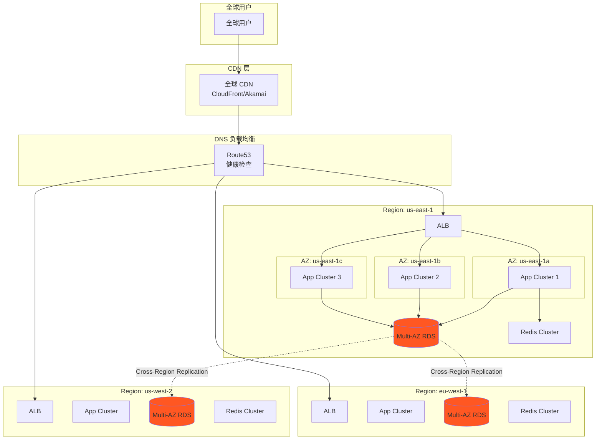

# 高可用部署方案

## 📋 方案概述

**目标：** 实现 99.99% 可用性（年停机时间 < 53分钟）

**适用场景：**
- 关键业务系统
- 大规模生产环境
- 金融/医疗行业
- 7x24 小时服务

**核心原则：**
- ✅ 消除单点故障
- ✅ 故障自动转移
- ✅ 多地域部署
- ✅ 实时监控告警

---

## 🏗️ 架构设计

### 多可用区架构



---

## 🔧 部署配置

### 1. 多可用区配置 (AWS)

```yaml
# k8s/multi-az-deployment.yaml
apiVersion: apps/v1
kind: Deployment
metadata:
  name: ai-app-ha
  namespace: ai-system
spec:
  replicas: 9  # 3 AZs × 3 replicas
  strategy:
    type: RollingUpdate
    rollingUpdate:
      maxSurge: 3
      maxUnavailable: 0
  selector:
    matchLabels:
      app: ai-app
  template:
    metadata:
      labels:
        app: ai-app
    spec:
      # 跨 AZ 分布
      topologySpreadConstraints:
      - maxSkew: 1
        topologyKey: topology.kubernetes.io/zone
        whenUnsatisfiable: DoNotSchedule
        labelSelector:
          matchLabels:
            app: ai-app
      - maxSkew: 1
        topologyKey: kubernetes.io/hostname
        whenUnsatisfiable: ScheduleAnyway
        labelSelector:
          matchLabels:
            app: ai-app
      
      # 反亲和性
      affinity:
        podAntiAffinity:
          preferredDuringSchedulingIgnoredDuringExecution:
          - weight: 100
            podAffinityTerm:
              labelSelector:
                matchLabels:
                  app: ai-app
              topologyKey: kubernetes.io/hostname
      
      containers:
      - name: app
        image: ai-app:latest
        ports:
        - containerPort: 8000
        resources:
          requests:
            memory: "2Gi"
            cpu: "1000m"
          limits:
            memory: "4Gi"
            cpu: "2000m"
        livenessProbe:
          httpGet:
            path: /health
            port: 8000
          initialDelaySeconds: 60
          periodSeconds: 10
          timeoutSeconds: 5
          failureThreshold: 3
        readinessProbe:
          httpGet:
            path: /ready
            port: 8000
          initialDelaySeconds: 30
          periodSeconds: 5
          timeoutSeconds: 3
          failureThreshold: 3

---
# PodDisruptionBudget
apiVersion: policy/v1
kind: PodDisruptionBudget
metadata:
  name: ai-app-pdb
  namespace: ai-system
spec:
  minAvailable: 6  # 保持 2/3 的 Pod 运行
  selector:
    matchLabels:
      app: ai-app
```

### 2. 多主 PostgreSQL 集群

```yaml
# k8s/postgres-ha.yaml
apiVersion: postgresql.cnpg.io/v1
kind: Cluster
metadata:
  name: postgres-ha
  namespace: ai-system
spec:
  instances: 3
  
  # PostgreSQL 配置
  postgresql:
    parameters:
      max_connections: "200"
      shared_buffers: "4GB"
      effective_cache_size: "12GB"
      maintenance_work_mem: "1GB"
      checkpoint_completion_target: "0.9"
      wal_buffers: "16MB"
      default_statistics_target: "100"
      random_page_cost: "1.1"
      effective_io_concurrency: "200"
      work_mem: "2097kB"
      min_wal_size: "2GB"
      max_wal_size: "8GB"
  
  # 主从复制
  replicationSlots:
    highAvailability:
      enabled: true
    updateInterval: 30
  
  # 备份配置
  backup:
    barmanObjectStore:
      destinationPath: "s3://ai-system-backups/postgres"
      s3Credentials:
        accessKeyId:
          name: aws-creds
          key: access-key-id
        secretAccessKey:
          name: aws-creds
          key: secret-access-key
      wal:
        compression: gzip
        maxParallel: 8
      retentionPolicy: "30d"
      data:
        compression: gzip
        jobs: 4
  
  # 监控
  monitoring:
    enabled: true
    
  # 资源配置
  resources:
    requests:
      memory: "8Gi"
      cpu: "4000m"
    limits:
      memory: "16Gi"
      cpu: "8000m"
  
  # 存储配置
  storage:
    size: 500Gi
    storageClass: "fast-ssd"
  
  # 故障转移
  nodeMaintenanceWindow:
    inProgress: false
    reusePVC: true
```

### 3. Redis Cluster

```yaml
# k8s/redis-cluster.yaml
apiVersion: apps/v1
kind: StatefulSet
metadata:
  name: redis-cluster
  namespace: ai-system
spec:
  serviceName: redis-cluster
  replicas: 6  # 3 master × 2 replica
  selector:
    matchLabels:
      app: redis-cluster
  template:
    metadata:
      labels:
        app: redis-cluster
    spec:
      containers:
      - name: redis
        image: redis:7-alpine
        command:
        - redis-server
        - /conf/redis.conf
        - --cluster-enabled yes
        - --cluster-config-file nodes.conf
        - --cluster-node-timeout 5000
        - --appendonly yes
        - --appendfilename appendonly.aof
        - --requirepass $(REDIS_PASSWORD)
        ports:
        - containerPort: 6379
          name: client
        - containerPort: 16379
          name: gossip
        volumeMounts:
        - name: conf
          mountPath: /conf
          readOnly: false
        - name: data
          mountPath: /data
        env:
        - name: REDIS_PASSWORD
          valueFrom:
            secretKeyRef:
              name: app-secrets
              key: redis-password
        resources:
          requests:
            memory: "4Gi"
            cpu: "2000m"
          limits:
            memory: "8Gi"
            cpu: "4000m"
      volumes:
      - name: conf
        configMap:
          name: redis-cluster-config
  volumeClaimTemplates:
  - metadata:
      name: data
    spec:
      accessModes: [ "ReadWriteOnce" ]
      storageClassName: "fast-ssd"
      resources:
        requests:
          storage: 50Gi

---
apiVersion: v1
kind: ConfigMap
metadata:
  name: redis-cluster-config
  namespace: ai-system
data:
  redis.conf: |
    cluster-enabled yes
    cluster-config-file nodes.conf
    cluster-node-timeout 5000
    appendonly yes
    appendfilename appendonly.aof
    save 900 1
    save 300 10
    save 60 10000
```

---

## 🔄 自动故障转移

### 1. 应用层故障转移

```python
# config/failover.py
import time
import logging
from functools import wraps
from django.db import DatabaseError
from redis.exceptions import RedisError

logger = logging.getLogger(__name__)

class CircuitBreaker:
    """熔断器模式"""
    
    def __init__(self, max_failures=5, timeout=60):
        self.max_failures = max_failures
        self.timeout = timeout
        self.failures = 0
        self.last_failure = None
        self.state = 'closed'  # closed, open, half-open
    
    def call(self, func):
        @wraps(func)
        def wrapper(*args, **kwargs):
            # 检查熔断器状态
            if self.state == 'open':
                if time.time() - self.last_failure > self.timeout:
                    self.state = 'half-open'
                    logger.info("Circuit breaker entering half-open state")
                else:
                    raise Exception("Circuit breaker is OPEN")
            
            try:
                result = func(*args, **kwargs)
                
                # 成功则重置
                if self.state == 'half-open':
                    self.state = 'closed'
                    self.failures = 0
                    logger.info("Circuit breaker closed")
                
                return result
            except Exception as e:
                self.failures += 1
                self.last_failure = time.time()
                
                if self.failures >= self.max_failures:
                    self.state = 'open'
                    logger.error(f"Circuit breaker OPEN after {self.failures} failures")
                
                raise e
        
        return wrapper

# 数据库故障转移
class DatabaseFailover:
    """数据库自动故障转移"""
    
    def __init__(self):
        self.primary_db = None
        self.standby_dbs = []
        self.current_index = 0
    
    def get_connection(self):
        """获取可用数据库连接"""
        # 尝试主库
        try:
            if self._is_healthy(self.primary_db):
                return self.primary_db
        except:
            logger.warning("Primary database unavailable")
        
        # 尝试备库
        for db in self.standby_dbs:
            if self._is_healthy(db):
                logger.info(f"Failing over to standby: {db}")
                return db
        
        raise DatabaseError("No available database")
    
    def _is_healthy(self, db):
        """检查数据库健康状态"""
        try:
            with db.cursor() as cursor:
                cursor.execute("SELECT 1")
                return True
        except:
            return False

# 缓存故障转移
class CacheFailover:
    """缓存自动故障转移"""
    
    def __init__(self):
        self.primary = None
        self.replicas = []
    
    def get_cache(self):
        """获取可用缓存实例"""
        # 尝试主缓存
        if self._is_healthy(self.primary):
            return self.primary
        
        # 尝试副本
        for cache in self.replicas:
            if self._is_healthy(cache):
                logger.info(f"Using cache replica: {cache}")
                return cache
        
        # 所有缓存不可用时降级
        logger.warning("All caches unavailable, degrading")
        return None
    
    def _is_healthy(self, cache):
        """检查缓存健康状态"""
        try:
            cache.ping()
            return True
        except:
            return False
```

### 2. 负载均衡配置

```nginx
# nginx-ha.conf
upstream app_backend {
    # 最少连接负载均衡
    least_conn;
    
    # 服务器定义
    server app-1.example.com:8000 max_fails=3 fail_timeout=30s weight=3;
    server app-2.example.com:8000 max_fails=3 fail_timeout=30s weight=3;
    server app-3.example.com:8000 max_fails=3 fail_timeout=30s weight=3;
    server app-4.example.com:8000 max_fails=3 fail_timeout=30s weight=2;
    server app-5.example.com:8000 max_fails=3 fail_timeout=30s weight=2;
    server app-6.example.com:8000 max_fails=3 fail_timeout=30s weight=2;
    
    # 保持连接
    keepalive 32;
    
    # 备用服务器（所有主服务器不可用时使用）
    server backup.example.com:8000 backup;
}

server {
    listen 80;
    server_name ai.example.com;
    
    # 健康检查
    location /health {
        access_log off;
        proxy_pass http://app_backend/health;
    }
    
    # 应用代理
    location / {
        proxy_pass http://app_backend;
        
        # 超时设置
        proxy_connect_timeout 5s;
        proxy_send_timeout 60s;
        proxy_read_timeout 300s;
        
        # 失败重试
        proxy_next_upstream error timeout invalid_header http_500 http_502 http_503 http_504;
        proxy_next_upstream_tries 3;
        
        # 代理头
        proxy_set_header Host $host;
        proxy_set_header X-Real-IP $remote_addr;
        proxy_set_header X-Forwarded-For $proxy_add_x_forwarded_for;
        proxy_set_header X-Forwarded-Proto $scheme;
        
        # 缓冲设置
        proxy_buffering on;
        proxy_buffer_size 4k;
        proxy_buffers 8 32k;
        proxy_busy_buffers_size 64k;
    }
}
```

---

## 💾 数据备份策略

### 1. 多层备份

```yaml
# 备份策略
backup_strategy:
  实时备份:
    - 工具: WAL 归档
    - 频率: 持续
    - 保留: 24小时
    - RTO: < 1分钟
    - RPO: 0
  
  增量备份:
    - 工具: Barman
    - 频率: 每15分钟
    - 保留: 7天
    - RTO: < 15分钟
    - RPO: < 15分钟
  
  完整备份:
    - 工具: pg_dump
    - 频率: 每日
    - 保留: 30天
    - RTO: < 1小时
    - RPO: < 24小时
  
  异地备份:
    - 工具: AWS S3 Cross-Region Replication
    - 频率: 实时
    - 保留: 90天
    - RTO: < 4小时
    - RPO: < 1小时
```

### 2. 自动备份脚本

```bash
#!/bin/bash
# scripts/backup-ha.sh

set -e

BACKUP_DIR="/backup/ai-system"
DATE=$(date +%Y%m%d_%H%M%S)
RETENTION_DAYS=30

# 创建备份目录
mkdir -p $BACKUP_DIR/{postgres,redis,files}

echo "🗄️  Starting backup at $(date)"

# PostgreSQL 备份（并行备份）
echo "📊 Backing up PostgreSQL..."
pg_dump -U ai_user -h postgres-primary.ai-system.svc.cluster.local \
  -j 8 -F d -f $BACKUP_DIR/postgres/backup_$DATE

# Redis 备份
echo "📈 Backing up Redis..."
redis-cli --rdb $BACKUP_DIR/redis/dump_$DATE.rdb \
  -h redis-primary.ai-system.svc.cluster.local

# 文件备份（增量）
echo "📁 Backing up files..."
rsync -av --delete --link-dest=$BACKUP_DIR/files/last \
  /app/media/ $BACKUP_DIR/files/$DATE/

# 更新最新链接
rm -f $BACKUP_DIR/files/last
ln -s $BACKUP_DIR/files/$DATE $BACKUP_DIR/files/last

# 上传到 S3（跨区域）
echo "☁️  Uploading to S3..."
aws s3 sync $BACKUP_DIR/ s3://ai-system-backups/$DATE/ \
  --storage-class STANDARD_IA \
  --metadata "backup-date=$DATE"

# 清理旧备份
echo "🧹 Cleaning old backups..."
find $BACKUP_DIR -mtime +$RETENTION_DAYS -delete

# 验证备份
echo "✅ Verifying backup..."
pg_restore -j 4 --list $BACKUP_DIR/postgres/backup_$DATE > /dev/null

# 发送通知
echo "📧 Sending notification..."
python scripts/notify.py "Backup completed: $DATE"

echo "✅ Backup completed successfully at $(date)"
```

---

## 📊 监控告警

### 1. 全方位监控

```yaml
# 监控指标
monitoring:
  基础设施:
    - CPU 使用率 > 80%
    - 内存使用率 > 85%
    - 磁盘使用率 > 90%
    - 网络带宽 > 80%
  
  应用层:
    - 响应时间 > 3s
    - 错误率 > 1%
    - QPS 下降 > 50%
    - 健康检查失败
  
  数据库:
    - 连接数 > 80%
    - 慢查询 > 100
    - 复制延迟 > 5s
    - 锁等待 > 10s
  
  缓存:
    - 命中率 < 90%
    - 内存使用 > 90%
    - 连接数 > 80%
  
  服务可用性:
    - 服务宕机
    - 副本数不足
    - Pod 频繁重启
    - 节点 NotReady
```

### 2. Prometheus 告警规则

```yaml
# prometheus/alerts.yaml
groups:
- name: ha_alerts
  interval: 30s
  rules:
  # 服务可用性告警
  - alert: ServiceDown
    expr: up == 0
    for: 1m
    labels:
      severity: critical
    annotations:
      summary: "Service {{ $labels.instance }} is down"
      description: "Service has been down for more than 1 minute"
  
  # 高错误率告警
  - alert: HighErrorRate
    expr: |
      rate(http_requests_total{status=~"5.."}[5m]) / 
      rate(http_requests_total[5m]) > 0.01
    for: 5m
    labels:
      severity: warning
    annotations:
      summary: "High error rate on {{ $labels.instance }}"
      description: "Error rate is {{ $value | humanizePercentage }}"
  
  # 数据库连接池告警
  - alert: DatabasePoolExhausted
    expr: |
      pg_stat_activity_count > pg_settings_max_connections * 0.8
    for: 5m
    labels:
      severity: warning
    annotations:
      summary: "Database pool nearly exhausted"
      description: "{{ $value }} connections used"
  
  # Redis 内存告警
  - alert: RedisHighMemory
    expr: |
      redis_memory_used_bytes / redis_memory_max_bytes > 0.9
    for: 5m
    labels:
      severity: warning
    annotations:
      summary: "Redis high memory usage"
      description: "{{ $value | humanizePercentage }} memory used"
  
  # Pod 崩溃告警
  - alert: PodCrashLooping
    expr: |
      rate(kube_pod_container_status_restarts_total[15m]) > 0
    for: 5m
    labels:
      severity: warning
    annotations:
      summary: "Pod {{ $labels.pod }} is crash looping"
      description: "Pod has restarted {{ $value }} times"
```

---

## 🧪 故障演练

### 1. 混沌工程测试

```yaml
# chaos-experiments/failure-scenarios.yaml
apiVersion: chaos-mesh.org/v1alpha1
kind: PodChaos
metadata:
  name: pod-kill-test
  namespace: ai-system
spec:
  action: pod-kill
  mode: fixed-percent
  value: "30"
  selector:
    namespaces:
      - ai-system
    labelSelectors:
      app: ai-app
  scheduler:
    cron: "@every 10m"

---
# 模拟网络延迟
apiVersion: chaos-mesh.org/v1alpha1
kind: NetworkChaos
metadata:
  name: network-delay-test
  namespace: ai-system
spec:
  action: delay
  mode: all
  selector:
    namespaces:
      - ai-system
    labelSelectors:
      app: ai-app
  delay:
    latency: "500ms"
    correlation: "100"
    jitter: "100ms"
  direction: to
  duration: "1m"
  scheduler:
    cron: "@hourly"

---
# 模拟磁盘故障
apiVersion: chaos-mesh.org/v1alpha1
kind: IOChaos
metadata:
  name: disk-fault-test
  namespace: ai-system
spec:
  action: diskFailure
  mode: one
  selector:
    namespaces:
      - ai-system
    labelSelectors:
      app: postgres
  path: "/var/lib/postgresql/data"
  percent: 50
  duration: "30s"
  scheduler:
    cron: "@daily"
```

### 2. 故障恢复演练脚本

```bash
#!/bin/bash
# scripts/disaster-drill.sh

echo "🔥 Starting Disaster Recovery Drill..."

# 场景1: 主数据库故障
echo "📊 Scenario 1: Primary database failure"
kubectl exec -it postgres-0 -n ai-system -- kill 9
echo "Waiting for failover..."
sleep 30
kubectl exec -it postgres-1 -n ai-system -- psql -c "SELECT pg_is_in_recovery();"
echo "✅ Failover successful!"

# 场景2: 整个可用区故障
echo "🌐 Scenario 2: Availability zone failure"
kubectl cordon <node-in-az-a>
kubectl drain <node-in-az-a> --ignore-daemonsets --delete-emptydir-data
echo "Waiting for rescheduling..."
sleep 60
kubectl get pods -n ai-system -o wide
echo "✅ Rescheduling successful!"

# 场景3: 网络分区
echo "🔌 Scenario 3: Network partition"
iptables -A INPUT -s <pod-ip> -j DROP
iptables -A OUTPUT -d <pod-ip> -j DROP
echo "Waiting for network isolation..."
sleep 30
kubectl exec -it app-pod -n ai-system -- curl -f http://service:8000/health
echo "✅ Service survived partition!"

# 清理
echo "🧹 Cleaning up..."
kubectl uncordon <node-in-az-a>
iptables -D INPUT -s <pod-ip> -j DROP
iptables -D OUTPUT -d <pod-ip> -j DROP

echo "🎉 Disaster Recovery Drill completed!"
```

---

## 📈 容量规划

### 集群规模建议

| 用户规模 | 节点数 | 实例类型 | 存储 | 月成本 (估算) |
|---------|-------|---------|------|--------------|
| 10万 | 3 AZ × 3 节点 | c6g.4xlarge | 1TB SSD | $3,000 |
| 50万 | 3 AZ × 5 节点 | c6g.8xlarge | 5TB SSD | $12,000 |
| 100万 | 3 AZ × 10 节点 | c6g.16xlarge | 10TB SSD | $30,000 |

---

## 🎯 SLA 目标

| 指标 | 目标 | 监控方式 |
|------|------|---------|
| **可用性** | 99.99% | Uptime 监控 |
| **响应时间** | P95 < 500ms | APM |
| **错误率** | < 0.1% | 日志分析 |
| **数据持久性** | 99.9999999% | 云厂商 SLA |
| **RTO** | < 5分钟 | 故障演练 |
| **RPO** | < 1分钟 | 备份验证 |

---

## 📚 相关文档

- [Kubernetes 部署方案](./03-kubernetes-deployment.md)
- [安全部署方案](./08-security-deployment.md)
- [监控方案](../monitoring/README.md)
