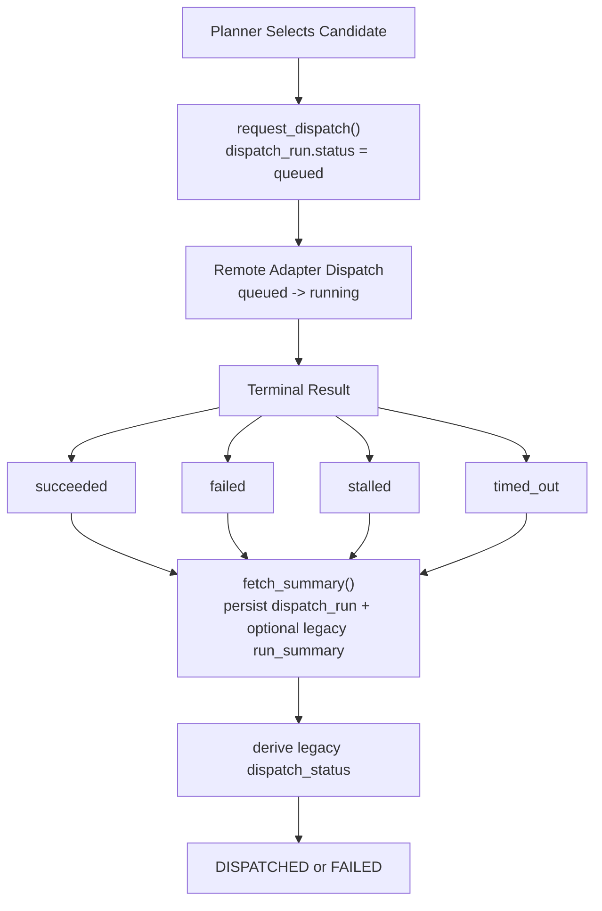

# Run Lifecycle

这份文档描述的是离线 hardening 之后的控制面生命周期，不要求真实 Linux worker 在线。

## Canonical Lifecycle



## Planner State

- `AutoResearchPlanRead.dispatch_run` is the new control-plane record.
- `AutoResearchPlanRead.run_summary` stays as the legacy AEP/OpenHands summary when local execution exists.
- `AutoResearchPlanRead.dispatch_status` remains the compatibility field exposed to current panel/API consumers.

## Remote Status Machine

- `queued`: planner has accepted the run and reserved a lane.
- `running`: adapter has started orchestration and may emit heartbeat data.
- `succeeded`: execution reached a terminal success state.
- `failed`: execution terminated without a usable result.
- `stalled`: orchestration stopped making progress.
- `timed_out`: execution exceeded its allowed runtime budget.

## Compatibility Mapping

- `dispatch_run.status in {queued, running}` -> legacy `dispatch_status = dispatching`
- `dispatch_run.status = succeeded` and summary is promotable -> legacy `dispatch_status = dispatched`
- `dispatch_run.status in {failed, stalled, timed_out}` -> legacy `dispatch_status = failed`

If a local/AEP run happened underneath the adapter, `dispatch_run` is the outer control-plane envelope and `run_summary` remains the inner execution result.

## Artifact Layout

The fake remote adapter writes control-plane artifacts under the normal run root:

```text
.masfactory_runtime/runs/<run_id>/
  remote_control/
    task_spec.json
    record.json
    events.ndjson
    heartbeat.json
    summary.json
```

When the lane falls back to a local AEP run, the existing AEP files stay in the same run root and `remote_control/` becomes the wrapper contract around them.
