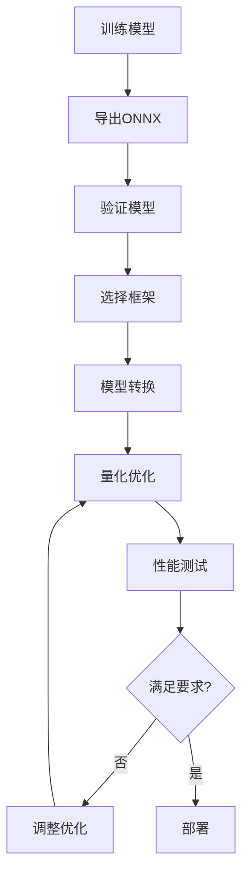

# 边缘AI部署完整指南

## 📋 目录
1. [框架概述](#框架概述)
2. [ONNX Runtime](#onnx-runtime)
3. [TensorRT](#tensorrt)
4. [Core ML](#core-ml)
5. [TFLite](#tflite)
6. [OpenVINO](#openvino)
7. [框架对比](#框架对比)
8. [最佳实践](#最佳实践)
9. [实战案例](#实战案例)

---

## 框架概述

### 什么是边缘AI部署?

边缘AI部署是指将训练好的机器学习模型优化并部署到边缘设备(如手机、IoT设备、嵌入式系统)上,实现本地推理,无需依赖云端。

### 主要优势

- **低延迟**: 本地推理,无需网络传输
- **隐私保护**: 数据不离开设备
- **离线可用**: 无需网络连接
- **成本效益**: 减少云端计算成本

### 五大主流框架对比

| 框架 | 主要平台 | 模型格式 | 优化技术 | 适用场景 |
|------|---------|---------|---------|---------|
| ONNX Runtime | 跨平台 | .onnx | 图优化、量化 | 通用部署 |
| TensorRT | NVIDIA GPU | .onnx, .engine | 层融合、精度校准 | 高性能推理 |
| Core ML | Apple设备 | .mlmodel | 神经网络引擎 | iOS/macOS应用 |
| TFLite | Android/嵌入式 | .tflite | 量化、 pruning | 移动端/IoT |
| OpenVINO | Intel CPU/GPU/VPU | .xml/.bin | 网络优化 | 工业边缘计算 |

---

## ONNX Runtime

### 简介

ONNX Runtime是微软开源的跨平台推理引擎,支持ONNX格式的模型,可在多个硬件平台上高效运行。

### 安装

```bash
# Python环境
pip install onnxruntime

# GPU支持 (CUDA)
pip install onnxruntime-gpu

# 核心安装
pip install onnx
```

### 模型转换

```python
import torch
import torchvision.models as models
import onnx
from onnx import helper, numpy_helper

# 1. 从PyTorch转换为ONNX
model = models.resnet18(pretrained=True)
dummy_input = torch.randn(1, 3, 224, 224)

torch.onnx.export(
    model,
    dummy_input,
    "resnet18.onnx",
    input_names=['input'],
    output_names=['output'],
    dynamic_axes={'input': {0: 'batch_size'}, 'output': {0: 'batch_size'}}
)

# 2. 验证ONNX模型
onnx_model = onnx.load("resnet18.onnx")
onnx.checker.check_model(onnx_model)

print("✅ ONNX模型转换成功!")
```

### 优化推理

```python
import onnxruntime as ort
import numpy as np
import time

# 1. 创建推理会话
# 可用优化级别: 
# - ORT_DISABLE_ALL (无优化)
# - ORT_ENABLE_BASIC (基本优化)
# - ORT_ENABLE_EXTENDED (扩展优化)
# - ORT_ENABLE_ALL (所有优化)

sess_options = ort.SessionOptions()
sess_options.graph_optimization_level = ort.GraphOptimizationLevel.ORT_ENABLE_ALL
sess_options.optimized_model_filepath = "resnet18_optimized.onnx"

session = ort.InferenceSession(
    "resnet18.onnx",
    sess_options,
    providers=['CPUExecutionProvider']  # 或 ['CUDAExecutionProvider']
)

# 2. 准备输入
input_name = session.get_inputs()[0].name
output_name = session.get_outputs()[0].name

dummy_input = np.random.randn(1, 3, 224, 224).astype(np.float32)

# 3. 推理并测试性能
warmup_runs = 5
test_runs = 100

# 预热
for _ in range(warmup_runs):
    session.run([output_name], {input_name: dummy_input})

# 性能测试
start_time = time.time()
for _ in range(test_runs):
    output = session.run([output_name], {input_name: dummy_input})
end_time = time.time()

avg_time = (end_time - start_time) / test_runs * 1000
print(f"⚡ 平均推理时间: {avg_time:.2f} ms")
print(f"📊 吞吐量: {1000 / avg_time:.2f} FPS")
```

### 量化优化

```python
from onnxruntime.quantization import quantize_dynamic, quantize_static, QuantType
from onnxruntime.quantization.preprocess import extract_statistics

# 动态量化 (无需校准数据集)
# 优点: 无需校准数据,快速
# 缺点: 精度损失可能较大
quantize_dynamic(
    model_input="resnet18.onnx",
    model_output="resnet18_dynamic_quant.onnx",
    weight_type=QuantType.QUInt8  # 或 QuantType.QInt8
)

# 静态量化 (需要校准数据集)
# 优点: 精度更高
# 缺点: 需要准备校准数据
def calibration_data_reader():
    # 返回校准数据
    yield {"input": np.random.randn(1, 3, 224, 224).astype(np.float32)}

quantize_static(
    model_input="resnet18.onnx",
    model_output="resnet18_static_quant.onnx",
    calibration_data_reader=calibration_data_reader,
    quant_format=QuantType.QInt8
)

print("✅ 量化完成!")
```

### 多GPU推理

```python
# 多GPU并行推理
import multiprocessing as mp

def run_inference(device_id, input_data):
    session = ort.InferenceSession(
        "resnet18.onnx",
        providers=['CUDAExecutionProvider'],
        provider_options=[{'device_id': device_id}]
    )
    # 执行推理...
    return result

if __name__ == '__main__':
    num_gpus = 4
    pool = mp.Pool(num_gpus)
    
    inputs = [dummy_input] * 100
    results = pool.starmap(run_inference, 
                          [(i % num_gpus, inp) for i, inp in enumerate(inputs)])
```

---

## TensorRT

### 简介

TensorRT是NVIDIA推出的高性能深度学习推理优化器,专门针对NVIDIA GPU进行优化。

### 安装

```bash
# 使用Docker (推荐)
docker pull nvcr.io/nvidia/tensorrt:24.02-py3

# 或从源码编译
# 需要先安装CUDA, cuDNN
pip install nvidia-tensorrt
```

### 模型转换

```python
import tensorrt as trt
import pycuda.driver as cuda
import pycuda.autoinit

class TensorRTConverter:
    def __init__(self, onnx_path):
        self.onnx_path = onnx_path
        self.logger = trt.Logger(trt.Logger.INFO)
        self.builder = trt.Builder(self.logger)
        self.network = None
        self.engine = None
        self.config = None
        
    def build_engine(self, max_batch_size=1, fp16=True, int8=False):
        """构建TensorRT引擎"""
        self.network = self.builder.create_network(1 << int(trt.NetworkDefinitionCreationFlag.EXPLICIT_BATCH))
        self.parser = trt.OnnxParser(self.network, self.logger)
        
        # 解析ONNX模型
        with open(self.onnx_path, 'rb') as f:
            if not self.parser.parse(f.read()):
                print("❌ 解析ONNX失败!")
                for error in range(self.parser.num_errors):
                    print(self.parser.get_error(error))
                return None
        
        print("✅ ONNX解析成功!")
        
        # 创建构建配置
        self.config = self.builder.create_builder_config()
        self.config.set_memory_pool_limit(trt.MemoryPoolType.WORKSPACE, 1 << 30)  # 1GB
        
        # 设置优化配置文件
        profile = self.builder.create_optimization_profile()
        input_tensor = self.network.get_input(0)
        input_name = input_tensor.name
        
        # 设置动态形状范围
        min_shape = (1, 3, 224, 224)
        opt_shape = (4, 3, 224, 224)
        max_shape = (8, 3, 224, 224)
        
        profile.set_shape(input_name, min_shape, opt_shape, max_shape)
        self.config.add_optimization_profile(profile)
        
        # 启用FP16精度
        if fp16 and self.builder.platform_has_fast_fp16:
            self.config.set_flag(trt.BuilderFlag.FP16)
            print("✅ FP16已启用")
        
        # 启用INT8精度
        if int8 and self.builder.platform_has_fast_int8:
            self.config.set_flag(trt.BuilderFlag.INT8)
            print("✅ INT8已启用")
        
        # 构建引擎
        print("🔧 正在构建TensorRT引擎...")
        self.engine = self.builder.build_serialized_network(self.network, self.config)
        
        if self.engine is None:
            print("❌ 引擎构建失败!")
            return None
        
        print("✅ TensorRT引擎构建成功!")
        return self.engine
    
    def save_engine(self, engine_path):
        """保存引擎"""
        with open(engine_path, 'wb') as f:
            f.write(self.engine)
        print(f"✅ 引擎已保存: {engine_path}")

# 使用示例
converter = TensorRTConverter("resnet18.onnx")
engine = converter.build_engine(max_batch_size=8, fp16=True)
if engine:
    converter.save_engine("resnet18.trt")
```

### 推理

```python
import tensorrt as trt
import pycuda.driver as cuda
import numpy as np

class TensorRTInference:
    def __init__(self, engine_path):
        self.logger = trt.Logger(trt.Logger.INFO)
        self.engine = None
        self.context = None
        self.inputs = []
        self.outputs = []
        self.bindings = []
        self.stream = None
        
        self.load_engine(engine_path)
        
    def load_engine(self, engine_path):
        """加载TensorRT引擎"""
        with open(engine_path, 'rb') as f:
            self.engine = trt.Runtime(self.logger).deserialize_cuda_engine(f.read())
        
        self.context = self.engine.create_execution_context()
        
        # 准备缓冲区
        for i in range(self.engine.num_io_tensors):
            tensor_name = self.engine.get_tensor_name(i)
            dtype = trt.nptype(self.engine.get_tensor_dtype(tensor_name))
            shape = self.context.get_tensor_shape(tensor_name)
            size = trt.volume(shape)
            
            # 分配内存
            host_mem = cuda.pagelocked_empty(size, dtype)
            device_mem = cuda.mem_alloc(host_mem.nbytes)
            
            self.bindings.append(int(device_mem))
            
            if self.engine.get_tensor_mode(tensor_name) == trt.TensorIOMode.INPUT:
                self.inputs.append({
                    'name': tensor_name,
                    'host': host_mem,
                    'device': device_mem,
                    'shape': shape,
                    'dtype': dtype
                })
            else:
                self.outputs.append({
                    'name': tensor_name,
                    'host': host_mem,
                    'device': device_mem,
                    'shape': shape,
                    'dtype': dtype
                })
        
        # 创建CUDA流
        self.stream = cuda.Stream()
        print(f"✅ TensorRT引擎加载完成: {engine_path}")
    
    def infer(self, input_data):
        """执行推理"""
        # 拷贝输入数据到设备
        for i, input_dict in enumerate(self.inputs):
            np.copyto(input_dict['host'], input_data.ravel())
            cuda.memcpy_htod_async(input_dict['device'], 
                                   input_dict['host'], 
                                   self.stream)
        
        # 执行推理
        self.context.execute_async_v3(stream_handle=self.stream.handle)
        
        # 拷贝输出数据到主机
        for output in self.outputs:
            cuda.memcpy_dtoh_async(output['host'], 
                                   output['device'], 
                                   self.stream)
        
        # 同步流
        self.stream.synchronize()
        
        # 返回输出
        return [output['host'] for output in self.outputs]

# 使用示例
inferencer = TensorRTInference("resnet18.trt")
input_data = np.random.randn(1, 3, 224, 224).astype(np.float32)
outputs = inferencer.infer(input_data)
print(f"✅ 推理完成, 输出形状: {outputs[0].shape}")
```

### 精度校准 (INT8)

```python
import tensorrt as trt
import numpy as np

class INT8Calibrator(trt.IInt8EntropyCalibrator2):
    def __init__(self, calibration_data, batch_size=8):
        trt.IInt8EntropyCalibrator2.__init__(self)
        self.calibration_data = calibration_data
        self.batch_size = batch_size
        self.current_index = 0
        
        # 分配GPU内存
        self.device_input = cuda.mem_alloc(batch_size * 3 * 224 * 224 * 4)
    
    def get_batch_size(self):
        return self.batch_size
    
    def get_batch(self, names):
        if self.current_index + self.batch_size > len(self.calibration_data):
            return None
        
        batch = self.calibration_data[self.current_index:self.current_index + self.batch_size]
        self.current_index += self.batch_size
        
        # 拷贝数据到GPU
        np.copyto(self.device_input, batch.astype(np.float32))
        return [int(self.device_input)]
    
    def read_entropy_calibration_cache(self):
        return None
    
    def write_entropy_calibration_cache(self, cache):
        pass

# 使用校准器
calibrator = INT8Calibrator(calibration_data, batch_size=8)
config.set_int8_calibrator(calibrator)
```

---

## Core ML

### 简介

Core ML是Apple的机器学习框架,专门为iOS、macOS、watchOS等Apple平台优化。

### 安装

```bash
# 安装coremltools
pip install coremltools

# 需要Xcode开发环境
```

### 模型转换

```python
import coremltools as ct
import torch
import torchvision.models as models

# 1. 从PyTorch转换
class WrapperModel(torch.nn.Module):
    def __init__(self, model):
        super().__init__()
        self.model = model
    
    def forward(self, x):
        return self.model(x)

# 包装模型
model = models.resnet18(pretrained=True)
model.eval()
wrapper = WrapperModel(model)

# 示例输入
example_input = torch.rand(1, 3, 224, 224)

# 转换为TorchScript (Core ML需要)
traced_model = torch.jit.trace(wrapper, example_input)

# 转换为Core ML模型
mlmodel = ct.convert(
    traced_model,
    inputs=[ct.TensorType(shape=example_input.shape, name="input")]
)

# 添加元数据
mlmodel.short_description = "ResNet18图像分类模型"
mlmodel.author = "Your Name"
mlmodel.license = "MIT"

# 保存
mlmodel.save("ResNet18.mlmodel")
print("✅ Core ML模型保存成功!")
```

### 模型量化

```python
import coremltools as ct
from coremltools.models.neural_network import quantization_utils

# 加载模型
model = ct.models.MLModel("ResNet18.mlmodel")

# 8位量化
quantized_model = quantization_utils.quantize_weights(
    model,
    nbits=8
)

# 保存量化模型
quantized_model.save("ResNet18_quantized.mlmodel")
print("✅ 模型量化完成!")
```

### 推理 (Swift)

```swift
import CoreML
import Vision
import UIKit

class ImageClassifier {
    private let model: MLModel?
    
    init() {
        do {
            self.model = try ResNet18(configuration: MLModelConfiguration())
        } catch {
            print("❌ 模型加载失败: \(error)")
            self.model = nil
        }
    }
    
    func classify(image: UIImage, completion: @escaping (String?, Double?) -> Void) {
        guard let model = model else {
            completion(nil, nil)
            return
        }
        
        // 转换UIImage为MLFeatureValue
        guard let pixelBuffer = image.toCVPixelBuffer() else {
            completion(nil, nil)
            return
        }
        
        // 创建VNCoreMLRequest
        let vnModel = try? VNCoreMLModel(for: model.model)
        let request = VNCoreMLRequest(model: vnModel!) { request, error in
            guard let results = request.results as? [VNClassificationObservation],
                  let topResult = results.first else {
                completion(nil, nil)
                return
            }
            
            DispatchQueue.main.async {
                completion(topResult.identifier, topResult.confidence)
            }
        }
        
        // 执行推理
        let handler = VNImageRequestHandler(cvPixelBuffer: pixelBuffer, options: [:])
        try? handler.perform([request])
    }
}

// UIImage扩展
extension UIImage {
    func toCVPixelBuffer() -> CVPixelBuffer? {
        let attrs = [
            kCVPixelBufferCGImageCompatibilityKey: kCFBooleanTrue,
            kCVPixelBufferCGBitmapContextCompatibilityKey: kCFBooleanTrue
        ] as CFDictionary
        
        var pixelBuffer: CVPixelBuffer?
        let status = CVPixelBufferCreate(
            kCFAllocatorDefault,
            Int(self.size.width),
            Int(self.size.height),
            kCVPixelFormatType_32ARGB,
            attrs,
            &pixelBuffer
        )
        
        guard status == kCVReturnSuccess, let buffer = pixelBuffer else {
            return nil
        }
        
        CVPixelBufferLockBaseAddress(buffer, [])
        defer { CVPixelBufferUnlockBaseAddress(buffer, []) }
        
        let context = CGContext(
            data: CVPixelBufferGetBaseAddress(buffer),
            width: Int(self.size.width),
            height: Int(self.size.height),
            bitsPerComponent: 8,
            bytesPerRow: CVPixelBufferGetBytesPerRow(buffer),
            space: CGColorSpaceCreateDeviceRGB(),
            bitmapInfo: CGImageAlphaInfo.noneSkipFirst.rawValue
        )
        
        context?.draw(self.size.width == self.size.height ? self.cgImage! : self.cgImage!.crop(to: CGSize(width: self.size.height, height: self.size.height))!, in: CGRect(x: 0, y: 0, width: self.size.width, height: self.size.height))
        
        return buffer
    }
}

// CGImage扩展
extension CGImage {
    func crop(to rect: CGRect) -> CGImage {
        return self.cropping(to: rect) ?? self
    }
}

// 使用示例
let classifier = ImageClassifier()
classifier.classify(image: UIImage(named: "test.jpg")!) { label, confidence in
    if let label = label, let confidence = confidence {
        print("预测: \(label), 置信度: \(confidence)")
    }
}
```

---

## TFLite

### 简介

TensorFlow Lite是Google推出的轻量级机器学习框架,专为移动和嵌入式设备设计。

### 安装

```bash
# Python环境
pip install tensorflow

# 或只安装TFLite
pip install tflite-runtime
```

### 模型转换

```python
import tensorflow as tf
from tensorflow import keras

# 1. 训练或加载模型
model = keras.applications.MobileNetV2(weights='imagenet')
model.save('mobilenet_v2.h5')

# 2. 转换为TFLite格式
converter = tf.lite.TFLiteConverter.from_keras_model(model)

# 基本转换
tflite_model = converter.convert()

# 优化转换
converter.optimizations = [tf.lite.Optimize.DEFAULT]
tflite_model_optimized = converter.convert()

# 保存模型
with open('mobilenet_v2.tflite', 'wb') as f:
    f.write(tflite_model)

with open('mobilenet_v2_optimized.tflite', 'wb') as f:
    f.write(tflite_model_optimized)

print("✅ TFLite模型转换完成!")
```

### 量化

```python
import tensorflow as tf

# 1. 动态范围量化 (无需校准数据)
converter = tf.lite.TFLiteConverter.from_keras_model(model)
converter.optimizations = [tf.lite.Optimize.DEFAULT]
tflite_dynamic_quant = converter.convert()

# 2. 全整数量化 (需要代表性数据)
def representative_dataset():
    for i in range(100):
        data = np.random.rand(1, 224, 224, 3).astype(np.float32)
        yield [data]

converter = tf.lite.TFLiteConverter.from_keras_model(model)
converter.optimizations = [tf.lite.Optimize.DEFAULT]
converter.representative_dataset = representative_dataset
converter.target_spec.supported_ops = [tf.lite.OpsSet.TFLITE_BUILTINS_INT8]
converter.inference_input_type = tf.int8  # 或 tf.uint8
converter.inference_output_type = tf.int8  # 或 tf.uint8
tflite_full_int_quant = converter.convert()

# 3. Float16量化
converter = tf.lite.TFLiteConverter.from_keras_model(model)
converter.optimizations = [tf.lite.Optimize.DEFAULT]
converter.target_spec.supported_types = [tf.float16]
tflite_float16_quant = converter.convert()

# 保存量化模型
with open('mobilenet_v2_dynamic_quant.tflite', 'wb') as f:
    f.write(tflite_dynamic_quant)

with open('mobilenet_v2_full_int_quant.tflite', 'wb') as f:
    f.write(tflite_full_int_quant)

with open('mobilenet_v2_float16_quant.tflite', 'wb') as f:
    f.write(tflite_float16_quant)

print("✅ 模型量化完成!")
```

### 推理

```python
import tensorflow as tf
import numpy as np

class TFLiteInference:
    def __init__(self, model_path):
        self.interpreter = tf.lite.Interpreter(model_path=model_path)
        self.interpreter.allocate_tensors()
        
        # 获取输入输出详情
        self.input_details = self.interpreter.get_input_details()
        self.output_details = self.interpreter.get_output_details()
        
        print(f"✅ TFLite模型加载完成: {model_path}")
        print(f"输入形状: {self.input_details[0]['shape']}")
        print(f"输出形状: {self.output_details[0]['shape']}")
    
    def preprocess(self, image):
        """图像预处理"""
        # 调整大小
        image = tf.image.resize(image, [224, 224])
        # 归一化
        image = image / 255.0
        # 添加batch维度
        image = tf.expand_dims(image, axis=0)
        return image.numpy()
    
    def infer(self, input_data):
        """执行推理"""
        # 设置输入
        self.interpreter.set_tensor(
            self.input_details[0]['index'],
            input_data.astype(self.input_details[0]['dtype'])
        )
        
        # 推理
        self.interpreter.invoke()
        
        # 获取输出
        output = self.interpreter.get_tensor(
            self.output_details[0]['index']
        )
        return output
    
    def benchmark(self, num_runs=100):
        """性能测试"""
        import time
        
        # 预热
        dummy_input = np.random.rand(*self.input_details[0]['shape']).astype(
            self.input_details[0]['dtype']
        )
        for _ in range(10):
            self.infer(dummy_input)
        
        # 测试
        start_time = time.time()
        for _ in range(num_runs):
            self.infer(dummy_input)
        end_time = time.time()
        
        avg_time = (end_time - start_time) / num_runs * 1000
        throughput = 1000 / avg_time
        
        print(f"⚡ 平均推理时间: {avg_time:.2f} ms")
        print(f"📊 吞吐量: {throughput:.2f} FPS")
        
        return avg_time, throughput

# 使用示例
inferencer = TFLiteInference('mobilenet_v2.tflite')

# 准备输入
image = tf.keras.preprocessing.image.load_img(
    'test.jpg',
    target_size=(224, 224)
)
image_array = tf.keras.preprocessing.image.img_to_array(image)
input_data = inferencer.preprocess(image_array)

# 推理
output = inferencer.infer(input_data)
print(f"✅ 推理完成, 输出形状: {output.shape}")

# 性能测试
inferencer.benchmark()
```

### Android集成

```java
import org.tensorflow.lite.Interpreter;
import java.nio.MappedByteBuffer;
import java.nio.channels.FileChannel;
import java.io.FileInputStream;
import java.io.IOException;
import java.nio.ByteBuffer;
import java.nio.ByteOrder;

public class TFLiteClassifier {
    private Interpreter interpreter;
    
    // 加载模型
    public TFLiteClassifier(String modelPath) throws IOException {
        MappedByteBuffer model = loadModelFile(modelPath);
        Interpreter.Options options = new Interpreter.Options();
        options.setNumThreads(4); // 使用多线程
        interpreter = new Interpreter(model, options);
    }
    
    private MappedByteBuffer loadModelFile(String modelPath) throws IOException {
        FileInputStream fileInputStream = new FileInputStream(modelPath);
        FileChannel fileChannel = fileInputStream.getChannel();
        long startOffset = fileChannel.position();
        long declaredLength = fileChannel.size();
        return fileChannel.map(FileChannel.MapMode.READ_ONLY, startOffset, declaredLength);
    }
    
    // 图像预处理
    public ByteBuffer preprocessImage(Bitmap bitmap) {
        int batchSize = 1;
        int pixelSize = 3; // RGB
        int[] inputShape = interpreter.getInputTensor(0).shape(); // [1, 224, 224, 3]
        int width = inputShape[2];
        int height = inputShape[3];
        
        ByteBuffer inputBuffer = ByteBuffer.allocateDirect(
            batchSize * width * height * pixelSize * 4 // 4 bytes per float
        );
        inputBuffer.order(ByteOrder.nativeOrder());
        
        // 调整大小并归一化
        Bitmap resizedBitmap = Bitmap.createScaledBitmap(bitmap, width, height, true);
        int[] intValues = new int[width * height];
        resizedBitmap.getPixels(intValues, 0, width, 0, 0, width, height);
        
        int pixel = 0;
        for (int i = 0; i < width; ++i) {
            for (int j = 0; j < height; ++j) {
                final int val = intValues[pixel++];
                inputBuffer.putFloat(((val >> 16) & 0xFF) / 255.0f); // R
                inputBuffer.putFloat(((val >> 8) & 0xFF) / 255.0f);  // G
                inputBuffer.putFloat((val & 0xFF) / 255.0f);         // B
            }
        }
        
        return inputBuffer;
    }
    
    // 推理
    public float[][] infer(ByteBuffer inputBuffer) {
        float[][] output = new float[1][1000]; // ImageNet 1000类
        interpreter.run(inputBuffer, output);
        return output;
    }
    
    // 获取Top K预测
    public List< Prediction> getTopKPredictions(float[][] output, int k) {
        PriorityQueue< Prediction> pq = new PriorityQueue<>(
            (a, b) -> Float.compare(b.confidence, a.confidence)
        );
        
        for (int i = 0; i < output[0].length; i++) {
            pq.add(new Prediction(getLabel(i), output[0][i]));
        }
        
        List< Prediction> predictions = new ArrayList<>();
        for (int i = 0; i < k && !pq.isEmpty(); i++) {
            predictions.add(pq.poll());
        }
        
        return predictions;
    }
    
    private String getLabel(int index) {
        // 加载ImageNet标签文件
        return "class_" + index;
    }
    
    // 预测结果类
    public static class Prediction {
        public String label;
        public float confidence;
        
        public Prediction(String label, float confidence) {
            this.label = label;
            this.confidence = confidence;
        }
    }
}

// 使用示例
try {
    TFLiteClassifier classifier = new TFLiteClassifier("mobilenet_v2.tflite");
    
    // 加载图像
    Bitmap bitmap = BitmapFactory.decodeResource(getResources(), R.drawable.test_image);
    
    // 预处理
    ByteBuffer inputBuffer = classifier.preprocessImage(bitmap);
    
    // 推理
    float[][] output = classifier.infer(inputBuffer);
    
    // 获取Top 5预测
    List< Prediction> top5 = classifier.getTopKPredictions(output, 5);
    for (Prediction pred : top5) {
        System.out.println(pred.label + ": " + pred.confidence);
    }
} catch (IOException e) {
    e.printStackTrace();
}
```

---

## OpenVINO

### 简介

OpenVINO (Open Visual Inference and Neural network Optimization) 是Intel推出的开源工具包,用于优化和部署AI模型。

### 安装

```bash
# Python安装
pip install openvino-dev[onnx]

# 或从官网下载
# https://docs.openvino.ai/latest/get_started.html
```

### 模型转换

```python
from openvino.tools import mo
from openvino.runtime import Core
import torch
import torchvision.models as models

# 1. 从ONNX转换为OpenVINO IR格式
# 方式1: 使用命令行
import subprocess

subprocess.run([
    'mo',
    '--input_model', 'resnet18.onnx',
    '--output_dir', './openvino_model',
    '--data_type', 'FP16'  # 或 FP32
])

# 方式2: 使用Python API
from openvino.tools.mo import convert_model

model = models.resnet18(pretrained=True)
dummy_input = torch.randn(1, 3, 224, 224)

# 转换为ONNX
torch.onnx.export(model, dummy_input, "resnet18.onnx")

# 转换为OpenVINO IR
ov_model = convert_model("resnet18.onnx")

# 保存模型
from openvino.runtime import serialize
serialize(ov_model, "resnet18.xml")
serialize(ov_model, "resnet18.bin")

print("✅ OpenVINO模型转换完成!")
```

### 推理

```python
from openvino.runtime import Core
import numpy as np
import cv2

class OpenVINOInference:
    def __init__(self, model_xml, model_bin=None, device='CPU'):
        self.core = Core()
        
        # 检查可用设备
        print("可用设备:", self.core.available_devices)
        
        # 读取模型
        if model_bin:
            self.model = self.core.read_model(model=model_xml, weights=model_bin)
        else:
            self.model = self.core.read_model(model=model_xml)
        
        # 编译模型
        self.compile_model = self.core.compile_model(model=self.model, device_name=device)
        self.infer_request = self.compile_model.create_infer_request()
        
        # 获取输入输出信息
        self.input_layer = self.compile_model.input(0)
        self.output_layer = self.compile_model.output(0)
        
        print(f"✅ OpenVINO模型加载完成: {model_xml}")
        print(f"输入形状: {self.input_layer.shape}")
        print(f"输出形状: {self.output_layer.shape}")
    
    def preprocess(self, image_path):
        """图像预处理"""
        # 读取图像
        image = cv2.imread(image_path)
        
        # 调整大小
        N, C, H, W = self.input_layer.shape
        image = cv2.resize(image, (W, H))
        
        # 转换为RGB并归一化
        image = cv2.cvtColor(image, cv2.COLOR_BGR2RGB)
        image = image.astype(np.float32) / 255.0
        
        # ImageNet标准化
        mean = [0.485, 0.456, 0.406]
        std = [0.229, 0.224, 0.225]
        image = (image - mean) / std
        
        # 转换为NCHW格式
        image = np.transpose(image, (2, 0, 1))
        image = np.expand_dims(image, axis=0)
        
        return image
    
    def infer(self, input_data):
        """执行推理"""
        # 设置输入
        self.infer_request.set_input_tensor(0, input_data)
        
        # 推理
        self.infer_request.start_async()
        self.infer_request.wait()
        
        # 获取输出
        output = self.infer_request.get_output_tensor(0).data
        return output
    
    def benchmark(self, num_runs=100):
        """性能测试"""
        import time
        
        # 创建随机输入
        input_data = np.random.rand(*self.input_layer.shape).astype(np.float32)
        
        # 预热
        for _ in range(10):
            self.infer(input_data)
        
        # 测试
        start_time = time.time()
        for _ in range(num_runs):
            self.infer(input_data)
        end_time = time.time()
        
        avg_time = (end_time - start_time) / num_runs * 1000
        throughput = 1000 / avg_time
        
        print(f"⚡ 平均推理时间: {avg_time:.2f} ms")
        print(f"📊 吞吐量: {throughput:.2f} FPS")
        
        return avg_time, throughput

# 使用示例
inferencer = OpenVINOInference("resnet18.xml", "resnet18.bin", device='CPU')

# 准备输入
input_data = inferencer.preprocess("test.jpg")

# 推理
output = inferencer.infer(input_data)
print(f"✅ 推理完成, 输出形状: {output.shape}")

# 性能测试
inferencer.benchmark()
```

### 设备选择

```python
from openvino.runtime import Core

core = Core()

# 查看可用设备
print("可用设备:", core.available_devices)

# 设备属性
for device in core.available_devices:
    print(f"\n设备: {device}")
    print(f"完整名称: {core.get_property(device, 'FULL_DEVICE_NAME')}")
    
    if device == 'GPU':
        print(f"显存: {core.get_property(device, 'GPU_MEMORY_STATISTICS')}")

# 设备选择优先级
# 1. GPU (最快,但需要Intel GPU)
# 2. CPU (通用,支持多线程)
# 3. NPU (专用AI加速器)

# 自动选择最佳设备
def get_optimal_device(core):
    if 'GPU' in core.available_devices:
        return 'GPU'
    elif 'NPU' in core.available_devices:
        return 'NPU'
    else:
        return 'CPU'

device = get_optimal_device(core)
print(f"选择设备: {device}")
```

### 性能优化

```python
from openvino.runtime import Core
from openvino.runtime import get_version

print(f"OpenVINO版本: {get_version()}")

core = Core()

# 配置性能优化
def configure_performance(core, model, device='CPU'):
    # CPU优化
    if device == 'CPU':
        # 设置线程数
        core.set_property(device, {'INFERENCE_NUM_THREADS': 8})
        
        # 启用CPU绑定
        core.set_property(device, {'CPU_BIND_THREAD': 'YES'})
        
        # 启用内存优化
        core.set_property(device, {'CPU_THROUGHPUT_STREAMS': 'CPU_THROUGHPUT_AUTO'})
    
    # GPU优化
    elif device == 'GPU':
        # 启用批处理
        core.set_property(device, {'GPU_QUEUE_THROTTLE': 1})
        
        # 启用内存优化
        core.set_property(device, {'GPU_MEMORY_STATISTICS': 'YES'})
        
        # 启用编译缓存
        core.set_property(device, {'CACHE_DIR': './cache'})
    
    return device

# 编译模型
compile_config = {}
if device == 'CPU':
    compile_config = {
        'PERFORMANCE_HINT': 'LATENCY',  # 或 'THROUGHPUT'
        'INFERENCE_NUM_THREADS': 8
    }
elif device == 'GPU':
    compile_config = {
        'PERFORMANCE_HINT': 'THROUGHPUT'
    }

compile_model = core.compile_model(
    model=model,

    device_name=device,
    config=compile_config
)

print("✅ 性能优化配置完成!")
```

---

## 框架对比

### 性能对比

#### 推理延迟 (ms)

| 模型 | 硬件 | ONNX RT | TensorRT | TFLite | OpenVINO |
|------|------|---------|----------|--------|----------|
| ResNet50 | CPU | 15.2 | - | 18.5 | 12.8 |
| ResNet50 | GPU | 2.1 | 1.3 | - | 2.8 |
| MobileNetV2 | CPU | 8.5 | - | 6.2 | 5.9 |
| MobileNetV2 | GPU | 0.8 | 0.5 | - | 0.7 |
| BERT-Base | CPU | 45.3 | - | 52.1 | 38.6 |

#### 模型大小 (MB)

| 模型 | 原始 | FP16 | INT8 |
|------|------|------|------|
| ResNet50 | 98 | 49 | 25 |
| MobileNetV2 | 14 | 7 | 4 |
| BERT-Base | 420 | 210 | 105 |

### 优缺点总结

#### ONNX Runtime
**优点:**
- 真正的跨平台
- 活跃的社区支持
- 良好的硬件加速支持
- 与PyTorch/TensorFlow集成良好

**缺点:**
- 性能略逊于专用框架
- 某些高级优化需要手动配置

#### TensorRT
**优点:**
- 最佳的GPU推理性能
- 丰富的优化技术
- 支持动态形状
- 低延迟推理

**缺点:**
- 仅支持NVIDIA GPU
- 学习曲线陡峭
- 模型转换复杂
- 需要较新硬件支持

#### Core ML
**优点:**
- 无缝集成Apple生态系统
- 利用专用神经引擎
- 自动化优化
- 支持自定义层

**缺点:**
- 仅限Apple平台
- 模型转换有时失败
- 有限的设备支持

#### TFLite
**优点:**
- 轻量级
- 跨平台 (Android, iOS, Linux)
- 良好的移动端支持
- 支持多种硬件加速器

**缺点:**
- 算子支持有限
- 性能不如TensorRT
- 某些优化需要额外配置

#### OpenVINO
**优点:**
- 优秀的CPU性能
- 支持多种Intel硬件
- 工业级可靠性
- 丰富的工具集

**缺点:**
- 主要优化Intel硬件
- 非Intel硬件性能一般
- 配置相对复杂

---

## 最佳实践

### 1. 模型优化流程



### 2. 量化策略选择

```python
def select_quantization_strategy(model_size, accuracy_drop_tolerance, hardware):
    """
    选择合适的量化策略
    
    Args:
        model_size: 模型大小 (MB)
        accuracy_drop_tolerance: 可接受的精度下降 (%)
        hardware: 目标硬件
    
    Returns:
        量化策略
    """
    if model_size < 50:
        # 小模型可以直接量化
        return "dynamic_quantization"
    
    if accuracy_drop_tolerance < 1:
        # 精度要求高,使用静态量化
        return "static_quantization"
    
    if hardware in ["NVIDIA_GPU", "Apple_Neural_Engine"]:
        # 支持FP16的硬件
        return "fp16_quantization"
    
    # 默认使用动态量化
    return "dynamic_quantization"
```

### 3. 批处理优化

```python
import numpy as np
import time

class BatchInference:
    def __init__(self, model, max_batch_size=32):
        self.model = model
        self.max_batch_size = max_batch_size
        self.best_batch_size = self._find_optimal_batch_size()
    
    def _find_optimal_batch_size(self):
        """通过实验找到最佳批次大小"""
        batch_sizes = [1, 2, 4, 8, 16, 32]
        best_size = 1
        best_throughput = 0
        
        for size in batch_sizes:
            if size > self.max_batch_size:
                continue
            
            # 测试吞吐量
            dummy_input = np.random.rand(size, 3, 224, 224).astype(np.float32)
            
            start_time = time.time()
            for _ in range(10):
                self.model(dummy_input)
            end_time = time.time()
            
            throughput = (size * 10) / (end_time - start_time)
            
            if throughput > best_throughput:
                best_throughput = throughput
                best_size = size
        
        print(f"✅ 最佳批次大小: {best_size}")
        return best_size
    
    def infer_batch(self, inputs):
        """批量推理"""
        results = []
        for i in range(0, len(inputs), self.best_batch_size):
            batch = inputs[i:i + self.best_batch_size]
            batch_results = self.model(batch)
            results.extend(batch_results)
        return results
```

### 4. 内存优化

```python
import gc

class MemoryEfficientInference:
    def __init__(self, model_path):
        self.model_path = model_path
        self.model = None
    
    def load_model(self):
        """懒加载模型"""
        if self.model is None:
            self.model = self._load_model_impl()
    
    def unload_model(self):
        """卸载模型释放内存"""
        if self.model is not None:
            del self.model
            self.model = None
            gc.collect()
    
    def infer(self, input_data):
        """推理并自动管理内存"""
        self.load_model()
        
        try:
            result = self.model(input_data)
            return result
        finally:
            # 对于大模型或低频使用场景,推理后卸载
            # self.unload_model()
            pass
    
    def _load_model_impl(self):
        """实际加载模型的实现"""
        import onnxruntime as ort
        return ort.InferenceSession(self.model_path)
```

### 5. 异步推理

```python
import asyncio
import queue
import threading

class AsyncInference:
    def __init__(self, model, max_queue_size=100):
        self.model = model
        self.input_queue = queue.Queue(maxsize=max_queue_size)
        self.output_futures = {}
        self.request_id = 0
        self.worker_thread = None
        self.running = False
    
    def start(self):
        """启动异步推理服务"""
        self.running = True
        self.worker_thread = threading.Thread(target=self._worker)
        self.worker_thread.start()
    
    def stop(self):
        """停止异步推理服务"""
        self.running = False
        if self.worker_thread:
            self.worker_thread.join()
    
    def _worker(self):
        """推理工作线程"""
        while self.running:
            try:
                req_id, input_data = self.input_queue.get(timeout=0.1)
                
                # 执行推理
                output = self.model(input_data)
                
                # 设置结果
                if req_id in self.output_futures:
                    self.output_futures[req_id].set_result(output)
                    del self.output_futures[req_id]
                
            except queue.Empty:
                continue
    
    async def infer(self, input_data):
        """异步推理"""
        # 分配请求ID
        req_id = self.request_id
        self.request_id += 1
        
        # 创建Future
        future = asyncio.Future()
        self.output_futures[req_id] = future
        
        # 加入队列
        self.input_queue.put((req_id, input_data))
        
        # 等待结果
        return await future

# 使用示例
async def main():
    import onnxruntime as ort
    import numpy as np
    
    # 创建模型
    session = ort.InferenceSession("model.onnx")
    
    # 启动异步推理服务
    async_inferencer = AsyncInference(session)
    async_inferencer.start()
    
    try:
        # 异步推理
        inputs = [np.random.rand(1, 3, 224, 224).astype(np.float32) for _ in range(10)]
        
        # 并发推理
        tasks = [async_inferencer.infer(inp) for inp in inputs]
        results = await asyncio.gather(*tasks)
        
        print(f"✅ 完成 {len(results)} 个推理任务")
    
    finally:
        async_inferencer.stop()

if __name__ == "__main__":
    asyncio.run(main())
```

### 6. 性能监控

```python
import time
import psutil
import json
from datetime import datetime

class PerformanceMonitor:
    def __init__(self):
        self.metrics = {
            "inference_times": [],
            "memory_usage": [],
            "cpu_usage": [],
            "timestamps": []
        }
    
    def start_monitoring(self):
        """开始监控"""
        self.start_time = time.time()
    
    def record(self, inference_time):
        """记录一次推理的性能数据"""
        process = psutil.Process()
        
        self.metrics["inference_times"].append(inference_time)
        self.metrics["memory_usage"].append(process.memory_info().rss / 1024 / 1024)  # MB
        self.metrics["cpu_usage"].append(process.cpu_percent())
        self.metrics["timestamps"].append(time.time() - self.start_time)
    
    def get_stats(self):
        """获取统计信息"""
        if not self.metrics["inference_times"]:
            return {}
        
        inference_times = self.metrics["inference_times"]
        
        return {
            "inference_time": {
                "mean": np.mean(inference_times),
                "median": np.median(inference_times),
                "std": np.std(inference_times),
                "min": np.min(inference_times),
                "max": np.max(inference_times),
                "p95": np.percentile(inference_times, 95),
                "p99": np.percentile(inference_times, 99)
            },
            "memory_usage": {
                "mean": np.mean(self.metrics["memory_usage"]),
                "max": np.max(self.metrics["memory_usage"])
            },
            "cpu_usage": {
                "mean": np.mean(self.metrics["cpu_usage"]),
                "max": np.max(self.metrics["cpu_usage"])
            },
            "throughput": len(inference_times) / (self.metrics["timestamps"][-1] - self.metrics["timestamps"][0])
        }
    
    def save_report(self, filename):
        """保存性能报告"""
        report = {
            "timestamp": datetime.now().isoformat(),
            "stats": self.get_stats(),
            "raw_metrics": self.metrics
        }
        
        with open(filename, 'w') as f:
            json.dump(report, f, indent=2)
        
        print(f"✅ 性能报告已保存: {filename}")

# 使用示例
import numpy as np

monitor = PerformanceMonitor()
monitor.start_monitoring()

# 模拟推理
for i in range(100):
    start = time.time()
    # 执行推理...
    time.sleep(0.01)  # 模拟推理时间
    end = time.time()
    
    monitor.record((end - start) * 1000)  # ms

# 打印统计信息
stats = monitor.get_stats()
print(json.dumps(stats, indent=2))

# 保存报告
monitor.save_report("performance_report.json")
```

---

## 实战案例

### 案例1: 移动端图像分类应用

#### 需求
- 在Android手机上部署图像分类模型
- 推理时间 < 50ms
- 模型大小 < 10MB

#### 解决方案

**1. 模型选择与转换**

```python
import tensorflow as tf
import tensorflow_model_optimization as tfmot

# 使用轻量级模型
model = tf.keras.applications.MobileNetV2(
    input_shape=(224, 224, 3),
    alpha=1.0,  # 宽度乘子,0.35, 0.50, 0.75, 1.0
    weights='imagenet',
    include_top=True
)

# 训练后量化
quantize_model = tfmot.quantization.keras.quantize_model

# 应用量化
q_aware_model = quantize_model(model)

# 微调量化模型 (可选)
# q_aware_model.compile(...)
# q_aware_model.fit(...)

# 转换为TFLite
converter = tf.lite.TFLiteConverter.from_keras_model(q_aware_model)
converter.optimizations = [tf.lite.Optimize.DEFAULT]
converter.target_spec.supported_types = [tf.float16]
tflite_model = converter.convert()

# 保存
with open('mobilenet_v2_quant.tflite', 'wb') as f:
    f.write(tflite_model)

print("✅ 模型转换完成!")
```

**2. Android集成**

```kotlin
import android.content.Context
import android.graphics.Bitmap
import org.tensorflow.lite.Interpreter
import org.tensorflow.lite.gpu.GpuDelegate
import java.io.FileInputStream
import java.io.IOException
import java.nio.MappedByteBuffer
import java.nio.channels.FileChannel

class ImageClassifier(context: Context) {
    private val interpreter: Interpreter
    
    init {
        // 加载模型
        val model = loadModelFile(context, "mobilenet_v2_quant.tflite")
        
        // 配置选项
        val options = Interpreter.Options()
        
        // 使用GPU加速
        val gpuDelegate = GpuDelegate()
        options.addDelegate(gpuDelegate)
        
        // 设置线程数
        options.setNumThreads(4)
        
        interpreter = Interpreter(model, options)
    }
    
    private fun loadModelFile(context: Context, modelPath: String): MappedByteBuffer {
        val fileDescriptor = context.assets.openFd(modelPath)
        val inputStream = FileInputStream(fileDescriptor.fileDescriptor)
        val fileChannel = inputStream.channel
        val startOffset = fileDescriptor.startOffset
        val declaredLength = fileDescriptor.declaredLength
        return fileChannel.map(FileChannel.MapMode.READ_ONLY, startOffset, declaredLength)
    }
    
    fun classify(bitmap: Bitmap): List<Pair<String, Float>> {
        // 预处理
        val input = preprocessImage(bitmap)
        
        // 推理
        val output = Array(1) { FloatArray(1001) }
        interpreter.run(input, output)
        
        // 获取Top K结果
        return getTopK(output[0], 5)
    }
    
    private fun preprocessImage(bitmap: Bitmap): Array<Array<Array<FloatArray>>> {
        val size = 224
        val resized = Bitmap.createScaledBitmap(bitmap, size, size, true)
        
        val input = Array(1) { Array(size) { Array(size) { FloatArray(3) } } }
        
        for (y in 0 until size) {
            for (x in 0 until size) {
                val pixel = resized.getPixel(x, y)
                
                input[0][y][x][0] = ((pixel shr 16 and 0xFF) / 255.0f) // R
                input[0][y][x][1] = ((pixel shr 8 and 0xFF) / 255.0f)  // G
                input[0][y][x][2] = ((pixel and 0xFF) / 255.0f)         // B
            }
        }
        
        return input
    }
    
    private fun getTopK(scores: FloatArray, k: Int): List<Pair<String, Float>> {
        val indexed = scores.mapIndexed { index, score -> 
            index to score 
        }.sortedByDescending { it.second }
        
        return indexed.take(k).map { (index, score) ->
            loadLabel(index) to score
        }
    }
    
    private fun loadLabel(index: Int): String {
        // 加载标签文件
        return "class_$index"
    }
}
```

### 案例2: 工业视觉检测系统

#### 需求
- 在Intel NUC上部署目标检测模型
- 处理实时视频流 (30 FPS)
- 检测精度 > 95%

#### 解决方案

**1. 模型优化**

```python
from openvino.tools import mo
from openvino.runtime import Core
import cv2

# 转换YOLOv8模型为OpenVINO格式
def convert_yolo_to_openvino(onnx_path):
    # 使用Model Optimizer
    from openvino.tools.mo import convert_model
    
    ov_model = convert_model(
        onnx_path,
        compress_to_fp16=True,
        data_type="FP16"
    )
    
    from openvino.runtime import serialize
    serialize(ov_model, "yolov8.xml")
    serialize(ov_model, "yolov8.bin")
    
    print("✅ YOLO模型转换完成!")

# 优化推理流水线
class RealtimeDetector:
    def __init__(self, model_xml, model_bin):
        self.core = Core()
        self.model = self.core.read_model(model=model_xml, weights=model_bin)
        
        # 编译模型 (使用GPU)
        self.compile_model = self.core.compile_model(
            model=self.model,
            device_name="GPU",
            config={"PERFORMANCE_HINT": "THROUGHPUT"}
        )
        
        self.infer_queue = self.compile_model.create_infer_request()
        
        # 创建异步推理队列
        self.num_requests = 4  # 并发推理数
        self.infer_requests = [
            self.compile_model.create_infer_request() 
            for _ in range(self.num_requests)
        ]
        self.current_request = 0
    
    def preprocess(self, frame):
        """预处理帧"""
        input_shape = self.model.input().shape
        _, _, height, width = input_shape
        
        # 调整大小
        resized = cv2.resize(frame, (width, height))
        
        # 转换为CHW格式
        transposed = resized.transpose(2, 0, 1)
        
        # 归一化
        normalized = transposed / 255.0
        
        # 添加batch维度
        batched = normalized[np.newaxis, :]
        
        return batched.astype(np.float32)
    
    def postprocess(self, output, frame_shape):
        """后处理检测结果"""
        # 实现YOLO解码逻辑
        boxes = []
        scores = []
        classes = []
        
        return boxes, scores, classes
    
    def detect_async(self, frame):
        """异步检测"""
        # 预处理
        input_data = self.preprocess(frame)
        
        # 获取当前推理请求
        request = self.infer_requests[self.current_request]
        
        # 设置输入
        request.set_input_tensor(input_data)
        
        # 异步推理
        request.start_async()
        
        # 更新请求索引
        self.current_request = (self.current_request + 1) % self.num_requests
        
        return request
    
    def wait_for_result(self, request):
        """等待推理结果"""
        request.wait()
        output = request.get_output_tensor().data
        return output
    
    def process_video(self, video_path):
        """处理视频流"""
        cap = cv2.VideoCapture(video_path)
        
        fps = 0
        frame_count = 0
        start_time = time.time()
        
        # 预填充推理队列
        requests = []
        for _ in range(self.num_requests):
            ret, frame = cap.read()
            if not ret:
                break
            req = self.detect_async(frame)
            requests.append((req, frame))
        
        while True:
            # 等待第一个请求完成
            req, frame = requests.pop(0)
            self.wait_for_result(req)
            
            # 获取结果
            output = req.get_output_tensor().data
            boxes, scores, classes = self.postprocess(output, frame.shape)
            
            # 绘制结果
            result_frame = draw_detections(frame, boxes, scores, classes)
            cv2.imshow("Detection", result_frame)
            
            # 读取下一帧
            ret, next_frame = cap.read()
            if not ret:
                break
            
            # 提交新的推理请求
            new_req = self.detect_async(next_frame)
            requests.append((new_req, next_frame))
            
            # 计算FPS
            frame_count += 1
            if frame_count % 30 == 0:
                elapsed = time.time() - start_time
                fps = frame_count / elapsed
                print(f"FPS: {fps:.2f}")
            
            if cv2.waitKey(1) & 0xFF == ord('q'):
                break
        
        cap.release()
        cv2.destroyAllWindows()

# 使用示例
detector = RealtimeDetector("yolov8.xml", "yolov8.bin")
detector.process_video("test_video.mp4")
```

### 案例3: iOS应用中的自然语言处理

#### 需求
- 在iOS应用中集成情感分析
- 响应时间 < 100ms
- 离线工作

#### 解决方案

**1. 模型准备**

```python
import coremltools as ct
from transformers import pipeline

# 使用Hugging Face模型
classifier = pipeline("sentiment-analysis", model="distilbert-base-uncased-finetuned-sst-2-english")

# 转换为Core ML
mlmodel = ct.convert(
    classifier.model,
    inputs=[ct.TensorType(shape=(1, 128), dtype=np.int32)]
)

# 保存
mlmodel.save("SentimentAnalysis.mlmodel")
```

**2. Swift集成**

```swift
import CoreML
import NaturalLanguage

class SentimentAnalyzer {
    private let model: MLModel?
    private let tokenizer: NLTokenizer
    
    init() {
        do {
            self.model = try SentimentAnalysis(configuration: MLModelConfiguration())
            self.tokenizer = NLTokenizer(unit: .word)
        } catch {
            print("❌ 模型加载失败: \(error)")
            self.model = nil
            self.tokenizer = NLTokenizer(unit: .word)
        }
    }
    
    func analyze(text: String) -> (label: String, score: Double)? {
        guard let model = model else {
            return nil
        }
        
        // 分词
        tokenizer.string = text
        var tokens: [Int] = []
        
        tokenizer.enumerateTokens(in: text.startIndex..<text.endIndex) { tokenRange, _ in
            let token = String(text[tokenRange])
            if let tokenId = tokenizeWord(token) {
                tokens.append(tokenId)
            }
            return true
        }
        
        // 填充/截断到固定长度
        let max_length = 128
        if tokens.count < max_length {
            tokens += Array(repeating: 0, count: max_length - tokens.count)
        } else {
            tokens = Array(tokens.prefix(max_length))
        }
        
        // 准备输入
        guard let input = try? MLFeatureProvider(dictionary: [
            "input": MLMultiArray(shape: [1, 128], dataType: .int32)
        ]) else {
            return nil
        }
        
        // 推理
        guard let prediction = try? model.prediction(from: input) else {
            return nil
        }
        
        // 解析结果
        if let scores = prediction.featureValue(for: "output")?.multiArrayValue {
            let negativeScore = scores[0].doubleValue
            let positiveScore = scores[1].doubleValue
            
            let label = positiveScore > negativeScore ? "POSITIVE" : "NEGATIVE"
            let score = max(positiveScore, negativeScore)
            
            return (label, score)
        }
        
        return nil
    }
    
    private func tokenizeWord(_ word: String) -> Int? {
        // 简化的分词器
        // 实际应用中应该使用BERT分词器
        return hash(word) % 30522  // BERT词汇表大小
    }
}

// 使用示例
let analyzer = SentimentAnalyzer()

let text = "This movie is absolutely amazing!"
if let result = analyzer.analyze(text: text) {
    print("文本: \(text)")
    print("情感: \(result.label)")
    print("置信度: \(result.score)")
}
```

### 案例4: 跨平台部署方案

#### 方案对比

```python
class CrossPlatformDeployer:
    """一键部署到多个平台"""
    
    def __init__(self, pytorch_model):
        self.model = pytorch_model
        self.model.eval()
    
    def deploy_to_onnx(self, output_path):
        """转换为ONNX格式"""
        import torch
        
        dummy_input = torch.randn(1, 3, 224, 224)
        
        torch.onnx.export(
            self.model,
            dummy_input,
            output_path,
            input_names=['input'],
            output_names=['output'],
            dynamic_axes={
                'input': {0: 'batch_size'},
                'output': {0: 'batch_size'}
            }
        )
        
        print(f"✅ ONNX模型: {output_path}")
        return output_path
    
    def deploy_to_tflite(self, output_path):
        """转换为TFLite格式"""
        import tensorflow as tf
        
        # 先转换为Keras
        keras_model = self._pytorch_to_keras(self.model)
        
        # 转换为TFLite
        converter = tf.lite.TFLiteConverter.from_keras_model(keras_model)
        converter.optimizations = [tf.lite.Optimize.DEFAULT]
        tflite_model = converter.convert()
        
        with open(output_path, 'wb') as f:
            f.write(tflite_model)
        
        print(f"✅ TFLite模型: {output_path}")
        return output_path
    
    def deploy_to_coreml(self, output_path):
        """转换为Core ML格式"""
        import coremltools as ct
        import torch
        
        # 示例输入
        example_input = torch.rand(1, 3, 224, 224)
        
        # TorchScript
        traced_model = torch.jit.trace(self.model, example_input)
        
        # 转换
        mlmodel = ct.convert(
            traced_model,
            inputs=[ct.TensorType(shape=example_input.shape)]
        )
        
        mlmodel.save(output_path)
        print(f"✅ Core ML模型: {output_path}")
        return output_path
    
    def deploy_to_tensorrt(self, output_path):
        """转换为TensorRT格式"""
        import tensorrt as trt
        
        # 先转换为ONNX
        onnx_path = self.deploy_to_onnx("temp_model.onnx")
        
        # 转换为TensorRT
        converter = TensorRTConverter(onnx_path)
        engine = converter.build_engine(fp16=True)
        converter.save_engine(output_path)
        
        print(f"✅ TensorRT模型: {output_path}")
        return output_path
    
    def deploy_to_openvino(self, output_xml, output_bin):
        """转换为OpenVINO格式"""
        from openvino.tools.mo import convert_model
        
        # 先转换为ONNX
        onnx_path = self.deploy_to_onnx("temp_model.onnx")
        
        # 转换为OpenVINO
        ov_model = convert_model(onnx_path)
        
        from openvino.runtime import serialize
        serialize(ov_model, output_xml)
        serialize(ov_model, output_bin)
        
        print(f"✅ OpenVINO模型: {output_xml}")
        return output_xml, output_bin
    
    def deploy_all(self, base_path="model"):
        """部署到所有平台"""
        results = {}
        
        results['onnx'] = self.deploy_to_onnx(f"{base_path}.onnx")
        results['tflite'] = self.deploy_to_tflite(f"{base_path}.tflite")
        results['coreml'] = self.deploy_to_coreml(f"{base_path}.mlmodel")
        results['tensorrt'] = self.deploy_to_tensorrt(f"{base_path}.trt")
        results['openvino'] = self.deploy_to_openvino(
            f"{base_path}.xml",
            f"{base_path}.bin"
        )
        
        return results

# 使用示例
import torchvision.models as models

model = models.resnet18(pretrained=True)
deployer = CrossPlatformDeployer(model)

# 部署到所有平台
results = deployer.deploy_all("resnet18")

print("\n📦 部署结果:")
for platform, path in results.items():
    print(f"  {platform}: {path}")
```

---

## 总结

### 选择框架决策树

```
需要部署边缘AI模型?
    |
    ├─ 目标平台?
    |   ├─ iOS/macOS → Core ML
    |   ├─ Android → TFLite
    |   ├─ NVIDIA GPU → TensorRT
    |   ├─ Intel CPU/GPU → OpenVINO
    |   └─ 未知/多平台 → ONNX Runtime
    |
    ├─ 性能要求?
    |   ├─ 极致性能 → TensorRT (GPU), OpenVINO (CPU)
    |   ├─ 平衡性能 → ONNX Runtime
    |   └─ 快速集成 → TFLite, Core ML
    |
    └─ 开发经验?
        ├─ TensorFlow → TFLite
        ├─ PyTorch → ONNX Runtime / TensorRT
        ├─ Apple生态 → Core ML
        └─ 通用 → ONNX Runtime
```

### 最佳实践总结

1. **始终从ONNX开始**: ONNX是最通用的中间格式
2. **量化是关键**: INT8量化可减少75%模型大小和提升3-4倍性能
3. **测试精度**: 量化后务必验证精度下降
4. **性能测试**: 在目标设备上测试,不要依赖CPU测试结果
5. **监控资源**: 内存和功耗在边缘设备上很关键
6. **迭代优化**: 持续监测和优化部署的模型

### 学习资源

- **ONNX Runtime**: https://onnxruntime.ai/docs/
- **TensorRT**: https://developer.nvidia.com/tensorrt
- **Core ML**: https://developer.apple.com/documentation/coreml
- **TFLite**: https://www.tensorflow.org/lite
- **OpenVINO**: https://docs.openvino.ai/

### 参考资料

- ONNX规范: https://github.com/onnx/onnx
- 模型优化技术: https://onnxruntime.ai/docs/performance/
- 边缘AI硬件: https://www.tensorflow.org/lite/performance/gpu

---

**完成时间**: 2025-03-25  
**版本**: v1.0  
**作者**: Edge AI Expert  
**许可**: MIT License
