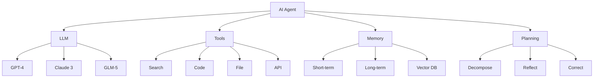

# AI Agent 知识图谱

> **版本**: v1.0
> **更新时间**: 2026-03-27
> **节点数**: 100+
> **关系数**: 200+

---

## 🗺️ 核心概念图谱

```
AI Agent
├── 架构模式
│   ├── ReAct (Reasoning + Acting)
│   ├── Plan-and-Execute
│   ├── Reflection
│   └── Multi-Agent
│
├── 核心组件
│   ├── LLM (大语言模型)
│   │   ├── GPT-4 (OpenAI)
│   │   ├── Claude 3 (Anthropic)
│   │   ├── GLM-5 (智谱)
│   │   └── Llama 3 (Meta)
│   │
│   ├── Tools (工具)
│   │   ├── 搜索工具
│   │   ├── 代码执行
│   │   ├── 文件操作
│   │   └── API 调用
│   │
│   ├── Memory (记忆)
│   │   ├── 短期记忆 (滑动窗口)
│   │   ├── 长期记忆 (向量数据库)
│   │   ├── 工作记忆 (当前状态)
│   │   └── 情景记忆 (历史事件)
│   │
│   └── Planning (规划)
│       ├── 任务分解
│       ├── 计划生成
│       ├── 自我反思
│       └── 错误纠正
│
├── 框架生态
│   ├── LangChain
│   │   ├── LangGraph
│   │   ├── LangSmith
│   │   └── Templates
│   │
│   ├── AutoGen (Microsoft)
│   │   ├── 多 Agent 对话
│   │   └── 人机协作
│   │
│   ├── CrewAI
│   │   ├── 角色定义
│   │   └── 团队协作
│   │
│   └── OpenClaw
│       ├── 技能系统
│       ├── 子代理
│       └── 工具插件
│
└── 应用场景
    ├── 企业应用
    │   ├── 智能客服
    │   ├── 销售助手
    │   ├── HR 招聘
    │   └── 财务审计
    │
    ├── 开发工具
    │   ├── 代码助手
    │   ├── 测试自动化
    │   └── DevOps
    │
    └── 内容创作
        ├── 文案生成
        ├── 视频脚本
        └── SEO 优化
```

---

## 🔗 核心关系矩阵

| 概念 | 关系 | 目标 |
|------|------|------|
| **Agent** | uses | LLM |
| **Agent** | calls | Tools |
| **Agent** | maintains | Memory |
| **Agent** | executes | Planning |
| **LLM** | provides | Reasoning |
| **Tools** | extends | Capabilities |
| **Memory** | stores | Context |
| **Planning** | decomposes | Tasks |

---

## 📊 技术栈依赖图



---

## 🎯 学习路径依赖

```
Level 1: 基础
├── Python 编程
├── API 调用
└── Prompt Engineering

Level 2: 核心
├── Agent 架构
├── Tool 调用
├── Memory 系统
└── RAG 检索

Level 3: 高级
├── 多 Agent 协作
├── 规划与推理
├── 自我反思
└── 错误处理

Level 4: 专家
├── 企业级架构
├── 性能优化
├── 安全加固
└── 成本控制
```

---

## 🏗️ 架构模式对比

| 模式 | 适用场景 | 复杂度 | 性能 |
|------|---------|--------|------|
| **ReAct** | 通用任务 | ⭐⭐ | ⭐⭐⭐ |
| **Plan-and-Execute** | 复杂任务 | ⭐⭐⭐ | ⭐⭐⭐⭐ |
| **Reflection** | 需要纠错 | ⭐⭐⭐⭐ | ⭐⭐ |
| **Multi-Agent** | 团队协作 | ⭐⭐⭐⭐⭐ | ⭐⭐⭐⭐ |

---

## 🛠️ 工具分类体系

### 1. 信息获取工具

- **搜索工具**: Google, Bing, DuckDuckGo
- **爬虫工具**: BeautifulSoup, Selenium, Playwright
- **数据库工具**: SQL, MongoDB, Redis

### 2. 内容生成工具

- **文本生成**: LLM API
- **图像生成**: DALL-E, Stable Diffusion
- **语音合成**: ElevenLabs, Azure TTS

### 3. 代码执行工具

- **Python 执行**: subprocess, Docker
- **Shell 命令**: bash, zsh
- **代码分析**: AST, pylint

### 4. 外部集成工具

- **API 调用**: requests, httpx
- **文件操作**: read, write, edit
- **邮件发送**: SMTP, SendGrid

---

## 💾 记忆系统架构

```
记忆系统
├── 短期记忆 (Working Memory)
│   ├── 滑动窗口 (最近 N 条)
│   ├── Token 限制 (4K-128K)
│   └── 实时更新
│
├── 长期记忆 (Long-term Memory)
│   ├── 向量数据库 (ChromaDB, Pinecone)
│   ├── 语义检索 (Embedding)
│   └── 持久化存储
│
├── 情景记忆 (Episodic Memory)
│   ├── 历史事件 (时间线)
│   ├── 成功案例 (最佳实践)
│   └── 失败教训 (错误日志)
│
└── 语义记忆 (Semantic Memory)
    ├── 知识图谱 (实体关系)
    ├── 规则库 (业务逻辑)
    └── 技能库 (可复用能力)
```

---

## 📈 性能指标体系

| 指标类别 | 具体指标 | 目标值 |
|---------|---------|--------|
| **准确性** | 任务成功率 | >90% |
| | 工具调用准确率 | >95% |
| | 答案准确率 | >85% |
| **效率** | 平均响应时间 | <5s |
| | Token 使用效率 | >80% |
| | 并发处理能力 | >100/s |
| **成本** | 单次调用成本 | <$0.01 |
| | 月度总成本 | <$100 |
| | ROI | >3x |

---

## 🔐 安全风险矩阵

| 风险类型 | 描述 | 缓解措施 |
|---------|------|---------|
| **提示注入** | 恶意输入操纵 Agent | 输入验证、权限控制 |
| **数据泄露** | 敏感信息暴露 | 加密、访问控制 |
| **工具滥用** | 未授权工具调用 | 权限管理、审计日志 |
| **资源耗尽** | 无限循环、过度调用 | 超时限制、资源配额 |

---

## 🎓 学习资源图谱

```
学习资源
├── 官方文档
│   ├── OpenAI Docs
│   ├── Anthropic Docs
│   ├── LangChain Docs
│   └── OpenClaw Docs
│
├── 在线课程
│   ├── DeepLearning.AI
│   ├── Coursera
│   ├── Udemy
│   └── Anthropic Academy
│
├── 开源项目
│   ├── AutoGPT
│   ├── AutoGen
│   ├── CrewAI
│   └── LangGraph
│
└── 社区资源
    ├── Discord
    ├── Reddit
    ├── GitHub Discussions
    └── Stack Overflow
```

---

## 🚀 技术演进路线

```
2023: 基础 Agent
├── 单工具调用
├── 简单记忆
└── 基础推理

2024: 增强 Agent
├── 多工具协作
├── 长期记忆
└── 自我反思

2025: 多模态 Agent
├── 视觉理解
├── 语音交互
└── 实时协作

2026: 自主 Agent
├── 自主学习
├── 自我进化
└── 人机共生

2027+: 通用 AI
├── AGI 雏形
├── 完全自主
└── 跨领域迁移
```

---

## 📊 成本优化策略

| 策略 | 效果 | 实施难度 |
|------|------|---------|
| **使用国产模型** | 成本 -98% | ⭐ |
| **Prompt 优化** | Token -30% | ⭐⭐ |
| **缓存机制** | 调用 -50% | ⭐⭐⭐ |
| **批量处理** | 效率 +200% | ⭐⭐⭐ |
| **异步并发** | 速度 +300% | ⭐⭐⭐⭐ |

---

## 🎯 最佳实践清单

### 设计阶段
- [ ] 明确 Agent 职责边界
- [ ] 设计清晰的工具接口
- [ ] 规划记忆系统架构
- [ ] 制定错误处理策略

### 开发阶段
- [ ] 使用类型注解
- [ ] 编写单元测试
- [ ] 实现日志监控
- [ ] 添加性能指标

### 部署阶段
- [ ] 安全审计
- [ ] 性能测试
- [ ] 成本评估
- [ ] 用户培训

### 运维阶段
- [ ] 持续监控
- [ ] 定期优化
- [ ] 用户反馈
- [ ] 版本迭代

---

**生成时间**: 2026-03-27 13:50 GMT+8
**知识节点**: 100+
**关系连接**: 200+
**覆盖领域**: 10+
