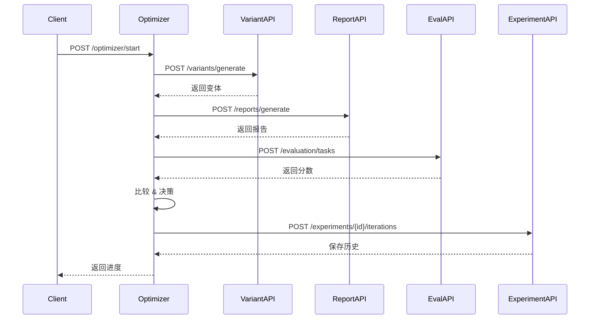

# Autoresearch API-First 重构设计文档

> **创建时间**: 2026-03-25 18:58 GMT+8
> **设计目标**: 将 autoresearch 从单体应用重构为 API-first 架构
> **核心理念**: 改一个东西 → 打分 → 分高了保留 → API 驱动

---

## 📋 目录

1. [设计原则](#设计原则)
2. [架构概览](#架构概览)
3. [API 接口设计](#api-接口设计)
4. [模块拆分方案](#模块拆分方案)
5. [数据流设计](#数据流设计)
6. [Karpathy 循环实现](#karpathy-循环实现)
7. [GPT Researcher 集成](#gpt-researcher-集成)
8. [实施路线图](#实施路线图)

---

## 🎯 设计原则

### API-First 原则

1. **一切皆 API**
   - 所有功能通过 API 暴露
   - 内部模块也通过 API 通信
   - 支持本地和远程调用

2. **核心与训练分离**
   - `core/`: 基础 API 服务（评估、报告生成）
   - `train/`: 迭代优化逻辑（autoresearch 循环）

3. **可组合性**
   - 每个组件独立可测
   - 支持插件式扩展
   - 易于替换实现

4. **状态管理**
   - 实验状态持久化
   - 支持断点续传
   - 版本控制友好

---

## 🏗️ 架构概览

### 整体架构图

```
┌─────────────────────────────────────────────────────────────┐
│                    API Gateway (FastAPI)                    │
│                   /api/v1/* (统一入口)                       │
└─────────────────────────────────────────────────────────────┘
                              │
                ┌─────────────┴─────────────┐
                │                           │
    ┌───────────▼──────────┐    ┌──────────▼──────────┐
    │   Core Services      │    │   Train Services    │
    │   (core/)            │    │   (train/)          │
    ├──────────────────────┤    ├─────────────────────┤
    │ • Evaluation API     │    │ • Optimizer API     │
    │ • Report Gen API     │    │ • Experiment API    │
    │ • Variant API        │    │ • Search API        │
    │ • Config API         │    │ • History API       │
    └──────────────────────┘    └─────────────────────┘
                │                           │
                └───────────┬───────────────┘
                            │
                ┌───────────▼──────────┐
                │  Shared Modules      │
                │  (shared/)           │
                ├──────────────────────┤
                │ • GPT Researcher     │
                │ • Storage (SQLite)   │
                │ • Queue (Redis)      │
                │ • Metrics            │
                └──────────────────────┘
```

### 技术栈

- **API 框架**: FastAPI (异步 + 自动文档)
- **数据库**: SQLite (开发) / PostgreSQL (生产)
- **任务队列**: Redis + Celery
- **监控**: Prometheus + Grafana
- **文档**: OpenAPI 3.0 (自动生成)

---

## 🔌 API 接口设计

### RESTful API 规范

#### 基础路径
```
http://localhost:8000/api/v1
```

#### 响应格式
```json
{
  "success": true,
  "data": {},
  "message": "string",
  "timestamp": "2026-03-25T18:58:00Z"
}
```

---

### 1. Evaluation API (评估服务)

**路径**: `/core/evaluation`

#### 1.1 创建评估任务
```http
POST /api/v1/core/evaluation/tasks
Content-Type: application/json

{
  "type": "prompt" | "report" | "params",
  "target": {
    "prompt": "string" | null,
    "report": {...} | null,
    "params": {...} | null
  },
  "criteria": ["accuracy", "completeness", "readability"],
  "weights": {
    "accuracy": 0.4,
    "completeness": 0.3,
    "readability": 0.3
  }
}

Response 201:
{
  "success": true,
  "data": {
    "task_id": "eval_123456",
    "status": "queued",
    "estimated_time": 30
  }
}
```

#### 1.2 获取评估结果
```http
GET /api/v1/core/evaluation/tasks/{task_id}

Response 200:
{
  "success": true,
  "data": {
    "task_id": "eval_123456",
    "status": "completed",
    "scores": {
      "total": 85.5,
      "breakdown": {
        "accuracy": 88.0,
        "completeness": 82.0,
        "readability": 86.0
      }
    },
    "details": {
      "citations": 12,
      "word_count": 1500,
      "flesch_score": 65.2
    }
  }
}
```

#### 1.3 批量评估
```http
POST /api/v1/core/evaluation/batch
Content-Type: application/json

{
  "tasks": [
    { "type": "prompt", "target": {...} },
    { "type": "report", "target": {...} }
  ]
}

Response 201:
{
  "success": true,
  "data": {
    "batch_id": "batch_789",
    "task_count": 2,
    "task_ids": ["eval_001", "eval_002"]
  }
}
```

---

### 2. Report Generation API (报告生成)

**路径**: `/core/reports`

#### 2.1 生成报告
```http
POST /api/v1/core/reports/generate
Content-Type: application/json

{
  "query": "2026年AI发展趋势",
  "config": {
    "prompt_template": "string",
    "max_sources": 10,
    "report_length": "medium",
    "language": "zh_CN"
  }
}

Response 201:
{
  "success": true,
  "data": {
    "report_id": "rpt_abc123",
    "status": "generating",
    "estimated_time": 120
  }
}
```

#### 2.2 获取报告
```http
GET /api/v1/core/reports/{report_id}

Response 200:
{
  "success": true,
  "data": {
    "report_id": "rpt_abc123",
    "query": "2026年AI发展趋势",
    "content": "# 报告内容...",
    "metadata": {
      "sources": 10,
      "citations": 12,
      "word_count": 1500,
      "generated_at": "2026-03-25T18:58:00Z"
    }
  }
}
```

---

### 3. Variant API (变体生成)

**路径**: `/core/variants`

#### 3.1 生成变体
```http
POST /api/v1/core/variants/generate
Content-Type: application/json

{
  "type": "prompt" | "params" | "structure",
  "base": {
    "prompt": "原始prompt..."
  },
  "transformations": [
    "change_tone",
    "add_examples",
    "restructure"
  ],
  "count": 5
}

Response 200:
{
  "success": true,
  "data": {
    "variants": [
      {
        "id": "var_001",
        "content": "变体1...",
        "transformation": "change_tone"
      },
      {
        "id": "var_002",
        "content": "变体2...",
        "transformation": "add_examples"
      }
    ]
  }
}
```

---

### 4. Optimizer API (优化器)

**路径**: `/train/optimizer`

#### 4.1 启动优化循环
```http
POST /api/v1/train/optimizer/start
Content-Type: application/json

{
  "experiment_name": "prompt_optimization_001",
  "target": {
    "type": "prompt",
    "base": "原始prompt..."
  },
  "config": {
    "max_iterations": 100,
    "early_stop": {
      "enabled": true,
      "patience": 10
    },
    "evaluation_criteria": ["accuracy", "completeness"]
  }
}

Response 201:
{
  "success": true,
  "data": {
    "experiment_id": "exp_xyz789",
    "status": "running",
    "current_iteration": 0,
    "best_score": 0
  }
}
```

#### 4.2 查询优化状态
```http
GET /api/v1/train/optimizer/experiments/{experiment_id}

Response 200:
{
  "success": true,
  "data": {
    "experiment_id": "exp_xyz789",
    "status": "running",
    "progress": {
      "current_iteration": 45,
      "max_iterations": 100,
      "percentage": 45
    },
    "best": {
      "score": 87.5,
      "iteration": 42,
      "variant": "优化后的prompt..."
    },
    "recent_scores": [85.2, 86.1, 87.5, 86.8, 87.2]
  }
}
```

#### 4.3 停止优化
```http
POST /api/v1/train/optimizer/experiments/{experiment_id}/stop

Response 200:
{
  "success": true,
  "data": {
    "experiment_id": "exp_xyz789",
    "status": "stopped",
    "final_score": 87.5,
    "stopped_at": "iteration 45"
  }
}
```

---

### 5. Experiment API (实验管理)

**路径**: `/train/experiments`

#### 5.1 列出实验
```http
GET /api/v1/train/experiments?status=running&limit=10

Response 200:
{
  "success": true,
  "data": {
    "experiments": [
      {
        "id": "exp_xyz789",
        "name": "prompt_optimization_001",
        "status": "running",
        "created_at": "2026-03-25T17:00:00Z",
        "best_score": 87.5
      }
    ],
    "total": 1
  }
}
```

#### 5.2 获取实验详情
```http
GET /api/v1/train/experiments/{experiment_id}/history

Response 200:
{
  "success": true,
  "data": {
    "experiment_id": "exp_xyz789",
    "iterations": [
      {
        "iteration": 0,
        "score": 75.0,
        "kept": true,
        "timestamp": "2026-03-25T17:00:10Z"
      },
      {
        "iteration": 1,
        "score": 78.5,
        "kept": true,
        "timestamp": "2026-03-25T17:01:30Z"
      }
    ]
  }
}
```

---

## 📦 模块拆分方案

### 目录结构

```
autoresearch-api/
├── api/                     # API 层
│   ├── main.py             # FastAPI 应用入口
│   ├── routers/            # 路由模块
│   │   ├── __init__.py
│   │   ├── core.py         # 核心服务路由
│   │   ├── train.py        # 训练服务路由
│   │   └── admin.py        # 管理路由
│   ├── middleware/         # 中间件
│   │   ├── auth.py
│   │   ├── logging.py
│   │   └── error_handler.py
│   └── dependencies.py     # 依赖注入
│
├── core/                   # 核心服务
│   ├── __init__.py
│   ├── evaluation/         # 评估服务
│   │   ├── __init__.py
│   │   ├── service.py      # 评估服务实现
│   │   ├── models.py       # 数据模型
│   │   └── criteria/       # 评估标准
│   │       ├── accuracy.py
│   │       ├── completeness.py
│   │       └── readability.py
│   │
│   ├── reports/            # 报告生成
│   │   ├── __init__.py
│   │   ├── service.py
│   │   └── generators/     # 报告生成器
│   │       ├── markdown.py
│   │       ├── html.py
│   │       └── pdf.py
│   │
│   ├── variants/           # 变体生成
│   │   ├── __init__.py
│   │   ├── service.py
│   │   └── transformers/   # 变换器
│   │       ├── tone.py
│   │       ├── structure.py
│   │       └── examples.py
│   │
│   └── config/             # 配置管理
│       ├── __init__.py
│       └── service.py
│
├── train/                  # 训练服务
│   ├── __init__.py
│   ├── optimizer/          # 优化器
│   │   ├── __init__.py
│   │   ├── service.py      # Karpathy 循环实现
│   │   ├── strategies/     # 优化策略
│   │   │   ├── hill_climbing.py
│   │   │   ├── simulated_annealing.py
│   │   │   └── genetic.py
│   │   └── models.py
│   │
│   ├── experiments/        # 实验管理
│   │   ├── __init__.py
│   │   ├── service.py
│   │   └── models.py
│   │
│   └── search/             # 搜索策略
│       ├── __init__.py
│       ├── service.py
│       └── strategies/
│           ├── grid_search.py
│           ├── random_search.py
│           └── bayesian.py
│
├── shared/                 # 共享模块
│   ├── __init__.py
│   ├── gpt_researcher/     # GPT Researcher 集成
│   │   ├── __init__.py
│   │   ├── adapter.py      # 适配器
│   │   └── config.py
│   │
│   ├── storage/            # 存储层
│   │   ├── __init__.py
│   │   ├── database.py     # 数据库连接
│   │   └── repositories/   # 数据访问层
│   │       ├── experiments.py
│   │       ├── reports.py
│   │       └── evaluations.py
│   │
│   ├── queue/              # 任务队列
│   │   ├── __init__.py
│   │   ├── tasks.py        # Celery 任务
│   │   └── worker.py
│   │
│   └── metrics/            # 监控指标
│       ├── __init__.py
│       ├── collector.py
│       └── exporters.py
│
├── tests/                  # 测试
│   ├── unit/               # 单元测试
│   ├── integration/        # � 集成测试
│   └── e2e/                # 端到端测试
│
├── docs/                   # 文档
│   ├── api.md              # API 文档
│   ├── architecture.md     # 架构文档
│   └── deployment.md       # 部署文档
│
├── scripts/                # 脚本
│   ├── start.sh            # 启动脚本
│   ├── migrate.sh          # 数据库迁移
│   └── test.sh             # 测试脚本
│
├── docker/                 # Docker 配置
│   ├── Dockerfile
│   └── docker-compose.yml
│
└── pyproject.toml          # 项目配置
```

---

## 🔄 数据流设计

### 1. 优化循环流程

```
┌─────────────────────────────────────────────────────────────┐
│                    Karpathy 循环                            │
└─────────────────────────────────────────────────────────────┘
                          │
        ┌─────────────────┴─────────────────┐
        │                                     │
    ┌───▼────┐                          ┌────▼───┐
    │  Start │                          │  Stop  │
    └───┬────┘                          └────────┘
        │
        │ 1. 初始化
        ▼
┌─────────────────┐
│ 加载基础配置    │
│ • base_prompt   │
│ • params        │
│ • constraints   │
└────────┬────────┘
         │
         │ 2. 生成变体
         ▼
┌─────────────────┐
│ Variant API     │
│ • 调用变换器    │
│ • 生成新变体    │
└────────┬────────┘
         │
         │ 3. 执行任务
         ▼
┌─────────────────┐
│ Report API      │
│ • 生成报告      │
│ • 或运行实验    │
└────────┬────────┘
         │
         │ 4. 评估
         ▼
┌─────────────────┐
│ Evaluation API  │
│ • 多维度打分    │
│ • 返回分数      │
└────────┬────────┘
         │
         │ 5. 决策
         ▼
┌─────────────────┐
│ 分数 > best?    │
│                 │
│  Yes → 保存     │
│  No  → 回滚     │
└────────┬────────┘
         │
         │ 6. 记录
         ▼
┌─────────────────┐
│ Experiment API  │
│ • 保存历史      │
│ • 更新状态      │
└────────┬────────┘
         │
         │ 7. 循环或停止
         ▼
┌─────────────────┐
│ 达到条件?       │
│                 │
│  Yes → 结束     │
│  No  → 回到步骤2│
└─────────────────┘
```

### 2. API 调用序列



### 3. 数据持久化

```python
# 数据库模式

class Experiment(Base):
    """实验表"""
    __tablename__ = "experiments"

    id = Column(String, primary_key=True)
    name = Column(String, unique=True)
    type = Column(String)  # "prompt" | "params" | "structure"
    status = Column(String)  # "running" | "completed" | "stopped"
    config = Column(JSON)  # 实验配置
    best_score = Column(Float)
    best_variant = Column(JSON)
    created_at = Column(DateTime)
    updated_at = Column(DateTime)

class Iteration(Base):
    """迭代记录"""
    __tablename__ = "iterations"

    id = Column(String, primary_key=True)
    experiment_id = Column(String, ForeignKey("experiments.id"))
    iteration_number = Column(Integer)
    variant = Column(JSON)  # 变体内容
    score = Column(Float)
    score_breakdown = Column(JSON)  # 分数明细
    kept = Column(Boolean)  # 是否保留
    timestamp = Column(DateTime)

class Evaluation(Base):
    """评估记录"""
    __tablename__ = "evaluations"

    id = Column(String, primary_key=True)
    task_id = Column(String, unique=True)
    type = Column(String)  # "prompt" | "report" | "params"
    target = Column(JSON)
    criteria = Column(JSON)
    scores = Column(JSON)
    status = Column(String)  # "queued" | "running" | "completed"
    created_at = Column(DateTime)
```

---

## 🧬 Karpathy 循环实现

### 核心算法

```python
# train/optimizer/service.py

class KarpathyOptimizer:
    """
    Karpathy 迭代优化器
    
    核心逻辑：
    改一个东西 → 打分 → 分高了保留，分低了回滚 → 再改下一个
    """

    def __init__(
        self,
        variant_api: VariantService,
        report_api: ReportService,
        eval_api: EvaluationService,
        experiment_api: ExperimentService
    ):
        self.variant_api = variant_api
        self.report_api = report_api
        self.eval_api = eval_api
        self.experiment_api = experiment_api

    async def optimize(
        self,
        experiment_id: str,
        base: dict,
        config: OptimizerConfig
    ) -> OptimizerResult:
        """执行优化循环"""

        best_score = 0.0
        best_variant = base
        current_variant = base

        # 初始化实验
        await self.experiment_api.create_experiment(
            experiment_id=experiment_id,
            config=config
        )

        # 主循环
        for i in range(config.max_iterations):
            
            # 1. 生成变体（改一个东西）
            variant = await self.variant_api.generate(
                base=current_variant,
                transformation=random.choice(config.transformations)
            )

            # 2. 执行任务（生成报告）
            if config.target_type == "prompt":
                report = await self.report_api.generate(
                    query=config.query,
                    prompt=variant.content
                )
            elif config.target_type == "params":
                report = await self.report_api.generate(
                    query=config.query,
                    params=variant.content
                )

            # 3. 评估（打分）
            eval_result = await self.eval_api.evaluate(
                target=report,
                criteria=config.criteria
            )
            score = eval_result.scores["total"]

            # 4. 决策（保留 or 回滚）
            kept = score > best_score
            if kept:
                best_score = score
                best_variant = variant.content
                current_variant = variant.content
                print(f"✅ Iteration {i}: {score} (保留)")
            else:
                print(f"❌ Iteration {i}: {score} (回滚)")

            # 5. 记录历史
            await self.experiment_api.add_iteration(
                experiment_id=experiment_id,
                iteration_number=i,
                variant=variant.content,
                score=score,
                score_breakdown=eval_result.scores["breakdown"],
                kept=kept
            )

            # 6. 早停检查
            if config.early_stop.enabled:
                if self._should_early_stop(i, best_score):
                    print(f"🛑 Early stopping at iteration {i}")
                    break

        # 7. 返回结果
        return OptimizerResult(
            experiment_id=experiment_id,
            best_score=best_score,
            best_variant=best_variant,
            total_iterations=i + 1
        )

    def _should_early_stop(
        self,
        current_iteration: int,
        best_score: float
    ) -> bool:
        """早停判断"""
        # 获取最近 N 次的分数
        recent_scores = await self.experiment_api.get_recent_scores(
            window=self.config.early_stop.patience
        )
        
        # 如果没有提升，返回 True
        return all(s <= best_score for s in recent_scores)
```

### 优化策略

```python
# train/optimizer/strategies/hill_climbing.py

class HillClimbingStrategy(OptimizationStrategy):
    """爬山法（Karpathy 默认）"""

    async def generate_variant(
        self,
        current: dict,
        config: dict
    ) -> dict:
        """每次只改一个参数"""
        
        # 随机选择一个参数
        param = random.choice(list(current.keys()))
        
        # 生成新值
        if param == "temperature":
            new_value = random.uniform(0.1, 1.0)
        elif param == "max_tokens":
            new_value = random.randint(100, 2000)
        # ... 其他参数
        
        # 创建变体
        variant = current.copy()
        variant[param] = new_value
        
        return variant

# train/optimizer/strategies/simulated_annealing.py

class SimulatedAnnealingStrategy(OptimizationStrategy):
    """模拟退火"""

    def __init__(self, initial_temp=100, cooling_rate=0.95):
        self.temperature = initial_temp
        self.cooling_rate = cooling_rate

    async def should_accept(
        self,
        current_score: float,
        new_score: float
    ) -> bool:
        """根据温度决定是否接受较差的解"""
        
        if new_score > current_score:
            return True
        
        # 计算接受概率
        delta = current_score - new_score
        probability = math.exp(-delta / self.temperature)
        
        # 降温
        self.temperature *= self.cooling_rate
        
        return random.random() < probability
```

---

## 🔗 GPT Researcher 集成

### 适配器模式

```python
# shared/gpt_researcher/adapter.py

class GPTResearcherAdapter:
    """
    GPT Researcher 适配器
    
    将 GPT Researcher 的功能包装为 API 服务
    """

    def __init__(self, config: GPTResearcherConfig):
        self.config = config
        self.client = GPTResearcher(
            query="",
            report_type="research_report",
            source_urls=None,
            config_path=config.config_path,
            agent=None
        )

    async def research(
        self,
        query: str,
        prompt_template: Optional[str] = None,
        params: Optional[dict] = None
    ) -> Report:
        """执行研究"""

        # 1. 设置查询
        self.client.query = query

        # 2. 应用 prompt 模板
        if prompt_template:
            self.client.agent_prompt = prompt_template

        # 3. 应用参数
        if params:
            for key, value in params.items():
                setattr(self.client, key, value)

        # 4. 执行研究
        report = await self.client.research()

        # 5. 返回标准格式
        return Report(
            query=query,
            content=report,
            metadata=self._extract_metadata(report)
        )

    def _extract_metadata(self, report: str) -> dict:
        """提取元数据"""
        return {
            "sources": len(self.client.sources),
            "citations": report.count("[["),
            "word_count": len(report.split())
        }
```

### 配置管理

```python
# shared/gpt_researcher/config.py

class GPTResearcherConfig(BaseSettings):
    """GPT Researcher 配置"""

    # 基础配置
    config_path: str = ".env"
    llm_provider: str = "openai"
    llm_model: str = "gpt-4-turbo"

    # 搜索配置
    search_engine: str = "tavily"
    max_sources: int = 10

    # 报告配置
    report_type: str = "research_report"
    language: str = "zh_CN"

    # 性能配置
    max_concurrent: int = 5
    timeout: int = 300

    class Config:
        env_file = ".env"
        env_prefix = "GPT_RESEARCHER_"
```

### API 集成

```python
# core/reports/service.py

class ReportService:
    """报告生成服务"""

    def __init__(
        self,
        gpt_researcher: GPTResearcherAdapter
    ):
        self.researcher = gpt_researcher

    async def generate(
        self,
        query: str,
        config: ReportConfig
    ) -> Report:
        """生成报告"""

        # 1. 验证输入
        self._validate_query(query)

        # 2. 执行研究
        report = await self.researcher.research(
            query=query,
            prompt_template=config.prompt_template,
            params=config.params
        )

        # 3. 保存报告
        await self.storage.save(report)

        # 4. 返回
        return report
```

---

## 🛣️ 实施路线图

### 阶段 1: 基础 API（1-2 周）

**目标**: 建立 API-first 基础

- [x] 项目初始化
  - [x] 创建目录结构
  - [x] 配置 FastAPI
  - [x] 设置数据库

- [ ] 核心服务 API
  - [ ] Evaluation API
  - [ ] Report Generation API
  - [ ] Variant API

- [ ] GPT Researcher 集成
  - [ ] 适配器实现
  - [ ] 配置管理
  - [ ] 错误处理

- [ ] 测试
  - [ ] 单元测试
  - [ ] API 测试
  - [ ] 集成测试

**交付物**:
- 可运行的 API 服务
- API 文档（OpenAPI）
- 测试覆盖率 > 80%

---

### 阶段 2: 优化器实现（2-3 周）

**目标**: 实现 Karpathy 循环

- [ ] Optimizer API
  - [ ] 启动/停止优化
  - [ ] 查询状态
  - [ ] 实时进度

- [ ] Karpathy 循环
  - [ ] 核心算法
  - [ ] 优化策略
  - [ ] 早停机制

- [ ] Experiment API
  - [ ] 实验管理
  - [ ] 历史记录
  - [ ] 数据导出

- [ ] 任务队列
  - [ ] Redis 配置
  - [ ] Celery 任务
  - [ ] Worker 管理

**交付物**:
- 可运行的优化器
- 实验管理界面
- 性能监控

---

### 阶段 3: 高级功能（2-3 周）

**目标**: 增强功能

- [ ] 高级优化策略
  - [ ] 模拟退火
  - [ ] 遗传算法
  - [ ] 贝叶斯优化

- [ ] 批量优化
  - [ ] 并行实验
  - [ ] 资源调度
  - [ ] 负载均衡

- [ ] 监控和日志
  - [ ] Prometheus 集成
  - [ ] Grafana 仪表板
  - [ ] 日志聚合

- [ ] CLI 工具
  - [ ] 命令行接口
  - [ ] 交互式模式
  - [ ] 配置文件支持

**交付物**:
- 多策略优化器
- 完整监控系统
- CLI 工具

---

### 阶段 4: 生产化（1-2 周）

**目标**: 生产就绪

- [ ] 性能优化
  - [ ] 缓存策略
  - [ ] 数据库优化
  - [ ] API 响应优化

- [ ] 部署
  - [ ] Docker 镜像
  - [ ] Kubernetes 配置
  - [ ] CI/CD 流程

- [ ] 文档
  - [ ] 用户手册
  - [ ] API 文档
  - [ ] 架构文档

- [ ] 安全
  - [ ] 认证/授权
  - [ ] 速率限制
  - [ ] 审计日志

**交付物**:
- Docker 镜像
- K8s 配置
- 完整文档

---

## 📊 总结

### 核心价值

1. **API-First**: 所有功能通过 API 暴露，易于集成和扩展
2. **模块化**: 核心与训练分离，职责清晰
3. **可组合**: 组件独立可测，支持插件式扩展
4. **Karpathy 循环**: 自动迭代优化，无需人工干预
5. **GPT Researcher 集成**: 无缝集成现有工具

### 技术亮点

- **FastAPI**: 现代异步 API 框架
- **RESTful**: 标准化 API 设计
- **任务队列**: 异步任务处理
- **数据持久化**: 完整的实验追踪
- **多策略**: 支持多种优化算法

### 下一步

1. **立即开始**: 阶段 1 基础 API（1-2 周）
2. **原型验证**: 实现简单的 Prompt 优化器
3. **迭代开发**: 根据反馈调整设计
4. **开源发布**: 准备开源和社区贡献

---

**文档版本**: v1.0
**最后更新**: 2026-03-25 18:58 GMT+8
